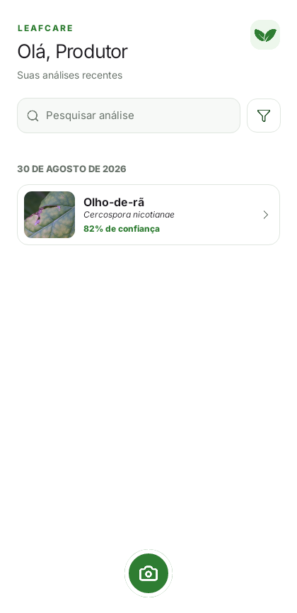

# LeafCare

> Offline Android application for visual screening of diseases and abnormalities in tobacco leaves using computer vision.

LeafCare is an academic project designed for field use where internet access may be unavailable. A producer can capture or select a leaf image, run the model directly on the phone and receive the three most likely classes with confidence scores. When confidence is insufficient, the app returns an inconclusive result instead of forcing a diagnosis.

> [!IMPORTANT]
> LeafCare is a visual screening tool, not a definitive diagnosis. Its results must be confirmed by a qualified agricultural professional.

## Current status

- Native Android app implemented with Kotlin and Jetpack Compose.
- CameraX capture and gallery import.
- Offline TFLite/LiteRT inference.
- Local Room history with search, filters and deletion.
- Photo guidance and reference examples.
- MobileNetV3Small baseline integrated into the app.
- Fourteen additional mobile model configurations benchmarked.
- Experimental three-model ensemble exported, but not yet integrated into Android.



## Results

The completed experiment uses 696 raw TLA/TV3 images distributed across 16 classes. The group-aware split contains 489 training, 104 validation and 103 test images.

| Test metric | Current Android model | Experimental ensemble |
|---|---:|---:|
| Top-1 accuracy | 77.67% | **80.58%** |
| Macro-F1 | 0.7157 | **0.7659** |
| Top-3 accuracy | 97.09% | **99.03%** |
| Accepted-prediction accuracy | 89.87% | **92.31%** |

The ensemble combines the previous MobileNetV3Small, a MobileNetV3Small trained with RMSprop and a MobileNetV3Large. The application intentionally retains the single-model baseline until the ensemble is profiled and validated on real Android devices.

See [the model benchmark](docs/BENCHMARK_MODELOS.md), [the extensive comparison](docs/RELATORIO_COMPARATIVO_MODELOS_LEAFCARE.md) and [the project roadmap](ROADMAP.md).

## Features

- capture a tobacco leaf using the device camera;
- select an existing image from the gallery;
- run classification without an internet connection;
- display top-3 classes and confidence scores;
- return an inconclusive result below the confidence threshold;
- show symptoms, favorable conditions and general guidance;
- store analyses locally and keep them after restarting the app;
- search, filter and delete history entries;
- show examples of correct, blurred, distant and dark photos.

## Architecture

```text
Camera / Gallery
      |
      v
Center crop + 224 x 224 RGB preprocessing
      |
      v
TFLite / LiteRT inference
      |
      v
Top 3 + confidence policy
      |
      v
Result screen + Room history
```

The Android code follows an MVVM-style separation:

```text
Compose UI -> ViewModel -> Repository -> Room / private files
                                  |
                                  +-> LiteRT interpreter
```

## Technology

| Area | Technology |
|---|---|
| Android | Kotlin, Jetpack Compose, CameraX |
| Persistence | Room / SQLite |
| Machine learning | Python 3.12, TensorFlow 2.16.1, Keras 3.3.3 |
| Mobile inference | TFLite / LiteRT 1.4.0 |
| Baseline architecture | MobileNetV3Small with transfer learning |
| Android build | Gradle 8.9, AGP 8.7.3, JDK 17, SDK 35 |
| Minimum Android | API 26 / Android 8 |

## Repository structure

```text
leafcare/
├── android-app/          Native Android application
├── machine-learning/     Dataset audit, training, evaluation and export
├── docs/                 Architecture, validation, results and licenses
├── samples/              Public sample and preprocessing fixture
├── ROADMAP.md            Remaining work and release criteria
├── LICENSE
└── README.md
```

The full datasets, virtual environments, build directories, APKs, caches and Keras checkpoints are intentionally excluded from Git.

## Run the Android app

1. Open `android-app` in Android Studio.
2. Select JDK 17 for Gradle.
3. Install Android SDK Platform 35 and Build Tools 34.0.0.
4. Sync the project.
5. Run the `app` configuration on an emulator or physical device.

PowerShell:

```powershell
cd android-app
.\gradlew.bat testDebugUnitTest assembleDebug
```

Linux/macOS:

```bash
cd android-app
chmod +x gradlew
./gradlew testDebugUnitTest assembleDebug
```

The first dependency sync requires internet access. Once installed, image analysis is performed offline.

## Run the machine-learning checks

From `machine-learning`:

```bash
python3.12 -m venv .venv
source .venv/bin/activate
python -m pip install -r requirements.txt
python -m pytest -q
python validate_bundle.py --require-model
python predict.py ../samples/reference_frog_eye.jpg
```

On Windows, activate the environment with `.venv\Scripts\activate`.

The baseline TFLite model, class order, metadata and evaluation artifacts are included. The training images are not included.

## Reproduce training

Place the source archives outside the repository and run:

```bash
cd machine-learning
python import_tla.py --tla /path/to/TLA.zip --ttdd /path/to/TTDD.zip
python prepare_dataset.py
python train.py
python evaluate.py
python export_tflite.py
python validate_bundle.py --require-model
```

The pipeline audits invalid files and duplicates, keeps related source groups in the same split, applies augmentation only to training data, trains in two transfer-learning stages and verifies Keras/TFLite parity before updating Android assets.

## Known limitations

- The experiment is based on only 696 images and several classes are rare.
- Some test classes contain only one or two images.
- There is no independent field dataset from Southern Brazil yet.
- Images unrelated to tobacco leaves can still receive a high softmax score.
- Disease descriptions and labels require agronomic review.
- The experimental ensemble has not been profiled on a physical Android device.
- The app does not currently record property or field identifiers.

## Documentation

- [Architecture](docs/ARCHITECTURE.md)
- [Dataset and split](docs/DATASET.md)
- [Inference contract](docs/INFERENCE_CONTRACT.md)
- [Validation evidence](docs/VALIDATION.md)
- [Model benchmark](docs/BENCHMARK_MODELOS.md)
- [Extensive model comparison](docs/RELATORIO_COMPARATIVO_MODELOS_LEAFCARE.md)
- [Ensemble Android integration](docs/ENSEMBLE_ANDROID_INTEGRATION.md)
- [Manual device tests](docs/MANUAL_TESTS.md)
- [Third-party notices](docs/THIRD_PARTY.md)

## License and data

The original project code is distributed under the [MIT License](LICENSE). Dataset images, reference photographs, fonts and pretrained weights retain their own licenses and attribution requirements. Review [third-party notices](docs/THIRD_PARTY.md) before redistribution or commercial use.
