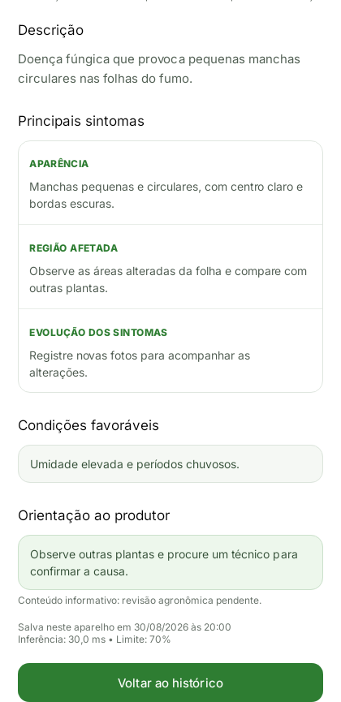
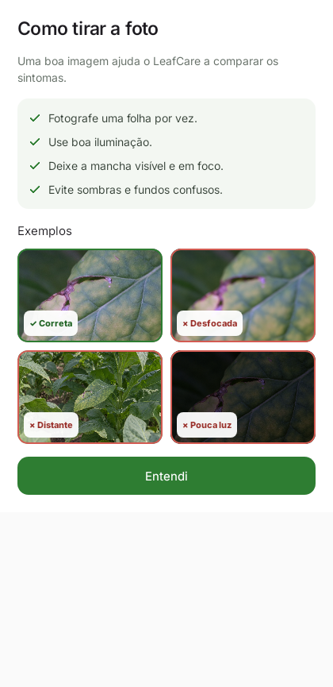

# LeafCare

Aplicativo Android **offline-first** para triagem visual de doenças e alterações em folhas de fumo. O LeafCare permite fotografar ou selecionar uma imagem, executar a classificação diretamente no celular, exibir até três hipóteses com seus respectivos níveis de confiança, armazenar o resultado localmente e sincronizar o histórico com o Supabase quando houver internet.

> **Aviso:** o LeafCare é uma ferramenta acadêmica de apoio e triagem visual. Ele **não substitui diagnóstico agronômico, laboratorial ou a avaliação de um profissional qualificado**.

---

## Sumário

- [Objetivo](#objetivo)
- [Estado atual](#estado-atual)
- [Principais funcionalidades](#principais-funcionalidades)
- [Fluxo de uso](#fluxo-de-uso)
- [Interface](#interface)
- [Arquitetura](#arquitetura)
- [Tecnologias](#tecnologias)
- [Estrutura do repositório](#estrutura-do-repositório)
- [Requisitos](#requisitos)
- [Configuração do Android](#configuração-do-android)
- [Executando o aplicativo](#executando-o-aplicativo)
- [Testes Android](#testes-android)
- [Machine Learning](#machine-learning)
- [Reproduzindo o pipeline de ML](#reproduzindo-o-pipeline-de-ml)
- [Supabase e sincronização](#supabase-e-sincronização)
- [Segurança e privacidade](#segurança-e-privacidade)
- [CI](#ci)
- [Limitações conhecidas](#limitações-conhecidas)
- [Próximos passos](#próximos-passos)
- [Documentação mantida](#documentação-mantida)
- [Licença e atribuições](#licença-e-atribuições)

---

## Objetivo

O projeto foi criado para apoiar a identificação preliminar de alterações visuais em folhas de fumo em cenários de campo, inclusive em locais com conectividade limitada.

A proposta central é manter a parte crítica da análise **no próprio aparelho**:

1. a imagem é obtida pela câmera ou galeria;
2. o pré-processamento ocorre localmente;
3. o modelo TensorFlow Lite é executado localmente;
4. o resultado é apresentado imediatamente;
5. o histórico é salvo no banco local;
6. a nuvem é utilizada somente para autenticação, sincronização e restauração do histórico.

Dessa forma, uma perda temporária de conexão não impede novas análises após o usuário já ter autenticado anteriormente no dispositivo.

---

## Estado atual

O repositório contém um **MVP funcional** composto por:

- aplicativo Android nativo em Kotlin;
- interface em Jetpack Compose;
- câmera com CameraX;
- importação de imagens pela galeria;
- classificador local em LiteRT/TensorFlow Lite;
- modelo MobileNetV3Small com 16 classes;
- resultado Top-3 e estado **Inconclusivo** por limiar de confiança;
- histórico local persistido com Room;
- autenticação via Supabase Auth;
- sincronização de análises e fotos em background;
- restauração de histórico em outro aparelho;
- políticas RLS e bucket privado no Supabase;
- pipeline Python para preparação, treinamento, avaliação, benchmark e exportação do modelo;
- testes unitários Android e Python;
- workflow de CI no GitHub Actions.

### Versões principais

| Item | Versão/configuração |
|---|---|
| Android `minSdk` | 26 — Android 8.0 |
| Android `targetSdk` / `compileSdk` | 35 |
| Java/JDK | 17 |
| Kotlin | 2.0.21 |
| Android Gradle Plugin | 8.7.3 |
| Gradle Wrapper | 8.9 |
| Jetpack Compose BOM | 2024.12.01 |
| Room | 2.6.1 |
| CameraX | 1.4.1 |
| WorkManager | 2.9.0 |
| LiteRT | 1.4.0 |
| Supabase Kotlin | 2.1.0 |
| Python | 3.12 recomendado |
| TensorFlow | 2.16.1 |
| Keras | 3.3.3 |

---

## Principais funcionalidades

| Funcionalidade | Implementação |
|---|---|
| Cadastro e login | Supabase Auth |
| Confirmação de e-mail | Deep link `leafcare://auth/confirm-email` |
| Recuperação de senha | Deep link `leafcare://auth/reset-password` |
| Perfil | Nome, e-mail, troca de senha e logout |
| Captura de imagem | CameraX |
| Importação de imagem | Seletor do sistema |
| Inferência | MobileNetV3Small em TFLite/LiteRT |
| Operação offline | Classificação e histórico local sem rede |
| Resultado | Top-3 + nível de confiança |
| Resultado inconclusivo | Aplicado quando a maior confiança fica abaixo do threshold |
| Histórico | Room/SQLite |
| Busca e filtros | Consulta sobre o histórico local |
| Exclusão | Tombstone local + sincronização posterior |
| Fotos | Armazenamento privado local + Supabase Storage |
| Sincronização | WorkManager com retry e backoff |
| Restore | Recuperação de análises remotas no login |
| Segurança backend | RLS por usuário e bucket privado |

---

## Fluxo de uso

```text
Cadastro / Login
       │
       ▼
Tela inicial / Histórico
       │
       ├───────────────┐
       │               │
       ▼               ▼
    Câmera          Galeria
       │               │
       └───────┬───────┘
               ▼
       Decodificação da imagem
               ▼
         Correção de EXIF
               ▼
        Center crop quadrado
               ▼
         Resize 224 × 224
               ▼
      Tensor RGB float32 0–255
               ▼
      MobileNetV3Small / LiteRT
               ▼
        Top-3 + threshold
               ▼
       Salva imediatamente
            no Room
               ▼
       Resultado na interface
               │
      internet disponível?
          │           │
         não         sim
          │           ▼
          │     WorkManager
          │           ▼
          └────► Supabase
                análise + foto
```

A UI observa o **Room**, e não o Supabase diretamente. Isso mantém a experiência consistente mesmo quando a conexão muda durante o uso.

---

## Interface

A interface atual utiliza Material 3, Jetpack Compose e a fonte Inter.

| Histórico | Câmera |
|---|---|
|  |  |

| Resultado | Ajuda para captura |
|---|---|
|  |  |

---

## Arquitetura

O projeto utiliza uma arquitetura MVVM pragmática, com injeção manual de dependências pelo `LeafCareApplication`.

```text
┌───────────────────────────────────────────────┐
│                 Jetpack Compose               │
│ Auth • Histórico • Câmera • Resultado • Ajuda│
└───────────────────────┬───────────────────────┘
                        │
                        ▼
┌───────────────────────────────────────────────┐
│                  ViewModels                   │
│        estado da UI + ações do usuário        │
└───────────────────────┬───────────────────────┘
                        │
                        ▼
┌───────────────────────────────────────────────┐
│                 Repositories                  │
└───────────────┬──────────────────┬────────────┘
                │                  │
                ▼                  ▼
       ┌────────────────┐   ┌──────────────────┐
       │ Room / SQLite  │   │ LeafClassifier   │
       │ fonte da UI    │   │ LiteRT / TFLite  │
       └───────┬────────┘   └──────────────────┘
               │
               ▼
       ┌────────────────┐
       │ WorkManager    │
       │ fila de sync   │
       └───────┬────────┘
               │
               ▼
       ┌────────────────┐
       │   Supabase     │
       │ Auth/DB/Storage│
       └────────────────┘
```

### Princípios usados

- **offline-first:** o resultado não depende da rede;
- **local-first:** o histórico local é atualizado antes da sincronização;
- **single source of truth:** a interface observa o banco Room;
- **sincronização idempotente:** análises são identificadas por UUID;
- **tombstones:** exclusões pendentes não ressuscitam durante restore;
- **estado separado para foto e análise:** uma linha e sua imagem podem sincronizar em momentos diferentes;
- **isolamento por conta:** dados locais são limpos quando o usuário efetivamente muda de conta;
- **inferência local:** imagens não precisam ser enviadas para a nuvem para serem classificadas.

Mais detalhes: [`docs/ARCHITECTURE.md`](docs/ARCHITECTURE.md).

---

## Tecnologias

### Android

- Kotlin
- Jetpack Compose
- Material 3
- Navigation Compose
- CameraX
- Room / SQLite
- Coroutines / Flow
- WorkManager
- Coil
- ExifInterface
- LiteRT / TensorFlow Lite
- Supabase Kotlin
- Ktor + OkHttp

### Machine Learning

- Python 3.12
- TensorFlow 2.16.1
- Keras 3.3.3
- NumPy
- Pillow
- scikit-learn
- Matplotlib
- PyYAML
- pytest

### Backend

- Supabase Auth
- PostgreSQL
- PostgREST
- Supabase Storage
- Row Level Security

---

## Estrutura do repositório

```text
leafcare/
├── .github/
│   └── workflows/
│       └── ci.yml                    # CI Python + Android
│
├── android-app/                      # Aplicativo Android
│   ├── app/
│   │   ├── schemas/                  # Schemas exportados do Room
│   │   └── src/
│   │       ├── androidTest/          # Testes instrumentados
│   │       ├── main/
│   │       │   ├── assets/           # TFLite, classes, catálogo e referências
│   │       │   ├── java/br/com/leafcare/
│   │       │   │   ├── auth/         # Auth Supabase
│   │       │   │   ├── data/         # Room + sync
│   │       │   │   ├── ml/           # Inferência e preprocessing
│   │       │   │   └── ui/           # Telas Compose
│   │       │   └── res/              # Imagens, fontes, estilos
│   │       └── test/                  # Testes unitários/Robolectric
│   ├── gradle/
│   ├── build.gradle.kts
│   ├── local.properties.example
│   └── settings.gradle.kts
│
├── machine-learning/                 # Pipeline de ML
│   ├── artifacts/                    # Modelo e métricas finais
│   ├── benchmark_artifacts/          # Resultados das comparações
│   ├── data/
│   │   └── prepared/                 # Manifesto/auditoria do split
│   ├── leafcare/                     # Código reutilizável do pipeline
│   ├── tests/                        # Testes Python
│   ├── prepare_dataset.py
│   ├── train.py
│   ├── evaluate.py
│   ├── export_tflite.py
│   ├── predict.py
│   ├── benchmark.py
│   ├── validate_bundle.py
│   ├── config.yaml
│   └── requirements.txt
│
├── supabase/
│   └── migrations/                   # Schema, RLS, storage e hardening
│
├── samples/                          # Fixtures para validação técnica
│   ├── preprocess_golden.json
│   └── reference_frog_eye.jpg
│
├── docs/
│   ├── ARCHITECTURE.md
│   ├── MACHINE_LEARNING.md
│   ├── SUPABASE.md
│   ├── TESTING.md
│   ├── THIRD_PARTY.md
│   ├── ml/assets/                    # Imagens de benchmark
│   ├── testing/                      # Resultados exportados de testes
│   ├── ui/screenshots/               # Capturas da interface
│   └── legal/                        # OFL e manifesto de referências
│
├── CHANGELOG.md
├── LICENSE
└── README.md
```

Arquivos gerados, secrets, datasets completos, ambientes virtuais e diretórios de build não devem ser versionados.

---

## Requisitos

### Para desenvolver o Android

- Git
- Android Studio atualizado
- JDK 17
- Android SDK Platform 35
- Android SDK Build Tools
- dispositivo Android ou emulador
- chave pública do projeto Supabase

### Para reproduzir o ML

- Python 3.12
- ambiente virtual recomendado
- dependências de `machine-learning/requirements.txt`
- dataset compatível com a estrutura esperada pelo pipeline

---

## Configuração do Android

### 1. Clone o repositório

```bash
git clone https://github.com/santunesigor/leafcare.git
cd leafcare
```

### 2. Crie `local.properties`

No Windows/PowerShell:

```powershell
cd android-app
Copy-Item local.properties.example local.properties
```

No Linux/macOS:

```bash
cd android-app
cp local.properties.example local.properties
```

Edite o arquivo criado:

```properties
sdk.dir=C:/caminho/para/Android/Sdk
SUPABASE_PUBLISHABLE_KEY=sua_chave_publica
```

> `local.properties` não deve ser commitado.

A URL do projeto Supabase já está definida no `BuildConfig`. A chave pública pode vir de `local.properties` ou da variável de ambiente `SUPABASE_PUBLISHABLE_KEY` em CI.

### 3. Nunca coloque no aplicativo

Não adicione ao APK:

- `service_role`;
- senha do PostgreSQL;
- JWT secret;
- tokens administrativos;
- qualquer secret capaz de ignorar RLS.

O aplicativo Android deve trabalhar somente com a chave pública e uma sessão autenticada.

---

## Executando o aplicativo

### Windows

```powershell
cd android-app
.\gradlew.bat assembleDebug
```

### Linux/macOS

```bash
cd android-app
./gradlew assembleDebug
```

O APK debug será gerado em:

```text
android-app/app/build/outputs/apk/debug/app-debug.apk
```

Para instalar via ADB:

```bash
adb install -r android-app/app/build/outputs/apk/debug/app-debug.apk
```

Ou abra o projeto `android-app/` diretamente no Android Studio e execute em um aparelho/emulador.

### Observação sobre o Supabase

O Gradle bloqueia o build se `SUPABASE_PUBLISHABLE_KEY` permanecer como placeholder. Isso evita gerar uma demonstração aparentemente funcional com configuração de autenticação inválida.

---

## Testes Android

Dentro de `android-app/`:

### Testes unitários

Windows:

```powershell
.\gradlew.bat testDebugUnitTest
```

Linux/macOS:

```bash
./gradlew testDebugUnitTest
```

### Validar assets do modelo

```bash
./gradlew verifyModelAssets
```

A task confere, entre outros pontos:

- presença de `leafcare.tflite`;
- status do metadata;
- lista e ordem das classes;
- hash do modelo;
- hash das classes.

### Lint

```bash
./gradlew lintDebug
```

### Build debug

```bash
./gradlew assembleDebug
```

### Testes instrumentados

Com emulador ou aparelho conectado:

```bash
./gradlew connectedDebugAndroidTest
```

O CI não executa testes instrumentados porque eles dependem de um dispositivo/emulador.

Roteiro mais completo: [`docs/TESTING.md`](docs/TESTING.md).

---

## Machine Learning

### Modelo integrado ao Android

O modelo atualmente empacotado no app é uma **MobileNetV3Small** treinada por transfer learning e fine-tuning.

Contrato de entrada:

| Item | Valor |
|---|---|
| Entrada | `[1, 224, 224, 3]` |
| Tipo | `float32` |
| Espaço de cor | RGB |
| Faixa de pixels | `0–255` |
| Resize | center crop + bilinear inteiro compatível Python/Android |
| Normalização | incorporada à MobileNetV3 |
| Saída | 16 probabilidades |
| Threads no Android | 2 |
| Threshold integrado | `0.70` |

### Classes

O modelo possui 16 classes:

1. `anthracnose`
2. `black_shank`
3. `brown_spot`
4. `cmv`
5. `frog_eye`
6. `genetic_abnormality`
7. `healthy`
8. `nematodes`
9. `potato_tuber_moth`
10. `pvy`
11. `sunscald`
12. `target_spot`
13. `tmv`
14. `tswv`
15. `weather_fleck`
16. `wildfire`

### Métricas do modelo integrado

Avaliação registrada no conjunto de teste com 103 imagens:

| Métrica | Resultado |
|---|---:|
| Top-1 accuracy | **77,67%** |
| Macro-F1 | **0,7157** |
| Top-3 accuracy | **97,09%** |
| Cobertura com threshold 0,70 | **76,70%** |
| Accuracy entre resultados aceitos | **89,87%** |

Essas métricas pertencem ao experimento registrado no repositório. Elas **não devem ser interpretadas como desempenho garantido em condições reais de campo**.

### Paridade Keras → TFLite

A exportação registrada comparou 20 imagens da validação:

- concordância Top-1: **100%**;
- maior erro absoluto observado: aproximadamente `7,72e-06`.

Isso verifica consistência numérica da conversão, não qualidade agronômica.

### Benchmark experimental

O repositório também contém benchmarks de outras arquiteturas/configurações e ensembles. Esses resultados servem para comparação experimental; eles não significam que o respectivo modelo já esteja instalado ou validado no aplicativo.

Detalhes técnicos: [`docs/MACHINE_LEARNING.md`](docs/MACHINE_LEARNING.md).

---

## Reproduzindo o pipeline de ML

Entre em `machine-learning/`:

```bash
cd machine-learning
python3.12 -m venv .venv
```

Ative o ambiente:

Windows:

```powershell
.\.venv\Scripts\Activate.ps1
```

Linux/macOS:

```bash
source .venv/bin/activate
```

Instale as dependências:

```bash
python -m pip install --upgrade pip
pip install -r requirements.txt
```

### 1. Testar o pipeline

```bash
python -m pytest -q
```

### 2. Auditar e preparar o dataset

```bash
python prepare_dataset.py --config config.yaml
```

Somente auditoria:

```bash
python prepare_dataset.py --config config.yaml --audit-only
```

### 3. Treinar

```bash
python train.py --config config.yaml
```

### 4. Avaliar

```bash
python evaluate.py --config config.yaml
```

### 5. Exportar para TFLite e atualizar os assets Android

```bash
python export_tflite.py --config config.yaml
```

### 6. Validar o bundle final

```bash
python validate_bundle.py --require-model
```

### 7. Executar uma predição pelo terminal

```bash
python predict.py caminho/para/imagem.jpg
```

Forçando backend Keras:

```bash
python predict.py caminho/para/imagem.jpg --backend keras
```

O pipeline utiliza `seed: 42` e split padrão de 70% treino, 15% validação e 15% teste, com separação orientada por grupos para reduzir vazamento entre imagens relacionadas.

---

## Supabase e sincronização

O Supabase é utilizado para três responsabilidades:

1. **Auth** — cadastro, login, sessão e recuperação de senha;
2. **PostgreSQL/PostgREST** — perfis e análises;
3. **Storage** — fotos privadas das análises.

### Migrations

As migrations estão em:

```text
supabase/migrations/
├── 20260923121620_initial_schema.sql
├── 20260923121632_auto_profile_creation.sql
├── 20260923121659_storage_analysis_photos.sql
└── 20260923121807_security_hardening.sql
```

Elas criam/configuram:

- tabela `profiles`;
- tabela `analyses`;
- triggers de `updated_at`;
- criação automática de perfil após cadastro;
- RLS por usuário autenticado;
- bucket privado `analysis-photos`;
- políticas de upload, leitura, atualização e exclusão das próprias fotos;
- hardening das funções/triggers.

### Caminho das fotos

```text
analysis-photos/{user_id}/{analysis_id}.jpg
```

### Estados locais de sincronização

Análises:

```text
PENDING_UPLOAD
SYNCED
PENDING_DELETE
ERROR
```

Fotos:

```text
PENDING_UPLOAD
SYNCED
ERROR
REMOTE_ONLY
```

O estado da foto é separado do estado da análise para evitar considerar uma análise totalmente sincronizada antes de sua foto estar disponível no backend.

Configuração detalhada: [`docs/SUPABASE.md`](docs/SUPABASE.md).

---

## Segurança e privacidade

O projeto implementa diversas proteções compatíveis com o escopo do MVP:

- chave administrativa não fica no aplicativo;
- RLS limita acesso aos registros do próprio usuário;
- bucket de fotos é privado;
- caminho remoto é separado por `user_id`;
- tráfego HTTP sem TLS está desabilitado (`usesCleartextTraffic=false`);
- backup automático do Android está desabilitado (`allowBackup=false`);
- fotos locais ficam no armazenamento privado do app;
- modelo valida hashes e ordem das classes antes de inferir;
- WorkManager verifica contexto de sessão durante sincronizações;
- tombstones impedem exclusões pendentes de serem sobrescritas pelo restore.

Ainda assim, o projeto é um MVP acadêmico e deve receber revisão adicional de segurança antes de qualquer implantação comercial.

---

## CI

O workflow `.github/workflows/ci.yml` executa duas etapas principais.

### Python

- instala Python 3.12;
- instala `requirements.txt`;
- executa `pytest`;
- executa `validate_bundle.py --require-model`.

### Android

- instala JDK 17;
- lê `SUPABASE_PUBLISHABLE_KEY` das variáveis do GitHub Actions;
- executa testes unitários;
- publica relatórios de teste como artifact;
- executa `verifyModelAssets`;
- gera o APK debug.

Pushes em `main` e `refactor/**` e pull requests para `main` acionam o workflow.

---

## Limitações conhecidas

### Machine Learning

- dataset relativamente pequeno para 16 classes;
- algumas classes têm pouquíssimas amostras no teste;
- distribuição de classes é desequilibrada;
- o threshold `0.70` do modelo integrado não é calibrado;
- softmax alta não equivale automaticamente a diagnóstico confiável;
- o modelo é de conjunto fechado: ele sempre distribui probabilidade entre as classes conhecidas;
- não existe ainda uma detecção robusta de imagem fora do domínio;
- não há validação externa suficiente em propriedades brasileiras;
- não há validação agronômica final de todo o catálogo.

### Aplicativo

- o primeiro cadastro/login depende de internet;
- a experiência multi-device depende de sincronização concluída;
- testes instrumentados exigem execução em aparelho/emulador;
- o APK atual é de debug e serve para desenvolvimento/demonstração;
- não há processo de assinatura/release preparado para publicação em loja.

### Produto

O resultado deve ser tratado como uma **hipótese de triagem**. Uma decisão de manejo agrícola não deve depender exclusivamente da saída do aplicativo.

---

## Próximos passos

Prioridades recomendadas para evolução:

- validar o aplicativo em mais aparelhos Android físicos;
- ampliar testes instrumentados e de sincronização;
- testar cenários reais de conectividade instável;
- coletar dataset independente de propriedades brasileiras;
- revisar rótulos e orientações com especialista agrícola;
- melhorar detecção de fotos desfocadas, escuras, distantes ou fora do domínio;
- calibrar confiança e threshold em um conjunto de validação independente;
- comparar o modelo atual com os melhores candidatos do benchmark em hardware real;
- medir latência, memória, bateria e tamanho do APK;
- definir pipeline de release assinado antes de qualquer distribuição de produção.

---

## Documentação mantida

A documentação foi intencionalmente reduzida para evitar dezenas de arquivos repetindo as mesmas informações.

| Documento | Conteúdo |
|---|---|
| [`README.md`](README.md) | visão geral, setup, execução, testes, ML, backend e limitações |
| [`docs/ARCHITECTURE.md`](docs/ARCHITECTURE.md) | arquitetura interna e contrato Python ↔ Android |
| [`docs/MACHINE_LEARNING.md`](docs/MACHINE_LEARNING.md) | dataset, modelo, métricas, benchmark e pipeline |
| [`docs/SUPABASE.md`](docs/SUPABASE.md) | setup do backend, schema, RLS e Storage |
| [`docs/TESTING.md`](docs/TESTING.md) | comandos e roteiro de validação |
| [`docs/THIRD_PARTY.md`](docs/THIRD_PARTY.md) | licenças, referências e atribuições |
| [`CHANGELOG.md`](CHANGELOG.md) | histórico resumido de versões |

---

## Licença e atribuições

O código original do LeafCare está sob licença [MIT](LICENSE).

Essa licença **não substitui** as licenças de dependências, fontes, imagens de referência, artigos, datasets ou pesos de terceiros.

Consulte [`docs/THIRD_PARTY.md`](docs/THIRD_PARTY.md) antes de redistribuir imagens, dados ou materiais derivados.

---

## Resumo

O LeafCare combina **Android nativo, inferência local, persistência offline e sincronização segura** para criar um fluxo de triagem visual utilizável mesmo quando a conectividade no campo é limitada.

A arquitetura foi estruturada para que a nuvem complemente o aplicativo — com autenticação, backup e restauração — sem transformar a internet em requisito para executar a classificação.
