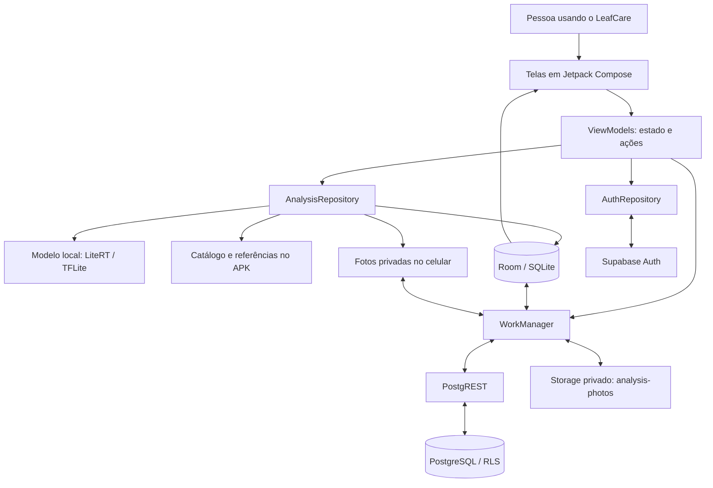
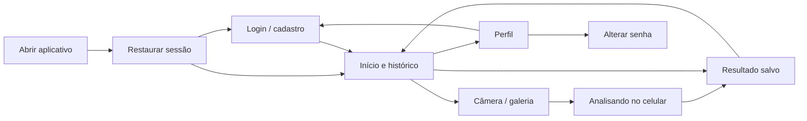
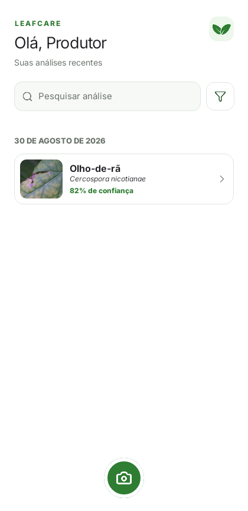
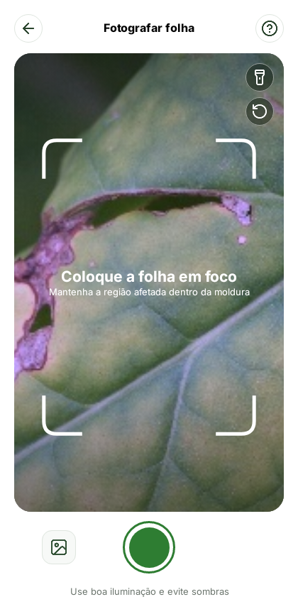
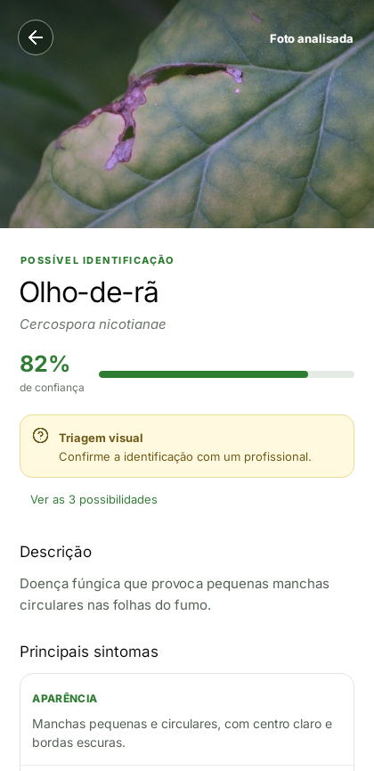
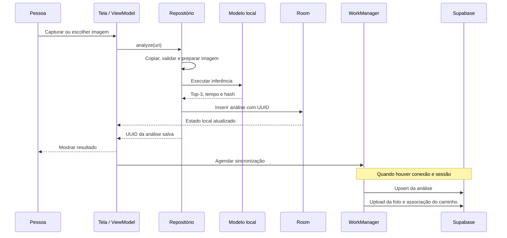
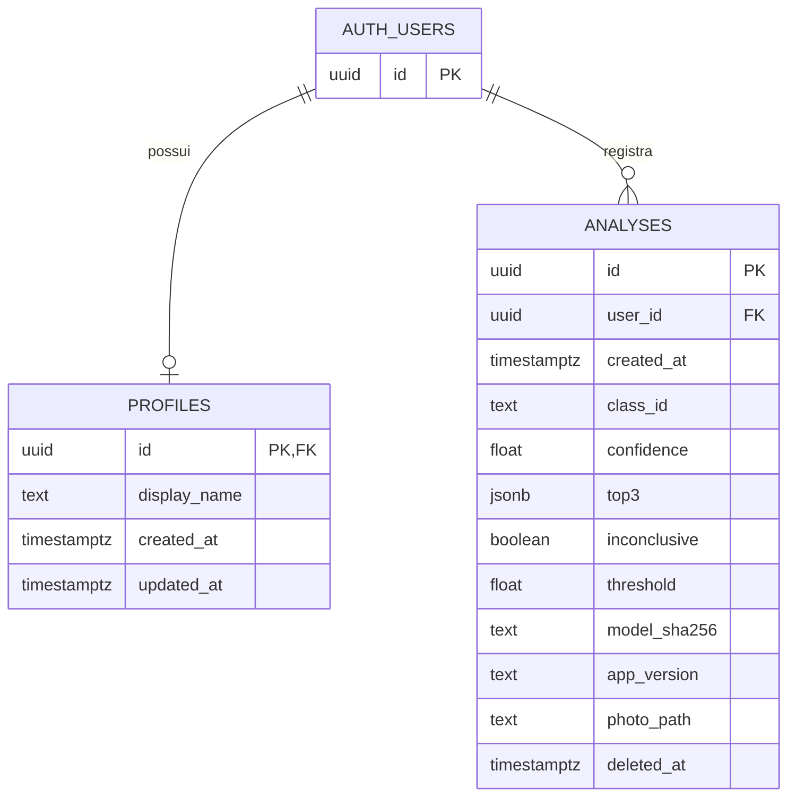
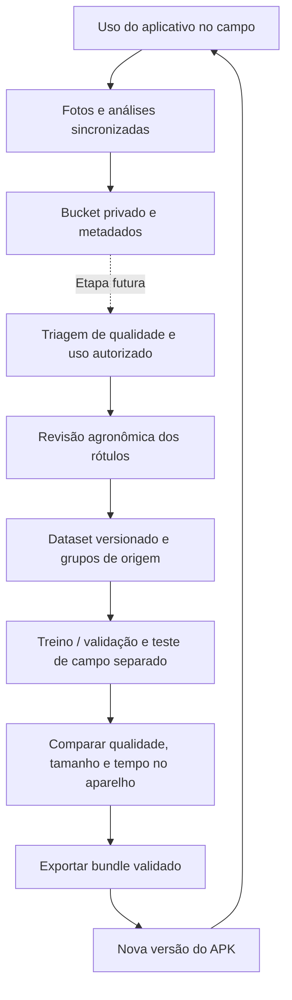

# LeafCare — jornada do aplicativo

Esta nota explica como o aplicativo foi construído, como uma foto vira uma análise, onde os dados ficam e como celular, Supabase e Machine Learning se conectam. Complementa a [Jornada do Machine Learning](JORNADA_MACHINE_LEARNING.md), usando o mesmo formato de propriedades YAML, callouts, diagramas e links relativos para leitura no Obsidian.

O retrato corresponde ao código da branch `refactor/auth-back-history`, no commit `a89fe4d`, e às migrations versionadas. Não foi feita inspeção do ambiente Supabase em produção durante esta documentação. Os marcos de criação vêm do histórico Git; as justificativas técnicas se apoiam no código e na documentação de arquitetura, sem presumir decisões ou conversas que não estão registradas.

> [!abstract] A ideia central
> O LeafCare é um aplicativo Android de **triagem visual de alterações em folhas de fumo**. O próprio celular classifica a imagem e salva o resultado. A internet é necessária para o primeiro acesso à conta e para os serviços remotos, mas uma sessão persistida permite analisar e consultar o histórico offline. O Supabase oferece autenticação, banco remoto e armazenamento privado de fotos; não executa o modelo.

## Navegação

- [1. O problema e as escolhas do aplicativo](#1-o-problema-e-as-escolhas-do-aplicativo)
- [2. Como o aplicativo foi criado](#2-como-o-aplicativo-foi-criado)
- [3. A arquitetura e as tecnologias](#3-a-arquitetura-e-as-tecnologias)
- [4. A experiência de uso e as telas](#4-a-experiência-de-uso-e-as-telas)
- [5. O caminho completo de uma foto](#5-o-caminho-completo-de-uma-foto)
- [6. Como a conta e a sessão funcionam](#6-como-a-conta-e-a-sessão-funcionam)
- [7. O banco local e os arquivos do aparelho](#7-o-banco-local-e-os-arquivos-do-aparelho)
- [8. O Supabase e o banco remoto](#8-o-supabase-e-o-banco-remoto)
- [9. Sincronização, exclusão e restauração](#9-sincronização-exclusão-e-restauração)
- [10. O bucket e a evolução do modelo](#10-o-bucket-e-a-evolução-do-modelo)
- [11. Segurança, limites e decisões](#11-segurança-limites-e-decisões)
- [12. Build, distribuição e validação](#12-build-distribuição-e-validação)
- [13. O que está pronto e o que falta](#13-o-que-está-pronto-e-o-que-falta)
- [14. Mapa do código e leitura no Obsidian](#14-mapa-do-código-e-leitura-no-obsidian)

## 1. O problema e as escolhas do aplicativo

Uma pessoa no campo precisa registrar uma folha, obter hipóteses sobre a alteração e consultar análises anteriores. Se cada previsão dependesse de enviar uma foto e esperar um servidor, uma conexão ruim impediria a principal função do produto. Por isso, o fluxo foi organizado ao redor do celular.

| Necessidade | Resposta no aplicativo | Por que isso ajuda |
|---|---|---|
| Analisar onde a conexão é instável | Modelo distribuído dentro do APK | A previsão não depende da rede. |
| Não perder a análise por falha de envio | Salvar primeiro no Room | A informação fica disponível antes da sincronização. |
| Usar câmera ou fotos já existentes | CameraX e seletor de documentos | Atende captura no momento e importação da galeria. |
| Consultar resultados depois | Histórico local com busca, filtros e agrupamento por dia | Facilita encontrar registros sem consultar um servidor. |
| Recuperar dados sincronizados | Conta Supabase, restauração e cache de fotos | O histórico pode ser reconstruído após reinstalação ou em outro aparelho. |
| Não apresentar toda previsão como definitiva | Top-3 e resultado inconclusivo | Expõe alternativas e permite recusar pontuações baixas. |
| Evoluir com fotos de uso real | Sincronização no bucket privado | Cria uma base de fotos que poderá ser revisada para futuras versões do modelo. |

**Offline-first** significa que a operação principal começa e termina localmente; o servidor recebe a cópia depois. Isso não significa ausência de conta: o aplicativo exige autenticação para liberar suas telas principais.

> [!warning] O significado do resultado
> A pontuação do modelo não é certeza agronômica. “Identificada” é uma categoria da interface para previsões aceitas pelo limiar, não uma confirmação por especialista. O aplicativo faz triagem e não substitui avaliação profissional.

## 2. Como o aplicativo foi criado

O Git mostra uma evolução em etapas: primeiro o aplicativo offline, depois conta e backend, depois sincronização e restauração, com ajustes de segurança e interface ao longo do caminho.

| Data | Marco verificável | Efeito no produto |
|---|---|---|
| 21/09/2026 | `17f30fa` — aplicação Android offline V3 | Base de captura, inferência, resultado e histórico local. |
| 21/09/2026 | `8669f8d`, `d0c3696`, `b8d62a7` | Limites do ViewModel, limiar definido pelo modelo e reutilização do interpretador. |
| 23/09/2026 | `4c98282` — schema, RLS e Storage | Estrutura remota de perfis, análises e fotos privadas. |
| 23/09/2026 | `15e495e`, `84cf031`, `a5ff292` | Integração e ajustes de autenticação, perfil e logout. |
| 24/09/2026 | `b3cc6d8` — sincronização offline-first | Fila persistente de análises locais para o servidor. |
| 24/09/2026 | `f0151f6` — sincronização privada de fotos | Upload separado das imagens para o bucket. |
| 24/09/2026 | `9a80c3e`, `c8182eb` | Restauração de análises remotas e download das fotos para cache local. |
| 24/09/2026 | `41ae5d5` — isolamento entre usuários | Proteção para troca de conta no mesmo celular. |
| 25–29/09/2026 | Recuperação de senha, confirmação por link e cooldowns | Fluxos de e-mail com retorno ao aplicativo e tratamento de limites de envio. |
| 29/09/2026 | `3adbcfc` — preparação da versão 1.0.0 | Marco de release registrado no repositório. |
| 05/10/2026 | `6e24a0b` — ensemble calibrado integrado | Atualização do bundle de inferência distribuído pelo app. |
| 06/10/2026 | `c0458b1`, `de74e24`, `a89fe4d` | Botão Voltar nos fluxos Auth, APK nomeado por versão/commit e histórico com dias recolhíveis. |

Essa ordem ajuda a entender o desenho atual: o banco remoto foi conectado a um fluxo local já existente. A sincronização não passou a ser uma condição para mostrar o resultado.

## 3. A arquitetura e as tecnologias



### 3.1 O papel de cada peça

| Tecnologia | Uso no LeafCare |
|---|---|
| Kotlin | Linguagem do aplicativo Android. |
| Jetpack Compose e Material 3 | Componentes, layout, estados visuais e tema. |
| Navigation Compose | Rotas de histórico, câmera, resultado, perfil e senha. |
| ViewModel, StateFlow e coroutines | Estado observável e tarefas sem bloquear a interface. |
| CameraX | Preview e captura vinculados ao ciclo de vida da tela. |
| Room sobre SQLite | Persistência estruturada e observação do histórico local. |
| LiteRT com API `Interpreter` TFLite | Execução do modelo no aparelho. |
| Coil | Exibição das fotos e das referências nas telas. |
| Supabase Auth | Cadastro, login, sessão e operações de senha. |
| PostgreSQL e PostgREST | Dados remotos acessados pela API do Supabase. |
| Supabase Storage | Arquivos das fotos, separados dos registros de análise. |
| WorkManager | Trabalho persistente em segundo plano, com condição de rede e retry. |
| Gradle, Android Gradle Plugin e KSP | Build, empacotamento e geração de código do Room. |
| GitHub Actions | Validações automatizadas e disponibilização de APK debug. |

### 3.2 Por que Android nativo?

A documentação de arquitetura registra Kotlin e Compose pela integração direta com CameraX, Room, WorkManager e LiteRT, sem ponte de um framework multiplataforma. Essa escolha atende o escopo Android e permite usar os recursos de câmera, persistência e execução em segundo plano do próprio sistema.

O projeto configura Android mínimo API 26, correspondente ao Android 8.0, e `compileSdk`/`targetSdk` 35. O desenvolvimento usa JDK 17. Esses valores são a configuração do repositório, não uma recomendação de atualização de dependências.

### 3.3 Camadas sem infraestrutura extra

As telas exibem estado e encaminham ações; os ViewModels coordenam as operações; os repositórios e serviços cuidam dos dados. `LeafCareApplication` cria, de forma lazy, banco, catálogo, repositório/classificador e cliente Supabase compartilhados. Não há framework adicional de injeção de dependências nessa montagem.

`LeafCareViewModel` concentra análise, exclusão, erros e eventos de navegação. `AuthViewModel` organiza formulários, bootstrap da sessão, recuperação e navegação de autenticação. O app usa `StateFlow` e coleta com ciclo de vida para atualizar a interface conforme o estado muda.

## 4. A experiência de uso e as telas



### 4.1 Início e histórico

A tela inicial é o próprio histórico. Ela mostra saudação com o nome da conta, registros em ordem decrescente de criação, acesso ao perfil e botão para nova análise.

A busca considera o título apresentado, o identificador da classe e o nome científico, sem diferenciar maiúsculas/minúsculas. Os filtros são **Todas**, **Identificadas** e **Inconclusivas**. O agrupamento usa a data no fuso horário do aparelho; cada dia pode ser expandido ou recolhido com animação. Busca, filtro e dias recolhidos usam `rememberSaveable`, preservando esses estados nas recriações compatíveis da tela.

### 4.2 Captura, galeria e ajuda

A tela de câmera pede a permissão Android e usa CameraX para preview e captura. Flash e troca de câmera dependem dos recursos disponíveis no aparelho. A galeria usa `OpenDocument` para selecionar JPEG, PNG, WebP ou BMP, sem precisar ler indiscriminadamente todos os arquivos do usuário.

Um painel de ajuda oferece instruções de captura. O enquadramento importa porque o processamento recorta a região central quadrada; partes relevantes da folha fora dessa região podem não entrar na imagem usada pelo modelo.

### 4.3 Resultado e conteúdo educativo

O resultado reúne foto, hipótese principal, pontuação, alternativas Top-3, data e informações da análise. Também apresenta conteúdo do catálogo: descrição, aparência, região afetada, evolução dos sintomas, condições favoráveis e orientação. Imagens de referência podem ser ampliadas.

Esses textos vêm de `diseases.json`, e as referências ficam em `assets/references/`. Não são respostas geradas por IA ou consultadas em um servidor a cada análise. O catálogo usa a classe prevista como chave, e pode sinalizar conteúdo ainda não revisado. As fontes e licenças das referências estão no [manifesto de referências](../legal/referencias_manifest.csv).

No caso inconclusivo, a orientação é específica e as hipóteses continuam sendo alternativas, não diagnósticos confirmados. A tela permite voltar, fazer outra foto ou solicitar exclusão com confirmação.

### 4.4 Identidade visual e capturas existentes

O tema usa verde, fundos claros, fonte Inter, bordas e botões arredondados. Cores, tipografia e componentes compartilhados estão em `LeafCareTheme.kt`; os ícones são recursos locais. A centralização reduz diferenças entre telas e mantém os elementos visuais disponíveis offline.

As capturas abaixo são **registros históricos do visual V3**, não screenshots produzidos ou validados na versão 1.1.2. O histórico atual já recebeu mudanças posteriores, como filtros compactos e agrupamentos recolhíveis.







## 5. O caminho completo de uma foto

### 5.1 Da seleção ao arquivo privado

1. A câmera gera uma captura temporária, ou o seletor entrega uma URI da imagem escolhida.
2. O ViewModel marca a operação como ocupada e impede uma segunda análise simultânea pela interface.
3. `AnalysisRepository` gera um UUID, que será a identidade da análise tanto local quanto remotamente.
4. A imagem é copiada para `filesDir/photos/{uuid}.img`, no armazenamento privado do aplicativo.
5. A cópia é limitada a **30 MB**. O decoder verifica formato, dimensões válidas e limite de **16 megapixels**.

Copiar o arquivo permite consultar a foto posteriormente sem depender de uma URI externa continuar acessível. A extensão `.img` é uma convenção de armazenamento, não um novo formato de imagem.

### 5.2 Preparação e inferência

`ImageDecoder` decodifica em sRGB e corrige orientação e espelhamento EXIF. `PixelPreprocessor` faz recorte central quadrado e resize bilinear para `224 × 224`, segundo o contrato `center_crop_bilinear_integer_v1`. O resultado vira tensor RGB `float32` com shape `[1,224,224,3]`, na faixa `0–255`.

O APK inclui `leafcare.tflite`, `classes.json` e `model_metadata.json`. O classificador valida hashes, ordem das classes, shapes, tipos de tensor e contrato do processamento. O interpretador e os buffers são preparados para reutilização; a execução usa duas threads, e um `Mutex` no repositório serializa operações de análise.

O bundle atual contém dois MobileNetV3Small e um MobileNetV3Large. A média das saídas e a calibração por temperatura já estão dentro do grafo. O Android recebe as pontuações finais, ordena as classes e guarda as três maiores. O limiar vem do metadata: no bundle atual, aproximadamente **0,631628**.

> [!example] Como aparece um inconclusivo
> Se a maior pontuação for 0,55 e o limiar for 0,631628, a análise será marcada como inconclusiva. O app ainda guarda a primeira hipótese e o Top-3 para referência. O limiar não é uma configuração livre escolhida pelo usuário na tela.

### 5.3 Persistência e resposta

Depois da inferência, o repositório grava a análise no Room. Só então emite o UUID para abrir a tela de resultado e agenda a sincronização. Se houver falha antes da gravação, remove o arquivo criado para aquela tentativa; o bitmap também é liberado após o uso. A conclusão da gravação local é protegida contra cancelamento da coroutine nesse trecho.



O campo `inferenceMs` mede a chamada ao interpretador. Não inclui cópia, decode, processamento, banco ou renderização. Portanto, ele não comprova sozinho a meta de até três segundos para o fluxo completo no Galaxy A06.

## 6. Como a conta e a sessão funcionam

### 6.1 Cadastro e login

O cadastro envia e-mail, senha e `display_name` ao Supabase Auth. Uma trigger do banco cria `public.profiles` a partir do novo usuário em `auth.users`. A saudação/perfil do aplicativo usa o nome dos metadados do usuário autenticado; a existência da tabela `profiles` não significa que cada tela faz uma consulta a ela.

O código suporta confirmação por e-mail: se o cadastro não retornar uma sessão, apresenta a orientação para confirmar. O link pode retornar ao aplicativo por `leafcare://auth/confirm-email`. A exigência efetiva de confirmação depende também da configuração do projeto Supabase.

No login, o backend valida as credenciais, e o SDK administra a persistência da sessão. `AuthRepository` traduz erros para mensagens compreensíveis, como senha incorreta, e-mail não confirmado, indisponibilidade ou falta de conexão.

### 6.2 Abertura offline e controle de entrada

Ao iniciar, o aplicativo restaura a sessão armazenada. Enquanto esse bootstrap não termina, mostra carregamento; isso evita exibir login antes de saber se a pessoa já estava autenticada.

Uma sessão local permite entrar no fluxo principal sem uma nova chamada de login. Erros de rede na observação da sessão não apagam imediatamente o estado local. As operações remotas continuam dependentes de conectividade e de credenciais aceitas pelo serviço; estar usando o classificador offline não garante que um envio remoto será autorizado.

### 6.3 Recuperação e alteração de senha

A recuperação solicita um e-mail com retorno por `leafcare://auth/reset-password`. `MainActivity` trata links tanto na abertura quanto em uma nova intent recebida com o app já em execução.

O fluxo reconhece código de troca de sessão ou tokens transportados pelo link. A sessão de recuperação é mantida em um estado separado de navegação: não libera o histórico apenas porque apareceu uma sessão autenticada de recuperação. Há marcador persistido para continuar corretamente após recriação do processo, controles de reenvio e cooldown padrão de 60 segundos, ajustável pela informação do servidor quando disponível.

Também existe alteração de senha a partir do perfil autenticado. O servidor continua sendo a autoridade sobre limites de envio e validade dos links; o countdown da interface organiza a experiência, mas não remove restrições do serviço.

### 6.4 Logout e troca de conta

O logout usa o escopo global do SDK. Quando a sessão é encerrada, o gate descarta a navegação principal e retorna ao fluxo Auth, impedindo que o botão Voltar reabra uma tela autenticada.

O logout, sozinho, não limpa o histórico local. No próximo acesso, `ensureAccountIsolation` compara o usuário com `last_account_user_id`, guardado em SharedPreferences. Se for a mesma conta, mantém os dados; se houver dados atribuídos a outra conta, ou sem atribuição conhecida, limpa Room e fotos locais antes de liberar o acesso.

Essa estratégia existe porque a entidade local não tem coluna de proprietário: o banco local representa uma conta por vez. Análises ainda não sincronizadas podem ser perdidas ao trocar de conta. A proteção privilegia não mostrar nem enviar registros de uma pessoa como se fossem de outra.

## 7. O banco local e os arquivos do aparelho

O Room usa o arquivo `leafcare.db`, com tabela `analyses`. A UI observa `Flow`s do DAO; o banco local é a fonte da lista, inclusive depois de uma restauração remota. O banco não guarda os bytes da foto: guarda o nome do arquivo correspondente.

| Grupo | Campos locais | Para que servem |
|---|---|---|
| Identidade | `id`, `photoName`, `createdAt` | Relacionar registro, arquivo e data. |
| Resultado | `classId`, `displayName`, `scientificName`, `confidence` | Registrar a hipótese principal. |
| Alternativas | `top3Json` | Preservar os três resultados em JSON. |
| Política | `inconclusive`, `threshold` | Guardar a decisão e o limiar usados naquele momento. |
| Rastreabilidade | `inferenceMs`, `modelSha256` | Relacionar a execução ao modelo efetivamente usado. |
| Sincronização | `syncStatus`, `deletedAt`, `photoSyncStatus` | Controlar envio, exclusão e disponibilidade da foto. |

O schema local está na versão 3. A migration 1→2 acrescentou estado de sync e exclusão; a 2→3 acrescentou estado de foto. As migrations permitem evoluir instalações existentes sem apagar o histórico simplesmente por atualizar essas versões do banco.

O catálogo e as referências educativas ficam no APK, separados das fotos pessoais. Uma atualização de catálogo pode mudar o conteúdo explicativo exibido ao abrir um registro antigo; a previsão, o limiar e o hash salvos continuam sendo os da análise original. Não há reclassificação automática do histórico após atualizar o modelo.

## 8. O Supabase e o banco remoto

### 8.1 Três serviços, três responsabilidades

**Auth** administra identidades e sessões. **PostgreSQL**, exposto pela API PostgREST, armazena os registros estruturados. **Storage** armazena arquivos das fotos. O aplicativo acessa esses serviços pelo cliente `supabase-kt`, configurado uma vez em `SupabaseClientHolder`, com os módulos Auth, PostgREST e Storage.

Não há um servidor próprio de classificação entre o celular e esses serviços, nem chamada a um modelo de linguagem para produzir o resultado ou os textos educativos.

### 8.2 Relações do banco



O diagrama resume os campos; `analyses` também tem `display_name`, `scientific_name`, `inference_ms` e `updated_at`. `profiles.id` é o mesmo UUID de `auth.users.id`; `analyses.user_id` identifica o proprietário. As referências usam `ON DELETE CASCADE`, mas o aplicativo não implementa por isso, automaticamente, um fluxo de exclusão de conta.

O `top3` remoto é JSONB, enquanto o Room usa uma string JSON. Datas locais em milissegundos são convertidas para timestamps ISO no envio. A análise remota registra ainda `app_version`, útil para relacionar um registro ao aplicativo que o sincronizou, e `model_sha256`, que identifica os pesos utilizados.

As triggers atualizam `updated_at`; índices apoiam consultas por usuário/data e registros excluídos. Existe timestamp de atualização, mas a restauração atual não usa um protocolo incremental por esse timestamp: busca as análises acessíveis e faz merge local.

### 8.3 Banco versus bucket

```text
PostgreSQL: public.analyses
  id: UUID da análise
  user_id: UUID da conta
  resultado, pontuações, versão, hash e photo_path
                         │
                         └── referência de aplicação
                                      │
Storage: bucket privado analysis-photos
  {user_id}/{analysis_id}.jpg
  conteúdo da foto
```

`photo_path` é uma referência mantida pelo código, não uma chave estrangeira SQL para o objeto do Storage. Por isso, enviar a linha e enviar a foto são operações separadas, sem uma transação única abrangendo ambos os serviços.

Na primeira gravação remota, o mapeamento usa o nome local da foto. Depois de subir o arquivo, atualiza `photo_path` para o caminho remoto. O download atual deriva o caminho da conta autenticada e do UUID, em vez de confiar em um caminho arbitrário armazenado na linha.

> [!info] Extensão não significa conversão
> O caminho remoto termina em `.jpg`, mas o upload atual envia os bytes do arquivo local sem uma etapa de recodificação para JPEG. Uma foto importada em PNG ou WebP pode manter esse conteúdo. Um futuro processo de triagem precisa verificar o formato real, e não apenas a extensão.

### 8.4 Migrations e reprodução

As quatro migrations de `supabase/migrations/` criam schema, perfil automático, bucket/policies e endurecimento de segurança. Elas descrevem como reproduzir a estrutura; conferir essas migrations não equivale a auditar o backend remoto em execução.

O arquivo [SUPABASE.md](../SUPABASE.md) detalha a configuração e aplicação. Nenhum schema, policy ou dado remoto foi alterado para produzir esta nota.

## 9. Sincronização, exclusão e restauração

### 9.1 Agendamento e tentativas

Uma análise nova, uma exclusão e a entrada autenticada podem agendar sincronização; `LeafCareApplication` também agenda ao iniciar para retomar pendências. O trabalho se chama `sync-analyses`, usa fila única com política `APPEND`, exige `NetworkType.CONNECTED` e tem backoff exponencial com base de 30 segundos.

O WorkManager persiste o trabalho e permite retomá-lo após encerramento/recriação do processo, conforme as condições e o agendamento do Android. Não garante envio instantâneo: estar conectado não significa que o serviço esteja acessível, e o sistema pode adiar execução.

O worker verifica sessão, faz o envio, restaura registros e baixa fotos. Em falhas, solicita retry enquanto `runAttemptCount` não atinge o limite configurado de 5. Depois, encerra aquela sequência de retries; pendências permanecem para um novo gatilho. Portanto, não há um loop infinito imediato nem um cron de sincronização periódica configurado nesse fluxo.

### 9.2 Estados da análise e da foto

| Estado da análise | Significado |
|---|---|
| `PENDING_UPLOAD` | Criada localmente e ainda sem confirmação remota. |
| `SYNCED` | Linha confirmada no banco remoto. |
| `PENDING_DELETE` | Exclusão local solicitada, aguardando confirmação remota. |
| `ERROR` | Uma operação falhou e permanece disponível para nova tentativa. |

| Estado da foto | Significado |
|---|---|
| `PENDING_UPLOAD` | Arquivo local aguardando upload. |
| `SYNCED` | Upload confirmado ou download/cache concluído. |
| `ERROR` | Upload falhou. |
| `REMOTE_ONLY` | Registro restaurado; foto ainda precisa ser obtida localmente. |

A linha pode estar `SYNCED` enquanto a foto ainda está pendente ou em erro. Os estados são independentes justamente porque não existe uma transação compartilhada entre banco e Storage.

O envio usa **upsert** pelo UUID local: insere se não existir e atualiza se já existir. O upload da foto também permite upsert e usa caminho determinístico. Uma repetição após falha não precisa criar outra análise ou outro nome de arquivo.

### 9.3 Excluir sem ressuscitar registros

Excluir primeiro marca `deletedAt` e `PENDING_DELETE`. A consulta do histórico omite a linha imediatamente, mas o registro continua no banco local como **tombstone**, uma marca de exclusão pendente.

Na sincronização, o código remove a foto remota quando aplicável, marca `deleted_at` na linha remota e, após confirmação, remove linha e arquivo locais. A linha remota permanece como soft-delete; não é apagada fisicamente por esse fluxo.

Se ocorrer erro, o tombstone permanece. A fila de upload não seleciona linhas com `deletedAt`, evitando que uma exclusão offline vire um novo envio de registro ativo. A restauração também preserva tombstones locais.

Essa exclusão é uma operação distribuída: uma falha entre remover o objeto e marcar a linha pode deixar um estado parcial até a tentativa seguinte. Os retries e estados persistidos existem para lidar com isso, não para prometer atomicidade entre serviços.

### 9.4 Reinstalação e outro aparelho

Depois da autenticação, a sincronização pode buscar registros remotos e reconstruir o Room. Ela não precisa executar de novo o modelo para restaurar a análise.

| Situação encontrada | Política de merge |
|---|---|
| Remoto ativo, UUID ausente localmente | Insere como `SYNCED` e foto `REMOTE_ONLY`. |
| UUID já existe localmente | Preserva o registro local, inclusive upload ou exclusão pendente. |
| Remoto excluído, sem registro local | Não importa como análise ativa. |
| Remoto excluído, local ativo e `SYNCED` | Remove registro e foto locais. |
| Remoto excluído, local pendente/tombstone | Preserva a pendência local. |
| Linha remota malformada | Ignora aquela linha sem bloquear toda a restauração. |

Depois de inserir o histórico textual, baixa fotos autenticadas do bucket. O download grava um temporário e renomeia para o arquivo final, evitando aceitar arquivo parcialmente baixado. Falha mantém `REMOTE_ONLY`, disponível para tentativa futura, sem apagar a análise.

Com as fotos em cache, elas ficam acessíveis offline. Uma reinstalação só recupera o que chegou ao backend: registros exclusivamente locais não sobrevivem à remoção dos dados do app. O manifesto desativa backup Android automático (`allowBackup=false`), portanto essa recuperação depende do Supabase.

> [!warning] Limites de sincronização entre aparelhos
> Há suporte de código para restauração e propagação de exclusões, mas o QA histórico não executou restore em um segundo aparelho por indisponibilidade. O app também não instala Supabase Realtime nesse cliente: novas alterações remotas aparecem numa execução de sincronização, não por uma assinatura ao vivo.

## 10. O bucket e a evolução do modelo

### 10.1 O que existe hoje

O bucket privado **`analysis-photos`** já é usado para sincronizar fotos de análises, restaurá-las e mantê-las vinculadas à conta. O upload ocorre automaticamente no fluxo de sincronização quando há sessão e conexão; a previsão local não precisa esperar esse upload.

Como passam a existir fotos do uso real acompanhadas da saída e do hash do modelo, o bucket também pode servir de origem para a triagem de novos dados. Essa intenção está registrada na seção 10.3 da [Jornada do Machine Learning](JORNADA_MACHINE_LEARNING.md#103-fotos-novas-e-triagem-do-supabase).

**Armazenar fotos não é treinar um modelo.** O repositório não implementa extração automática do bucket para o dataset, revisão de rótulos, retreinamento contínuo nem atualização remota automática dos pesos no aplicativo.

### 10.2 O ciclo de melhoria previsto



O loop reúne mecanismos já existentes e etapas futuras. Sua finalidade é aproximar o modelo das condições reais de campo: fundos, iluminação, aparelhos, estágio dos sintomas e classes pouco representadas.

Para transformar as fotos em dados úteis, será necessário:

1. Definir uso autorizado, seleção e rastreabilidade das fotos; armazenamento para histórico não equivale automaticamente a consentimento específico para treino.
2. Separar imagens legíveis, folhas relevantes e casos com possibilidade de revisão.
3. Obter rótulos revisados, registrando quem ou qual fonte os confirmou.
4. Identificar duplicatas e agrupar imagens relacionadas por planta, propriedade ou sessão quando houver informação disponível.
5. Reservar grupos para teste de campo independente antes de usar os demais em treino ou seleção de modelos.
6. Versionar dados e avaliar novos candidatos com métricas por classe, cobertura das previsões aceitas e custo real no aparelho.
7. Integrar um bundle aprovado e distribuir uma nova versão do aplicativo.

> [!warning] A previsão não é um rótulo confirmado
> O `class_id` salvo é a saída do modelo. Usá-lo diretamente como verdade de treino pode reforçar os erros do próprio sistema. O schema atual não possui uma estrutura específica de revisão agronômica, consentimento de treino ou identificação de planta/propriedade/sessão; esses requisitos do ciclo futuro não devem ser tratados como já implementados.

O hash e a versão ajudam a investigar falhas: “qual modelo gerou essa hipótese?”. Não respondem “qual é o diagnóstico verdadeiro?”. As duas informações têm funções distintas.

### 10.3 Como o modelo novo chegaria ao usuário

Hoje os pesos estão em `assets/`, dentro do APK. O pipeline Python exporta o TFLite e seus metadados; a integração verifica a consistência e empacota esses arquivos. Para receber o próximo modelo, a pessoa precisa instalar uma versão do aplicativo que o contenha. O app não aprende sozinho durante o uso, nem baixa novos pesos do bucket.

Uma análise antiga preserva o hash e resultado original; não é automaticamente atualizada pelo modelo novo. Isso mantém rastreabilidade entre versões.

## 11. Segurança, limites e decisões

### 11.1 Identidade e autorização

A configuração Android usa URL do projeto e chave publicável, lida de `local.properties` ou variável de ambiente de CI. Uma chave publicável identifica o projeto para o cliente; **não concede acesso administrativo**. A sessão autenticada e as regras do backend determinam o acesso.

As tabelas `profiles` e `analyses` têm RLS: as policies comparam `auth.uid()` ao proprietário e são direcionadas a usuários autenticados. No Storage, o bucket é privado e as policies conferem se a primeira pasta do caminho corresponde ao UUID da sessão. Assim, a proteção remota não depende apenas dos filtros enviados pelo Android.

A migration de hardening também revoga execução pública direta das funções internas de trigger. O APK não deve conter `service_role`, senha do banco ou segredo JWT. O manifesto bloqueia tráfego HTTP em texto claro e desativa backup automático.

Esses mecanismos não equivalem a declarar criptografia própria do banco local ou do arquivo de foto: o código usa o armazenamento privado do Android, sem adicionar uma camada específica de criptografia do Room.

### 11.2 Compromissos do desenho atual

| Escolha | Benefício | Limite ou custo |
|---|---|---|
| Inferência local | Classificação sem rede | Pesos ocupam espaço no APK e precisam caber no aparelho. |
| Room observado pela UI | Histórico disponível mesmo se o backend falhar | É preciso gerenciar merge e pendências. |
| Fotos local e remotamente | Cache offline e recuperação | Consome armazenamento local, remoto e tráfego. |
| Sincronização em segundo plano | Resultado não espera upload | Servidor pode estar desatualizado até o próximo envio. |
| UUID e upsert | Retries sem criar novos identificadores | Não substitui uma política de conflitos para toda alteração possível. |
| Estado de foto separado | Falha de upload não invalida resultado | Registro pode existir temporariamente sem foto disponível. |
| Banco local de uma conta por vez | Implementação simples com isolamento | Troca de conta pode eliminar pendências ainda não enviadas. |
| Supabase gerenciado | Auth, banco e arquivos sem backend próprio para o MVP | Serviços remotos dependem de rede, configuração, limites e custos do provedor. |
| Conteúdo educativo local | Consulta offline | Revisões de conteúdo chegam pelo APK. |

O classificador não possui uma validação agronômica automática da cena: conseguir decodificar uma imagem e retornar scores não confirma que ela é uma folha de fumo válida. O threshold também não foi validado como detector geral de objetos ou classes desconhecidas.

## 12. Build, distribuição e validação

### 12.1 Do repositório ao APK

O Gradle compila Kotlin/Compose, gera código do Room via KSP, inclui recursos e assets e empacota o aplicativo. `verifySupabaseConfig` impede build com placeholder da chave. `verifyModelAssets` verifica presença de modelo treinado, classes e hashes; integra o pre-build de release e pode ser executado explicitamente para debug.

Com JDK 17, SDK 35 e configuração local já preparados, os comandos Linux/macOS dentro de `android-app/` são:

```bash
./gradlew testDebugUnitTest verifyModelAssets lintDebug assembleDebug
```

No Windows, substitua `./gradlew` por `.\gradlew.bat` nos comandos acima.

O artefato de distribuição debug fica em:

```text
android-app/app/build/outputs/apk/distribution/debug/
  leafcare-<versão>-<commit>.apk
```

O caminho padrão `app/build/outputs/apk/debug/app-debug.apk` também continua existindo. O nome com versão e commit permite identificar qual build foi testada; ele não indica que alterações não commitadas foram incorporadas ao hash.

### 12.2 Integração contínua

O workflow `.github/workflows/ci.yml` cobre push em `main`, `refactor/**`, `experiment/**` e pull requests para `main`. O job Python executa testes e valida o bundle. O job Android executa testes unitários, verificação de assets, lint e assemble, e publica relatórios e APK como artefatos do GitHub Actions.

Esse workflow não publica automaticamente em loja nem executa testes instrumentados com aparelho/emulador. Também não transforma documentação histórica de QA em evidência de um teste novo.

### 12.3 O que os testes verificam

Os testes existentes cobrem política Top-3/inconclusivo, contrato do ensemble, mapeamento de sync, DAO, retries/restore, isolamento de contas, sessão/navegação Auth, validação de formulários, sanitização de erros, links de recuperação e partes da interface. Há teste instrumentado de persistência de histórico, que exige dispositivo ou emulador.

O [registro de QA](../TESTING.md) contém evidências históricas de 29/09/2026: análises online/offline, sync, exclusão, reinstalação, restore, fotos e isolamento, entre outros itens. Ele diferencia verificações parciais, visuais e não executadas. Esses resultados não devem ser atribuídos automaticamente à versão atual.

## 13. O que está pronto e o que falta

### Implementado no código

- [x] Aplicativo Android nativo com câmera, galeria e ajuda.
- [x] Classificação local com bundle TFLite e política Top-3/inconclusivo.
- [x] Catálogo e referências educativas disponíveis no APK.
- [x] Histórico Room, busca, filtros e dias recolhíveis.
- [x] Cadastro, confirmação por link, login, sessão persistida, perfil, logout e senha.
- [x] Sincronização de análises e fotos, retry e tombstones de exclusão.
- [x] Restauração remota com cache local das fotos.
- [x] Isolamento local entre contas e policies remotas por usuário nas migrations.
- [x] Build debug identificado por versão/commit e CI com artefato APK.

“Implementado” descreve o código presente, não aprovação completa de campo de todas as combinações.

### Validações ou evolução pendentes

- [ ] Medir o tempo completo de análise no Galaxy A06, incluindo primeira execução e uso prolongado.
- [ ] Confirmar a meta de até três segundos com medições reproduzíveis.
- [ ] Completar QA entre dois aparelhos e os casos parciais documentados.
- [ ] Revisar fotos de campo e estabelecer rótulos confirmados e partições independentes.
- [ ] Estruturar uso autorizado e rastreabilidade do conjunto derivado do bucket.
- [ ] Executar novo treino/avaliação e distribuir outro bundle quando houver dados revisados e evidência de melhoria.

Esses itens são estado e possibilidades de evolução. Esta documentação não iniciou coleta adicional, treinamento, mudanças de schema ou infraestrutura.

## 14. Mapa do código e leitura no Obsidian

### 14.1 Onde encontrar cada responsabilidade

Os caminhos abaixo são relativos à raiz do repositório. As classes Android estão em `android-app/app/src/main/java/br/com/leafcare/`.

| Assunto | Fonte principal |
|---|---|
| Montagem dos serviços e isolamento | [`LeafCareApplication.kt`](../../android-app/app/src/main/java/br/com/leafcare/LeafCareApplication.kt) |
| Gate, rotas e recebimento de links | [`MainActivity.kt`](../../android-app/app/src/main/java/br/com/leafcare/MainActivity.kt) |
| Estado de análise e ações da UI | [`ui/LeafCareViewModel.kt`](../../android-app/app/src/main/java/br/com/leafcare/ui/LeafCareViewModel.kt) |
| Histórico e filtros | [`ui/HistoryScreen.kt`](../../android-app/app/src/main/java/br/com/leafcare/ui/HistoryScreen.kt) |
| Captura e seleção | [`ui/CameraScreen.kt`](../../android-app/app/src/main/java/br/com/leafcare/ui/CameraScreen.kt) |
| Resultado e conteúdo | [`ui/ResultScreen.kt`](../../android-app/app/src/main/java/br/com/leafcare/ui/ResultScreen.kt), [`data/DiseaseCatalog.kt`](../../android-app/app/src/main/java/br/com/leafcare/data/DiseaseCatalog.kt) |
| Tema e componentes | [`ui/LeafCareTheme.kt`](../../android-app/app/src/main/java/br/com/leafcare/ui/LeafCareTheme.kt) |
| Conta e comunicação Auth | [`auth/AuthRepository.kt`](../../android-app/app/src/main/java/br/com/leafcare/auth/AuthRepository.kt), [`auth/AuthViewModel.kt`](../../android-app/app/src/main/java/br/com/leafcare/auth/AuthViewModel.kt) |
| Cliente remoto | [`auth/SupabaseClientHolder.kt`](../../android-app/app/src/main/java/br/com/leafcare/auth/SupabaseClientHolder.kt) |
| Arquivos, análise e gravação | [`data/AnalysisRepository.kt`](../../android-app/app/src/main/java/br/com/leafcare/data/AnalysisRepository.kt) |
| Schema, DAO e migrations locais | [`data/AppDatabase.kt`](../../android-app/app/src/main/java/br/com/leafcare/data/AppDatabase.kt) |
| Contrato e inferência | [`ml/LeafClassifier.kt`](../../android-app/app/src/main/java/br/com/leafcare/ml/LeafClassifier.kt) |
| Decode e pixels | [`ml/ImageDecoder.kt`](../../android-app/app/src/main/java/br/com/leafcare/ml/ImageDecoder.kt), [`ml/PixelPreprocessor.kt`](../../android-app/app/src/main/java/br/com/leafcare/ml/PixelPreprocessor.kt) |
| Sync, merge e downloads | [`data/AnalysisSyncRunner.kt`](../../android-app/app/src/main/java/br/com/leafcare/data/AnalysisSyncRunner.kt) |
| JSON e chamadas remotas | [`data/AnalysisSyncApi.kt`](../../android-app/app/src/main/java/br/com/leafcare/data/AnalysisSyncApi.kt) |
| Agendamento e retry | [`data/SyncAnalysesWorker.kt`](../../android-app/app/src/main/java/br/com/leafcare/data/SyncAnalysesWorker.kt) |
| Schema, triggers e RLS remotos | [`supabase/migrations/`](../../supabase/migrations/) |
| Recursos embarcados | [`assets/`](../../android-app/app/src/main/assets/) |
| Build e distribuição | [`app/build.gradle.kts`](../../android-app/app/build.gradle.kts), [`ci.yml`](../../.github/workflows/ci.yml) |
| Referência de arquitetura | [ARCHITECTURE.md](../ARCHITECTURE.md) |
| Setup e QA | [DEVELOPMENT.md](../DEVELOPMENT.md), [TESTING.md](../TESTING.md) |
| Treinamento e próximos dados | [Jornada do Machine Learning](JORNADA_MACHINE_LEARNING.md) |

### 14.2 Abrir esta nota

Abra a pasta do repositório `leafcare` como vault no Obsidian e abra `docs/explain/JORNADA_APLICATIVO.md`. Assim, os links relativos para as outras notas e as imagens existentes mantêm seus caminhos. Use o modo de leitura para renderizar os callouts e diagramas Mermaid, sem necessidade de plugin adicional para esses recursos.

Se preferir um vault separado, copie a estrutura necessária preservando os caminhos; copiar somente este `.md` deixa o texto legível, mas não leva as imagens nem os arquivos referenciados.
