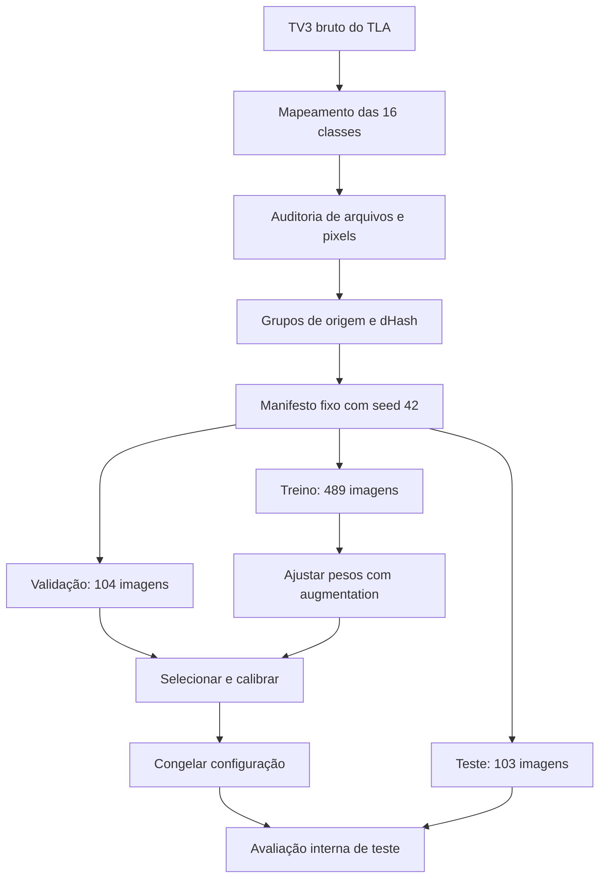
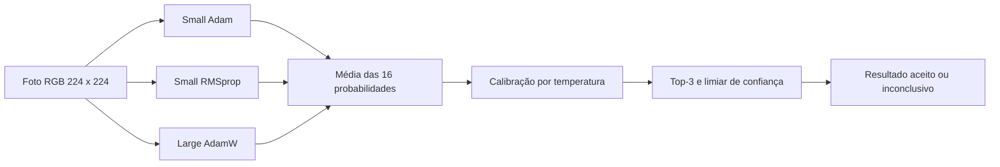

# LeafCare — jornada do Machine Learning

Esta nota explica a preparação dos dados, as rodadas de experimentos, a escolha do modelo e sua chegada ao Android. Foi construída a partir dos scripts, artefatos e histórico disponíveis na `main`, após o merge do PR #3. Não houve novo treinamento durante a elaboração desta documentação.

> [!abstract] Estado atual
> O APK 1.1.0 usa **dois MobileNetV3Small e um MobileNetV3Large**, reunidos em um único TFLite. A composição foi escolhida pela validação histórica e retreinada antes da integração. No teste interno, o novo bundle acertou **84/103 imagens (81,55%)**, contra **80/103 (77,67%)** do modelo anterior. A medição do fluxo completo no Galaxy A06 e a validação independente com fotos de campo continuam pendentes.

## Navegação

- [1. O problema e os requisitos](#1-o-problema-e-os-requisitos)
- [2. O que aconteceu com os dados](#2-o-que-aconteceu-com-os-dados)
- [3. O que cada métrica responde](#3-o-que-cada-métrica-responde)
- [4. As rodadas de benchmark](#4-as-rodadas-de-benchmark)
- [5. Como chegamos à escolha do ensemble](#5-como-chegamos-à-escolha-do-ensemble)
- [6. Como o ensemble atual foi treinado](#6-como-o-ensemble-atual-foi-treinado)
- [7. Calibração e resultado inconclusivo](#7-calibração-e-resultado-inconclusivo)
- [8. Exportação e integração no Android](#8-exportação-e-integração-no-android)
- [9. Resultados, custo e limitações](#9-resultados-custo-e-limitações)
- [10. Roadmap de Machine Learning](#10-roadmap-de-machine-learning)
- [11. Como reproduzir e encontrar as evidências](#11-como-reproduzir-e-encontrar-as-evidências)

## 1. O problema e os requisitos

O LeafCare faz **triagem visual de alterações em folhas de fumo**. Recebe uma foto, calcula pontuações para 16 classes e apresenta até três hipóteses. Uma pontuação baixa pode levar a um resultado inconclusivo. A classificação não substitui avaliação agronômica.

A escolha precisa atender conjuntamente a estes requisitos:

| Requisito | Consequência para o ML |
|---|---|
| Classificar no aparelho | O modelo precisa funcionar no runtime Android; a previsão não depende de API externa. |
| Funcionar offline após autenticação | Pesos e metadados ficam no APK. Supabase atende autenticação e sincronização. |
| Espera desejada de até 3 segundos | Medir o fluxo completo no **Samsung Galaxy A06**, incluindo imagem, inferência, gravação local e apresentação. |
| Dados pequenos e desbalanceados | Usar transferência de aprendizado, métricas por classe e cuidado com sobreajuste. |
| Permitir resultado inconclusivo | Escolher o limiar na validação e acompanhar cobertura e acerto das previsões aceitas. |
| Preservar histórico e comparabilidade | Registrar modelo, hashes, classes, processamento, configuração e split. |

A animação de carregamento já existe no app. Os três segundos são uma meta de experiência, não um atraso obrigatório nem um timeout já implementado. A sincronização das fotos acontece em segundo plano.

## 2. O que aconteceu com os dados

### 2.1 Origem e seleção

O conjunto utilizado veio da seção **TV3 bruta do TLA — Tobacco Leaf Abnormality**, com imagens de folhas inteiras. A importação histórica está em [`import_tla.py`](../../machine-learning/import_tla.py) e seu resultado em [`import_report.json`](../../machine-learning/data/import_report.json).

O importador extraiu as imagens e as organizou em `data/raw/<classe>/`, usando o mapa [`tla_class_map.yaml`](../../machine-learning/tla_class_map.yaml). Os bytes das imagens selecionadas foram copiados do arquivo de origem; resize e augmentation ocorrem depois, ao carregar dados para o modelo.

As fontes TLA e TTDD tiveram SHA256 registrado. O TTDD forneceu a taxonomia e passou por auditoria: **1.571 imagens**, das quais **173** identificadas pelo importador como sintéticas pelos nomes `_aug` ou `_paste`. Isso não significa que essas imagens entraram no treino.

> [!info] Por que não usar todas as imagens disponíveis?
> Fragmentos TV6 e versões derivadas/processadas do TTDD foram excluídos. Uma folha inteira e um recorte ou versão transformada dela poderiam aparecer em partições diferentes, produzindo uma avaliação artificialmente fácil. A seleção registrada contém somente as **696 imagens TV3 brutas**.

### 2.2 Auditoria, duplicatas e grupos

O pipeline em [`leafcare/dataset.py`](../../machine-learning/leafcare/dataset.py) verifica decodificação, formato, dimensões e caminhos. Calcula dois hashes SHA256: um do arquivo e outro dos pixels RGB decodificados, incluindo o shape. Assim, consegue reconhecer uma duplicata exata de pixels mesmo quando os arquivos têm metadados diferentes.

Duplicatas na mesma classe podem ser removidas pelo pipeline. Pixels iguais em classes diferentes são tratados como conflito de rótulo e bloqueiam a preparação. **Na execução registrada, não houve arquivos inválidos, duplicatas exatas removidas ou conflitos de rótulo.** Essas são capacidades do código, não alterações que ocorreram nas 696 imagens.

A separação usa grupos construídos de duas formas:

1. O importador gera `groups.csv` usando a classe e o número `IMG` do nome original, ou o nome sem extensão quando não encontra esse número.
2. Um dHash de 64 bits aproxima a semelhança visual. Pares com distância de Hamming de até **4** são unidos ao mesmo grupo; grupos também são unidos pelos identificadores de origem.

A auditoria registrada encontrou **zero pares próximos pelo dHash**. Os agrupamentos de origem ainda foram usados. O mínimo operacional configurado foi de oito grupos por classe.

> [!warning] Limite dos grupos atuais
> O identificador de arquivo não informa planta, propriedade ou sessão de captura. Ausência de hashes/grupos compartilhados reduz formas conhecidas de vazamento, mas não comprova independência agronômica ou geográfica entre as partições.

### 2.3 Split fixo e distribuição das classes

A preparação usa seed **42** e metas **70% treino / 15% validação / 15% teste**. A função `stratified_group_split` procura uma alocação que aproxime as proporções por classe, mantendo cada grupo inteiro. O resultado efetivo foi **489 / 104 / 103**.

| Classe — ordem da saída do modelo | Treino | Validação | Teste | Total |
|---|---:|---:|---:|---:|
| `anthracnose` | 6 | 1 | 1 | 8 |
| `black_shank` | 7 | 2 | 2 | 11 |
| `brown_spot` | 35 | 8 | 7 | 50 |
| `cmv` | 35 | 8 | 8 | 51 |
| `frog_eye` | 35 | 7 | 8 | 50 |
| `genetic_abnormality` | 7 | 1 | 1 | 9 |
| `healthy` | 35 | 8 | 7 | 50 |
| `nematodes` | 29 | 6 | 6 | 41 |
| `potato_tuber_moth` | 35 | 8 | 7 | 50 |
| `pvy` | 25 | 5 | 5 | 35 |
| `sunscald` | 48 | 10 | 10 | 68 |
| `target_spot` | 35 | 7 | 8 | 50 |
| `tmv` | 46 | 10 | 10 | 66 |
| `tswv` | 7 | 1 | 1 | 9 |
| `weather_fleck` | 41 | 9 | 9 | 59 |
| `wildfire` | 63 | 13 | 13 | 89 |
| **Total** | **489** | **104** | **103** | **696** |

Os números das pastas TV3 são mapeados para slugs; a ordem final das probabilidades é a ordem de classes do manifesto, apresentada acima. Não se deve usar o número original da pasta como índice da saída.

O [`manifest.json`](../../machine-learning/data/prepared/manifest.json) registra caminho, classe, grupo, partição e hashes. Ao carregar esse manifesto, o pipeline verifica a ordem de classes, a ausência de grupos/pixels compartilhados entre partições e o SHA256 de cada imagem local.

As rodadas posteriores **reutilizaram esse split**, sem redistribuir as imagens para melhorar resultados. A preparação recusa sobrescrever um manifesto existente; uma futura versão do dataset deve ter outra pasta de preparação.

### 2.4 Processamento e augmentation

No MobileNetV3 integrado, cada imagem passa por orientação EXIF, conversão para RGB/sRGB, tratamento de transparência sobre fundo branco, recorte quadrado central e resize bilinear para **224×224**. A entrada é float32, RGB **0–255**; o rescaling faz parte de cada backbone. O resize usa arredondamento inteiro definido para corresponder ao Kotlin.

No treino atual, aplicam-se flips horizontal/vertical, rotação Keras com fator **0,08**, zoom **0,10** e contraste **0,10**, limitando os pixels a 0–255. A validação e o teste não recebem essas transformações aleatórias. Augmentation oferece variações durante o treino; não aumenta o número de fotos reais independentes.

Os outros backbones respeitaram o processamento dos respectivos checkpoints, incluindo resize/crop, interpolação e normalização. MobileCLIP2-S0 usa **256×256**; os demais candidatos executados nessa rodada usam **224×224**. Essa diferença é parte do experimento e precisa ser preservada para reproduzir suas métricas.



## 3. O que cada métrica responde

| Métrica | Pergunta respondida | Cuidado na interpretação |
|---|---|---|
| Top-1 | A primeira hipótese coincide com o rótulo? | Classes frequentes têm mais influência no total. |
| Macro-F1 | Como está o equilíbrio entre precisão e recall, dando o mesmo peso às 16 classes? | Uma troca de acerto em classe com um exemplo pode alterar muito a média. |
| Top-3 | O rótulo aparece entre as três hipóteses? | Não significa que a primeira hipótese estava certa. |
| Cobertura | Que fração das imagens supera o limiar e recebe previsão aceita? | Pode cair quando o limiar sobe. |
| Acerto entre aceitas | Das previsões que passaram pelo limiar, quantas acertaram? | Deve ser lido junto da cobertura e do número de casos aceitos. |
| NLL | Quão boas são as probabilidades atribuídas aos rótulos corretos? | É usada na calibração; difere de acurácia. |
| Mediana / P95 de tempo | Qual o tempo típico e qual cobre 95% das medições? | Depende do aparelho, runtime e etapas incluídas. |

A **Macro-F1 de validação** orienta o ranking comparativo, porque o dataset tem classes com oito imagens e outras com 89. Checkpoint de uma rede e escolha entre modelos são decisões distintas: os MobileNets atuais escolhem checkpoint pela **perda de validação**; os ajustes dos novos backbones escolhem pela **Macro-F1 de validação**.

## 4. As rodadas de benchmark

### 4.1 Baseline e benchmark móvel histórico — setembro de 2026

O pipeline inicial e o MobileNetV3Small foram registrados no commit `79e0775`. Esse modelo tinha **948.352 parâmetros**, um TFLite de aproximadamente **3,59 MiB** e limiar **0,70**. Acertou 80/103 imagens no teste.

O benchmark móvel histórico, recuperável no commit `24389c3`, treinou **14 configurações**, variando arquitetura, dropout, augmentation, otimizador, camadas liberadas e uso de pesos de classe. Incluiu MobileNetV2, MobileNetV3Small/Large, EfficientNetB0, EfficientNetV2B0 e NASNetMobile.

Cada candidato partia de ImageNet, treinava a cabeça com backbone congelado e depois ajustava camadas finais, mantendo BatchNorm congelada. As duas fases tinham até 12 épocas, LR de fine-tuning de `0,00001` e checkpoints pela perda de validação. A augmentation histórica padrão usava contraste **0,12** e seeds próprias; a versão forte acrescentava translação e brilho. Não é exatamente a receita atual.

A busca acrescentou o baseline anterior e combinações de dois ou três dos seis melhores candidatos individuais: **15 estratégias individuais + 15 pares + 20 trios = 50 estratégias**. O ranking usava Macro-F1 de validação, depois Top-1, Top-3 e menor quantidade de parâmetros. O código só mantinha um ensemble se sua vantagem sobre o melhor individual fosse de pelo menos **0,01 de Macro-F1**.

O trio vencedor foi `baseline_anterior + m3s_rmsprop + m3l_base`: dois Small e um Large. Obteve Macro-F1 de validação **0,8179**, contra **0,7785** do melhor individual histórico. Temperatura e limiar também foram escolhidos na validação; o limiar histórico procurava valores em uma grade de 0,45 a 0,95, com passo 0,01.

Esse ensemble ficou experimental; o app ainda usava o Small. As exportações individuais float32 preservaram o Top-1 nas imagens verificadas. A quantização dinâmica apresentou perdas de paridade: concordâncias Top-1 de aproximadamente **92,23%, 87,38% e 95,15%** nos três membros. Portanto, aqueles arquivos menores não eram substitutos equivalentes demonstrados.

Hoje, [`historical_summary.json`](../../machine-learning/benchmark_artifacts/vision/historical_summary.json) preserva os resultados publicados. Recuperar números do Git não representa treinar novamente. Não há métricas individuais de teste publicadas para todos os candidatos históricos.

### 4.2 DINOv2-S — primeira ampliação

O experimento isolado do commit `88daa73` usa DINOv2 ViT-S/14 da Meta como extrator congelado. Em vez de treinar uma rede inteira, extrai características e treina um **linear probe**: um classificador linear sobre essas características.

Compara dois probes logísticos predefinidos, com e sem pesos balanceados. Seleciona pela validação, calibra e avalia no teste fixo. O resultado de teste foi **87/103 acertos (84,47%)**, Macro-F1 **0,7497**. Esse modelo não substituiu os assets Android.

### 4.3 Backbones congelados — 5 de outubro de 2026

Foram considerados MobileNetV4 Conv Medium, TinyViT-5M, TinyViT-11M, MobileCLIP2-S0, DINOv2-B e DINOv3-S. **Cinco rodaram**; o DINOv3 ficou com status `access_restricted`, porque os pesos exigiam acesso aprovado e não havia checkpoint local. Não há métricas executadas para ele.

O protocolo em [`experiments/vision/benchmark.py`](../../machine-learning/experiments/vision/benchmark.py) usa float32, batch 8, seed 42, backbone congelado e nenhuma augmentation. Compara dois probes logísticos: `C=1`, com/sem balanceamento, solver LBFGS e até mil iterações, exigindo convergência. Desempata por Top-1, Top-3 e preferência pelo probe sem pesos.

Configuração, temperatura e limiar são registrados antes da inferência de teste. A auditoria inicial lê arquivos de teste para verificar hashes; isso é diferente de usar suas previsões para escolher o modelo.

Os pré-treinamentos diferem: MobileNetV4 usa ImageNet-1k; TinyViT usa destilação de ImageNet-22k seguida de ajuste em ImageNet-1k; MobileCLIP2 usa DFNDR-2B; DINOv2 usa LVD-142M. No MobileCLIP2, apenas o encoder visual é usado. O DINOv2-B concatena CLS e média dos patches via timm, enquanto o experimento S usa a implementação Meta.

Logo, o benchmark compara **configurações completas**: arquitetura, pré-treinamento, representação e processamento. Não isola o efeito de trocar somente a arquitetura.

### 4.4 Fine-tuning dos cinco candidatos públicos

O passo seguinte, em [`experiments/vision/finetune.py`](../../machine-learning/experiments/vision/finetune.py), inicializa o classificador a partir do probe selecionado e ajusta os pesos com dados de treino:

| Item | Receita predefinida |
|---|---|
| Seed / batch | 42 / 8 |
| Otimizador | AdamW; weight decay `0,0001` |
| Cabeça | Até 3 épocas, LR `0,001` |
| Ajuste posterior | Até 15 épocas; LR da cabeça `0,0001`, backbone `0,00001` |
| Parada | Cinco épocas sem melhora na seleção por validação |
| Balanceamento | Pesos calculados somente nas classes do treino |
| Augmentation | Flips, rotação até 12°, variações de brilho/contraste/saturação |
| Camadas liberadas | Encoder inteiro nos CNNs/TinyViTs; últimos dois blocos e normalização final no DINOv2-B |
| BatchNorm | Estatísticas congeladas |

O checkpoint inicial também podia vencer. Selecionava-se a melhor Macro-F1 de validação, com desempate Top-1/Top-3 e preferência pela época anterior. Os dois finalistas da rodada foram **DINOv2-B ajustado** e **TinyViT-11M**. No TinyViT-11M, venceu uma época de ajuste da cabeça; liberar o backbone não melhorou a validação.

Durante a exportação, foi encontrado um cache de atenção TinyViT que persistia após restaurar pesos. O runner passou a invalidá-lo, e os dois ajustes TinyViT foram repetidos com a mesma receita. As tabelas usam os resultados corrigidos.

Nenhum desses cinco ajustes melhorou a Macro-F1 de teste do respectivo probe. O fine-tuning melhorou algumas métricas de validação, mas não produziu melhora geral demonstrada no teste interno.

### 4.5 Exportação experimental e relatório unificado

Os dois finalistas foram exportados com LiteRT Torch para TFLite float32, em cache local, **sem substituir o app** nessa etapa. Ambos preservaram o Top-1 nas 104 imagens de validação e passaram no limite de erro absoluto de probabilidades de `0,0001`.

Os bundles experimentais têm aproximadamente **327,27 MiB** para DINOv2-B e **47,89 MiB** para TinyViT-11M. Mesmo exportados, exigem seu resize/crop/bicubic correto antes da entrada; copiar apenas o arquivo para o app não reproduz as métricas.

O [`report.py`](../../machine-learning/experiments/vision/report.py) reúne histórico, baseline anterior, probes, ajustes e ensemble integrado em [`comparison.csv`](../../machine-learning/benchmark_artifacts/vision/comparison.csv): **29 linhas de configurações/status**, incluindo DINOv3 não executado. Essas 29 linhas não são 29 arquiteturas distintas nem substituem as 50 estratégias da busca histórica. Campos sem medição ficam vazios.

## 5. Como chegamos à escolha do ensemble

A escolha reuniu o resultado de validação e a possibilidade de manter o contrato móvel existente:

1. O trio histórico liderou a Macro-F1 de validação: **0,8179**, com ganho acima do critério mínimo sobre o melhor individual daquela busca.
2. Os novos probes ampliaram as alternativas; os ajustes não superaram esse valor de validação. DINOv2-B ajustado chegou a **0,8069**.
3. MobileNetV3 já tinha processamento e integração Android estabelecidos. O trio completo cabia em um TFLite float32 muito menor que os dois finalistas exportados.
4. O usuário autorizou retreinar o ensemble e torná-lo padrão para testar no app. A composição ficou fixada **antes desse novo treino**; não houve outra busca de membros usando o teste depois da integração.

> [!warning] O que a escolha não demonstra
> O ensemble não venceu todas as métricas de teste. DINOv2-B congelado teve a maior Top-1 registrada, e TinyViT-5M congelado teve a maior Macro-F1 de teste. A decisão seguiu a validação e o contexto de integração; não prova que o ensemble seja o melhor modelo para fotos futuras ou que já atenda aos três segundos no A06.

| Configuração | Macro-F1 de validação | Top-1 de teste | Macro-F1 de teste |
|---|---:|---:|---:|
| **Ensemble integrado — novo treino** | **0,8179** | **81,55%** | **0,7371** |
| Ensemble histórico | 0,8179 | 80,58% | 0,7659 |
| DINOv2-B ajustado | 0,8069 | 83,50% | 0,7201 |
| TinyViT-11M ajustado | 0,7786 | 80,58% | 0,7144 |
| MobileNetV3Small anterior | 0,7750 | 77,67% | 0,7157 |
| DINOv2-S congelado | 0,7676 | 84,47% | 0,7497 |
| DINOv2-B congelado | 0,7624 | 87,38% | 0,7551 |
| TinyViT-5M congelado | 0,6912 | 83,50% | 0,8040 |

O teste já era conhecido por rodadas anteriores e a validação recebeu diversas buscas. Escolher agora pelo maior número dessa coluna de teste aumentaria a dependência dessa amostra. Uma comparação independente com fotos de campo será necessária para sustentar uma nova decisão.

## 6. Como o ensemble atual foi treinado

### 6.1 Três redes independentes

O script [`train_ensemble.py`](../../machine-learning/train_ensemble.py), integrado no commit `6e24a0b`, treina três membros a partir de ImageNet. As diferenças de arquitetura, seed e otimizador oferecem diversidade entre suas previsões; o ganho da combinação é medido, não garantido por essa diversidade.

| Membro | Backbone | Seed | Otimizador | LR inicial | Dropout | Camadas finais liberadas | Máximo: congelado / ajuste | Executado: congelado / ajuste |
|---|---|---:|---|---:|---:|---:|---:|---:|
| `small_adam` | MobileNetV3Small | 42 | Adam | 0,001 | 0,25 | 30 | 25 / 20 | 25 / 20 |
| `small_rmsprop` | MobileNetV3Small | 54 | RMSprop; momentum 0,9 | 0,0007 | 0,25 | 30 | 12 / 12 | 12 / 5 |
| `large_adamw` | MobileNetV3Large | 44 | AdamW; weight decay 0,00001 | 0,0007 | 0,30 | 40 | 12 / 12 | 12 / 12 |

Cada backbone usa global average pooling, seguido de dropout e uma camada densa softmax para as 16 classes. O dropout atua no treino, não na inferência final. Os Small têm **948.352 parâmetros cada**, e o Large **3.011.728**, totalizando **4.908.432**.

O treino usa batch 16 e entropia cruzada categórica esparsa. Como a razão de frequências do treino supera o limite configurado de 1,5, aplica pesos de classe `N_treino / (16 × contagem_da_classe_no_treino)`. Validação e teste não entram nesse cálculo.

### 6.2 As duas fases e a seleção

Primeiro, o backbone permanece congelado e a cabeça aprende as classes do LeafCare. Depois, liberam-se as camadas finais indicadas na tabela, mantendo BatchNorm congelada e usando LR **0,00001**.

O pipeline salva o checkpoint de menor `val_loss`, usa early stopping e reduz o LR quando a perda de validação estagna. A patience é seis para `small_adam` e três para os outros. Após as duas fases, compara suas melhores perdas; empate favorece a fase congelada.

Os três membros desta execução selecionaram a fase de fine-tuning. Seus históricos e hashes estão em `benchmark_artifacts/ensemble/<membro>/`. A execução registrada usou **CPU**, Python 3.12.14, TensorFlow 2.16.1 e Keras 3.3.3; o ambiente registrou uma lista vazia de GPUs detectadas.

### 6.3 Combinação das probabilidades

Para uma mesma imagem, as três redes produzem vetores de 16 probabilidades. A média é calculada classe a classe, com pesos iguais:

$$
\bar p_c = \frac{p_{1,c} + p_{2,c} + p_{3,c}}{3}
$$

Não há votação só pelo rótulo vencedor, escolha de uma rede por foto ou concatenação das três listas Top-3. O resultado nasce da média de todas as pontuações. Não houve destilação para uma rede única: o arquivo único ainda executa os **três backbones**.



O novo treino usa a augmentation atual do pipeline, diferente da receita histórica. Por isso, ter a mesma composição e a mesma Macro-F1 de validação arredondada não significa recuperar os mesmos pesos ou as mesmas previsões.

## 7. Calibração e resultado inconclusivo

### 7.1 Temperatura

A temperatura ajusta as pontuações sem retreinar os backbones. O pipeline minimiza a **NLL na validação**, aplicando:

$$
q = \operatorname{softmax}\left(\frac{\log(\operatorname{clip}(\bar p, 10^{-7}, 1))}{T}\right)
$$

A busca atual otimiza o logaritmo da temperatura no intervalo de −3 a 3 e conserva `T=1` se a otimização não reduzir a NLL. Nesta execução, **T = 0,8351045566863412**. Uma temperatura positiva preserva a ordem das hipóteses; modifica a distribuição das pontuações e pode alterar quais fotos passam pelo limiar.

Calibração reduz um erro observado nas probabilidades de validação. Não transforma softmax em certeza de diagnóstico nem garante calibração em outro tipo de foto.

### 7.2 Limiar de aceitação

Entre os valores de confiança observados na validação, o algoritmo busca a **maior cobertura com pelo menos 90% de acerto entre previsões aceitas**. Se nenhum valor atingir a meta, prioriza acerto e depois cobertura, registrando o fallback.

O limiar final é calculado usando as saídas do **TFLite candidato**. Para evitar que pequenas diferenças de float32 mudem o caso na fronteira, ele é colocado entre a última confiança rejeitada e a primeira aceita. O valor integrado é **0,6316283345222473**.

| Partição | Aceitas | Acertos entre aceitas | Cobertura | Acurácia entre aceitas |
|---|---:|---:|---:|---:|
| Validação | 91/104 | 82/91 | 87,50% | 90,11% |
| Teste | 82/103 | 76/82 | 79,61% | 92,68% |

No teste, **21 fotos** ficaram abaixo do limiar. Top-1 de 81,55% é a acurácia de todas as 103 imagens; 92,68% corresponde apenas às 82 aceitas. Os dois números respondem a perguntas diferentes.

O `confidence_threshold: 0.70` de `config.yaml` permanece como configuração legada. O ensemble define seu limiar na exportação e o Android usa `model_metadata.json`; alterar o YAML não equivale a recalibrar o bundle atual.

## 8. Exportação e integração no Android

### 8.1 Paridade antes de instalar

O grafo Keras combinado contém os três membros, a média e a temperatura. A conversão gera um **TFLite float32 com operadores built-in**, sem quantização nessa integração.

Antes de substituir os assets, o exportador verifica as **104 imagens de validação**:

- Top-1 Keras/TFLite idêntico em todas elas.
- Erro absoluto máximo de probabilidades: **0,000006795**, abaixo do limite de **0,0001**.
- Concordância com a fórmula NumPy de média/calibração: erro máximo de aproximadamente **0,000002205**.

Após passar nessa verificação, registra a configuração final e avalia o teste no TFLite real. Não usa o teste para trocar os membros ou reajustar a receita. O teste conhecido continua sendo uma avaliação interna, mesmo com essa separação procedural.

### 8.2 Contrato do bundle

| Campo | Valor integrado |
|---|---|
| Arquitetura | `MobileNetV3Ensemble` |
| Entrada | `[1,224,224,3]`, float32, RGB 0–255 |
| Processamento externo | Recorte central e bilinear inteiro compatível com Python/Kotlin |
| Processamento no grafo | Rescaling de cada MobileNet, média, temperatura e softmax |
| Saída | 16 probabilidades float32, na ordem registrada |
| Tamanho | 18.061.004 bytes — 17,22 MiB |
| SHA256 do modelo | `a039eebb22284e68d903f3e9f5c0f32c1a51073e5e3f91b569f31ac5a5b6fc40` |

O exportador atualiza `machine-learning/artifacts/` e `android-app/app/src/main/assets/`. TFLite e metadados devem corresponder ao mesmo modelo. O Android usa um único Interpreter com duas threads e valida composição, calibração, temperatura e limiar. Não reaplica softmax, temperatura ou rescaling fora do grafo.

O app mantém inferência local, Top-3, histórico Room e sincronização posterior. Novas análises registram o hash e o limiar do novo bundle; registros antigos preservam seus valores. Não houve alteração de schema Room/Supabase para integrar o ensemble.

Os comandos legados `python -m legacy.evaluate` e `python export_tflite.py`, executados em `machine-learning/`, têm proteção para não sobrescrever o ensemble com o fluxo do Small. Para o modelo atual, a entrada é `train_ensemble.py`.

### 8.3 O que foi validado

Na integração, passaram **37 testes Python do pipeline** e **29 dos experimentos**, além da validação do bundle. A paridade executou inferência real; também foi verificado o Keras combinado recarregado na foto de referência.

O CI do commit integrado passou em testes Android, verificação dos assets, lint e geração de APK debug. O merge `74dfcfb` também teve CI concluído com sucesso. Isso comprova as verificações executadas e a construção do APK; não equivale a testar desempenho ou generalização no A06.

## 9. Resultados, custo e limitações

### 9.1 Histórico e treino integrado são resultados separados

| Métrica de teste | Small anterior | Ensemble histórico | Ensemble integrado |
|---|---:|---:|---:|
| Top-1 | 80/103 — 77,67% | 83/103 — 80,58% | 84/103 — 81,55% |
| Macro-F1 | 0,7157 | 0,7659 | 0,7371 |
| Top-3 | 97,09% | 99,03% | 99,03% |
| Limiar | 0,7000 | 0,7400 | 0,6316 |
| Cobertura | 76,70% | 75,73% | 79,61% |
| Acurácia entre aceitas | 89,87% | 92,31% | 92,68% |

O novo ensemble ganhou **quatro acertos** sobre o Small e **um** sobre o ensemble histórico, mas sua Macro-F1 foi **menor que a histórica**. Os números antigos foram preservados em vez de apresentados como resultados do novo treinamento.

### 9.2 Como o custo foi medido

Nas rodadas congeladas, o tempo registrado mede só o encoder, com batch 1, cinco aquecimentos e 30 amostras. Na GPU, há sincronização CUDA. Decode, processamento, transferências e probe ficam fora desse tempo. O pico CUDA corresponde à memória alocada pelo PyTorch, incluindo modelo residente; não é a RAM total do processo.

As rodadas ajustadas medem encoder e classificador. As exportações TFLite usam CPU desktop, duas threads, cinco aquecimentos e 30 amostras. O pipeline Python inclui leitura, decode, processamento e inferência, mas não Room/UI.

Para o **ensemble integrado completo**, em Intel Core i5-13400:

| Medição | Mediana | P95 |
|---|---:|---:|
| Inferência TFLite | 4,42 ms | 4,79 ms |
| Pipeline Python com Top-3 | 9,68 ms | 10,46 ms |

As medições antigas usam outros perfis: DINOv2-S foi medido em GTX 1050 Ti; os novos probes em GTX 1650; parte das medições TFLite históricas não registrou o hardware. Não se deve comparar diretamente esses tempos ou somar latências individuais como se fosse medir o ensemble completo.

### 9.3 Limites da evidência

- Quatro classes têm apenas um ou dois casos no teste; suas métricas oscilam com pouquíssimos acertos.
- As buscas repetidas usam uma validação pequena e um teste já conhecido. Não foi demonstrada significância estatística das diferenças entre candidatos.
- Não há avaliação independente suficiente de fotos de campo no Brasil nem comprovação de independência por planta/propriedade no dataset atual.
- O conjunto é fechado em 16 classes. Não foram validados casos fora dessa taxonomia, folhas com múltiplos problemas ou outros tipos de imagem.
- Temperatura e limiar foram ajustados na mesma validação pequena e podem perder qualidade em campo.
- O treino por transferência e as verificações de paridade não demonstram correção agronômica dos rótulos/recomendações.
- Não há medição do fluxo Android completo no A06. O tempo desktop não comprova a meta de três segundos.

## 10. Roadmap de Machine Learning

### 10.1 Etapas concluídas

- [x] Importar TV3 bruto e registrar fontes, taxonomia e contagens.
- [x] Auditar imagens, construir grupos e fixar o split 489/104/103.
- [x] Treinar e integrar o MobileNetV3Small inicial.
- [x] Comparar 14 configurações móveis e suas combinações históricas.
- [x] Executar DINOv2-S e ampliar a rodada para cinco outros candidatos públicos.
- [x] Ajustar os cinco candidatos, corrigir o cache TinyViT e exportar os dois finalistas.
- [x] Unificar métricas de qualidade, rejeição, tamanho, tempo, memória e status no benchmark.
- [x] Retreinar a composição do ensemble, calibrar, verificar paridade e integrá-la no APK 1.1.0.
- [x] Publicar a integração por PR e incorporá-la à `main`.

### 10.2 Próximo passo: medir e usar o APK no A06

- [ ] Medir do início da análise até o resultado visível, separando decode, processamento, inferência, Room e UI.
- [ ] Registrar modelo/hash, versão do app, tamanho das fotos, mediana e P95, incluindo primeira execução e aparelho aquecido pelo uso.
- [ ] Verificar funcionamento offline, carregamento, Top-3/inconclusivo e preservação do histórico no aparelho.
- [ ] Comparar o fluxo com a meta de até três segundos e registrar o resultado no benchmark.

**Critério de conclusão:** medição real e reproduzível no A06, com as etapas incluídas identificadas. A escolha de mediana/P95 como critérios de aprovação precisa ficar explícita; a meta atual não é uma medição concluída.

### 10.3 Fotos novas e triagem do Supabase

O usuário informou que as fotos novas serão obtidas com o tempo e passarão por triagem do bucket privado existente **`analysis-photos`**. A sincronização atual armazena fotos de análises; não há incorporação automática dessas fotos ao treinamento.

- [ ] Fazer uma triagem de qualidade: foto legível, folha relevante, condições de captura e possibilidade de rotular.
- [ ] Revisar o diagnóstico com conhecimento agronômico e registrar a origem do rótulo; a previsão do app não serve como rótulo confirmado.
- [ ] Identificar duplicatas e agrupar por planta/propriedade/sessão quando essa informação estiver disponível.
- [ ] Separar grupos para uma avaliação de campo independente **antes** de usar os demais para treinar ou escolher modelos.
- [ ] Priorizar a representação das classes raras e de diferentes fundos, iluminações, aparelhos e estágios dos sintomas.
- [ ] Criar uma versão identificada do dataset, com manifesto, hashes, distribuição e grupos auditados, preservando o split histórico.

**Critério de conclusão:** conjunto revisado e rastreável, com partição de campo independente e sem misturar fotos relacionadas entre treino e avaliação. Esta nota descreve o plano; não executa exportação do bucket, relabeling ou alteração de schema.

### 10.4 Nova rodada e escolha apoiada em campo

- [ ] Fixar protocolo, candidatos e métricas antes de observar os resultados da avaliação independente.
- [ ] Comparar baseline, ensemble e alternativas relevantes com os mesmos grupos e versões de dados.
- [ ] Usar apenas treino/validação para pesos, checkpoints, composição, temperatura e limiar.
- [ ] Avaliar a configuração congelada no conjunto de campo e registrar métricas por classe, confusões, cobertura e falhas.
- [ ] Considerar incerteza das métricas; se houver intervalos, calculá-los respeitando os grupos disponíveis.
- [ ] Combinar qualidade de campo com tamanho, memória e latência real no A06 para decidir a próxima versão do modelo.

**Critério de conclusão:** decisão sustentada por avaliação independente e requisitos do app, mantendo histórico dos resultados anteriores.

### 10.5 Possibilidades posteriores, condicionadas às medições

Estas são opções para investigar, não tarefas já implementadas ou resultados prometidos:

| Possibilidade | Quando faria sentido | Verificação necessária |
|---|---|---|
| Quantização | Se tamanho, memória ou tempo no aparelho exigirem redução | Paridade, métricas e calibração do novo bundle; o histórico dinâmico já mostrou divergências. |
| Destilação do ensemble | Se for útil aproximar o trio com uma rede menor | Treinar e avaliar a rede menor; não presumir que conservará o ganho. |
| Retomar TinyViT/DINOv2 | Se dados de campo ou medições mudarem a comparação | Processamento correto, custo móvel e protocolo independente. |
| DINOv3 | Se houver acesso autorizado aos pesos ou checkpoint local compatível | Rodar o experimento antes de atribuir métricas; o status atual é restrito. |
| Avaliar imagens fora das classes | Para entender recusas e falhas em entradas de uso real | Conjunto rotulado específico; o limiar atual não foi validado como detector de classes desconhecidas. |

## 11. Como reproduzir e encontrar as evidências

### 11.1 Comandos do ensemble atual

Com Python 3.12 e as dependências de `machine-learning/requirements.txt`, a partir de `machine-learning/`:

```bash
# Dataset local compatível com os hashes do manifesto existente.
python prepare_dataset.py --config config.yaml --audit-only

# O modo de treino reutiliza membros locais já concluídos e verificados.
python train_ensemble.py --train-only
python train_ensemble.py --export-only
python validate_bundle.py --require-model
python -m pytest -q tests
```

`--audit-only` não recria o split, mas atualiza o relatório de auditoria. `--export-only` exige os modelos Keras locais dos três membros; esses pesos intermediários ficam em cache ignorado pelo Git. Para treinar do início, use um ambiente/checkout de reprodução sem membros concluídos no cache.

Não execute preparação normal sobre o manifesto existente. Para dados novos, crie uma configuração apontando para outra pasta de preparação. Não altere o dataset para fazer uma verificação antiga passar.

### 11.2 Comandos dos experimentos e relatório

Os ambientes de treino PyTorch e de exportação LiteRT Torch são separados para preservar versões compatíveis. A instalação detalhada está no [README dos experimentos](../../machine-learning/experiments/vision/README.md).

```bash
experiments/vision/.venv/bin/python -m experiments.vision.benchmark --validate-only
experiments/vision/.venv/bin/python -m experiments.vision.benchmark
experiments/vision/.venv/bin/python -m experiments.vision.finetune
experiments/vision/.cache/export-venv/bin/python -m experiments.vision.export_candidates
experiments/vision/.venv/bin/python -m experiments.vision.report
```

Para o Android, dentro de `android-app/`, com JDK/SDK e configuração local:

```bash
./gradlew verifyModelAssets testDebugUnitTest lintDebug assembleDebug
```

O APK sai em `app/build/outputs/apk/debug/app-debug.apk`. Dataset bruto, caches, checkpoints intermediários e configurações sensíveis permanecem locais; resultados, manifesto e bundle integrado são versionados.

### 11.3 Mapa de evidências

| Assunto | Fonte principal |
|---|---|
| Importação e taxonomia | [`import_tla.py`](../../machine-learning/import_tla.py), [`import_report.json`](../../machine-learning/data/import_report.json), [`tla_class_map.yaml`](../../machine-learning/tla_class_map.yaml) |
| Auditoria e separação | [`leafcare/dataset.py`](../../machine-learning/leafcare/dataset.py), [`audit.json`](../../machine-learning/data/prepared/audit.json), [`manifest.json`](../../machine-learning/data/prepared/manifest.json) |
| Imagem e augmentation | [`preprocessing.py`](../../machine-learning/leafcare/preprocessing.py), [`training.py`](../../machine-learning/leafcare/training.py) |
| Histórico móvel | [`historical_summary.json`](../../machine-learning/benchmark_artifacts/vision/historical_summary.json); scripts `benchmark.py` e `finalize_benchmark.py` no commit `24389c3` |
| Probes e ajuste | [`experiments/dinov2/`](../../machine-learning/experiments/dinov2/), [`experiments/vision/`](../../machine-learning/experiments/vision/) |
| Comparação completa | [Benchmark de modelos](../benchmarks/BENCHMARK_MODELOS.md), [`comparison.csv`](../../machine-learning/benchmark_artifacts/vision/comparison.csv) |
| Treinamento atual | [`train_ensemble.py`](../../machine-learning/train_ensemble.py), [`protocol.json`](../../machine-learning/benchmark_artifacts/ensemble/protocol.json), [`benchmark_artifacts/ensemble/`](../../machine-learning/benchmark_artifacts/ensemble/) |
| Modelo distribuído | [`model_metadata.json`](../../machine-learning/artifacts/model_metadata.json), [`metrics.json`](../../machine-learning/artifacts/metrics.json), [`conversion_parity.json`](../model-reports/ensemble/conversion_parity.json) |
| Contrato Android | [`LeafClassifier.kt`](../../android-app/app/src/main/java/br/com/leafcare/ml/LeafClassifier.kt), [`EnsembleBundleTest.kt`](../../android-app/app/src/test/java/br/com/leafcare/EnsembleBundleTest.kt) |
| Operação e próximos dados | [Machine Learning](../MACHINE_LEARNING.md), [Supabase](../SUPABASE.md), [Testes e QA](../TESTING.md) |

### 11.4 Marcos no Git

| Commit | Marco |
|---|---|
| `79e0775` | Importação, pipeline reproduzível e baseline, em 21/09/2026. |
| `24389c3` | Evidências históricas do benchmark móvel. |
| `88daa73` | Experimento DINOv2-S, em 03/10/2026. |
| `fdadc9d` | Ampliação dos backbones congelados, em 05/10/2026. |
| `b279dbb` | Fine-tuning e exportação dos finalistas. |
| `6e24a0b` | Novo treino e integração do ensemble calibrado. |
| `74dfcfb` | Merge do [PR #3](https://github.com/santunesigor/leafcare/pull/3) na `main`. |

Os diagramas Mermaid, fórmulas, propriedades YAML, links relativos e callouts desta nota podem ser usados no Obsidian. Abra o repositório como vault para manter os caminhos relativos para scripts e artefatos; o texto também permanece legível como Markdown comum.
