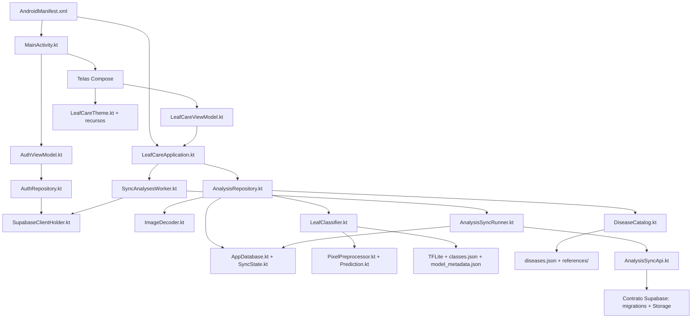
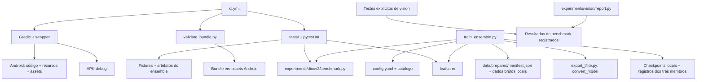

# Mapa do repositório LeafCare

> [!abstract] Estado após a organização
> Snapshot dos **366 arquivos de projeto** após a organização do ML, antes da configuração do OpenSpec. A base da análise é o commit `1f9a93e`; cada arquivo desse escopo aparece na árvore e tem uma linha de utilidade/consumidores. A integração posterior fica documentada no [guia OpenSpec](../../openspec/README.md), incluindo `openspec/` e `.agents/skills/`, que não fazem parte desta árvore histórica.

## Navegação

- [[MAPA_REPOSITORIO#Decisões sobre os quatro arquivos|Excluir ou manter os quatro arquivos citados]]
- [[MAPA_REPOSITORIO#Organização aplicada|Organização aplicada e remoções]]
- [[MAPA_REPOSITORIO#Candidatos dispensáveis para o APK|O que não é necessário ao APK]]
- [[MAPA_REPOSITORIO#Dependências principais|Diagramas de dependências]]
- [[MAPA_REPOSITORIO#Árvore completa|Árvore completa atual]]
- [[MAPA_REPOSITORIO#Inventário por pasta|Utilidade e consumidores de cada arquivo]]
- [[MAPA_REPOSITORIO#Arquivos locais fora do Git|Arquivos locais, caches e checkpoints]]
- [[MAPA_REPOSITORIO#Validações realizadas|Validações e APK]]

## Decisões sobre os quatro arquivos

| Arquivo | Eu excluiria? | Motivo e ação |
| --- | --- | --- |
| `HistoryPersistenceTest.kt` | **Não** | É teste instrumentado executável de inserir, reabrir e excluir análise em Room. Não é evidência histórica. Mantido em `androidTest/`, onde Gradle o descobre. |
| `Inter-OFL.txt` | **Não** | É a licença das fontes Inter usadas por `LeafCareTheme.kt`. Ausência de import não torna licença dispensável. Mantida em `docs/legal/`; já é documentação com nomenclatura em inglês. |
| `MODEL_STATUS.json` | **Sim** | Descrevia o modelo único anterior, com hash/métricas divergentes do ensemble e sem consumidor de execução. Removido. O status atual está nos metadados do bundle e as métricas em `artifacts/metrics.json`. |
| `pytest.ini` | **Não** | Define a suíte padrão `tests/` e o marcador TensorFlow. É lido automaticamente pelo pytest; deve ficar em `machine-learning/`. |

## Organização aplicada

O app continua usando **MobileNetV3Ensemble**, com dois MobileNetV3Small e um MobileNetV3Large fundidos em um TFLite float32, 16 classes, temperatura 0,835105 e limiar 0,631628. Não foram alterados pesos, classes, limiar, dataset, receita de treino ou schema do backend.

```text
machine-learning/
├── README.md                 # guia do que pertence ao modelo atual
├── train_ensemble.py         # pipeline atual
├── export_tflite.py          # conversor compartilhado; mantido
├── artifacts/               # bundle atual + métricas/metadados lidos pelo código
├── leafcare/                # código compartilhado
├── data/                    # manifesto/grupos/auditoria
├── tests/                   # testes atuais
├── legacy/                  # scripts do modelo único anterior
│   ├── train.py
│   └── evaluate.py
├── experiments/             # comparação e dependências compartilhadas
└── benchmark_artifacts/     # preservada integralmente, sem renomear

docs/
├── legal/                   # licenças/proveniência mantidas
├── model-reports/ensemble/  # oito relatórios/gráficos do modelo atual
└── archive/ui/              # três capturas usadas na jornada do app
```

| Mudança | Arquivos / efeito |
| --- | --- |
| Relatórios do modelo atual → `docs/model-reports/ensemble/` | `accuracy.png`, `loss.png`, `confusion_matrix.png`, `confusion_matrix.json`, `history.json`, `config_used.json`, `conversion_parity.json`, `test_predictions.json`. Conteúdo preservado; exportações futuras do ensemble escrevem nessa pasta. |
| Pipeline anterior → `machine-learning/legacy/` | `train.py` e `evaluate.py`; execução por `python -m legacy.train` / `python -m legacy.evaluate` a partir de `machine-learning/`. Import do teste e documentação ajustados. |
| Capturas referenciadas → `docs/archive/ui/` | `camera-v3.png`, `history-v3.png`, `result-top-v3.png`. Renomeados em inglês; links da jornada ajustados. |
| Bundle/pipeline atuais | `artifacts/` conserva seis arquivos versionados consumidos pelo código, além do Keras local ignorado. Arquivos da inferência Android permanecem nos mesmos caminhos. |
| Registros de benchmarks | `benchmark_artifacts/` conserva todos os arquivos e conteúdos. `experiments/dinov2/benchmark.py` permanece porque o ensemble o importa. |

**Removidos por ausência de consumidores úteis para o estado atual:**

- `docs/ml/MODEL_STATUS.json`: status desatualizado do modelo anterior.
- `docs/testing/python_environment.txt`: snapshot antigo de ambiente.
- `docs/testing/python_tests.xml`: relatório antigo, não definição de testes.
- `docs/testing/android-tests/TEST-br.com.leafcare.PredictionPolicyTest.xml`: relatório antigo.
- `docs/testing/android-tests/TEST-br.com.leafcare.VisualV3Test.xml`: relatório antigo.
- `docs/ui/screenshots/ajuda-v3.png`: captura sem referência na documentação.
- `docs/ui/screenshots/resultado-v3-final.png`: captura sem referência na documentação.

Essas remoções não apagam as definições dos testes. Relatórios novos são produzidos pelo build/pytest/CI. Não foram excluídos ambientes Python, dados brutos ou checkpoints locais.

## Candidatos dispensáveis para o APK

“Não vai no APK” não implica “não tem utilidade no projeto”. Esta lista é uma recomendação para decisões futuras; os itens abaixo foram mantidos.

| Candidato | Necessário ao modelo atual? | Recomendação |
| --- | --- | --- |
| `legacy/train.py` | Não participa do treino atual. | Primeiro candidato a excluir se a reprodução do modelo único for abandonada. Já isolado em `legacy/`. |
| `legacy/evaluate.py` | Não avalia o ensemble, mas é importado por um teste de proteção. | Excluir só junto com o suporte/teste/documentação do legado. |
| `experiments/vision/` | Não participa da inferência do app. | Pode ser separado futuramente junto com os seus testes/relatórios; não mover isoladamente porque os caminhos e imports são relacionados. |
| Gráficos e relatórios em `docs/model-reports/ensemble/` | Não são lidos pelo app. | Manter como evidência identificada do modelo publicado; paridade já é referenciada pela jornada ML. |
| Ambientes `.venv/` e caches de download | Não vão no APK. | Reconstruíveis, com custo de reinstalação/download. Não são arquivos versionados. |
| Checkpoints de `experiments/ensemble/.cache/` | Não são lidos pelo app, mas são necessários a `--export-only`. | Guardar para não precisar treinar novamente. |
| `docs/explain/LeafCare - Jornada do Projeto.odp` | Não vai no APK nem é carregado pelo pipeline. | Apresentação editável; opcional conforme interesse em conservar esse material. |

**Não excluir:** bundle/classes/catálogo, manifesto e grupos, testes/fixtures, `export_tflite.py`, `leafcare/` nem `experiments/dinov2/benchmark.py` por parecerem antigos. `benchmark_artifacts/` foi mantida conforme solicitado.

## Leitura do inventário

| Marca | Significado |
| --- | --- |
| 🟢 | Execução do app/backend. |
| 🔵 | Build, testes, pipeline, bundle ou contrato. |
| 🟠 | Relatórios/evidências de modelos e histórico técnico. |
| ⚪ | Documentação, licença ou proveniência. |

“Quem usa” lista consumidores identificados por imports Python, referências estáticas a símbolos Kotlin, recursos Android, leitura de artefatos e convenções de framework/build. Referências Kotlin são análise de símbolos, não grafo do compilador. Recursos `references/` são descobertos dinamicamente pelo prefixo da classe. SQL → Kotlin indica contrato remoto, não import. As dependências transitivas e bibliotecas externas não são enumeradas.

Arquivo sem leitor direto pode servir à auditoria/reprodução. Isso não prova que seja inútil. Treinos, importação de dados, exportação que substitui assets e migrations não foram executados nesta limpeza. A única mudança no exportador do ensemble é o destino dos relatórios.

## Dependências principais

As setas indicam **A usa/depende de B**. Para descobrir quem depende de um arquivo, siga as setas que chegam nele ou consulte “Quem usa” no inventário.





No fluxo de geração, `train_ensemble.py` **produz** bundle/artefatos; `report.py` produz `comparison.csv`. Produção de arquivo não foi confundida com dependência de leitura nas tabelas.

## Árvore completa

Arquivos do projeto presentes após a organização; exclui outputs, caches, dados locais ignorados e `.git/`.

```text
leafcare/
├── .github/
│   └── workflows/
│       └── ci.yml
├── android-app/
│   ├── app/
│   │   ├── schemas/
│   │   │   └── br.com.leafcare.data.AppDatabase/
│   │   │       ├── 1.json
│   │   │       ├── 2.json
│   │   │       └── 3.json
│   │   ├── src/
│   │   │   ├── androidTest/
│   │   │   │   └── java/
│   │   │   │       └── br/
│   │   │   │           └── com/
│   │   │   │               └── leafcare/
│   │   │   │                   └── HistoryPersistenceTest.kt
│   │   │   ├── main/
│   │   │   │   ├── assets/
│   │   │   │   │   ├── references/
│   │   │   │   │   │   ├── anthracnose_1.jpg
│   │   │   │   │   │   ├── anthracnose_2.jpg
│   │   │   │   │   │   ├── black_shank_1.jpg
│   │   │   │   │   │   ├── black_shank_2.jpg
│   │   │   │   │   │   ├── brown_spot_1.jpg
│   │   │   │   │   │   ├── brown_spot_2.jpg
│   │   │   │   │   │   ├── cmv_1.jpg
│   │   │   │   │   │   ├── cmv_2.jpg
│   │   │   │   │   │   ├── frog_eye_1.jpg
│   │   │   │   │   │   ├── frog_eye_2.jpg
│   │   │   │   │   │   ├── frog_eye_3.jpg
│   │   │   │   │   │   ├── genetic_abnormality_1.jpg
│   │   │   │   │   │   ├── genetic_abnormality_2.jpg
│   │   │   │   │   │   ├── healthy_1.jpg
│   │   │   │   │   │   ├── healthy_2.jpg
│   │   │   │   │   │   ├── nematodes_1.jpg
│   │   │   │   │   │   ├── nematodes_2.jpg
│   │   │   │   │   │   ├── potato_tuber_moth_1.jpg
│   │   │   │   │   │   ├── potato_tuber_moth_2.jpg
│   │   │   │   │   │   ├── pvy_1.jpg
│   │   │   │   │   │   ├── pvy_2.jpg
│   │   │   │   │   │   ├── sunscald_1.jpg
│   │   │   │   │   │   ├── sunscald_2.jpg
│   │   │   │   │   │   ├── target_spot_1.jpg
│   │   │   │   │   │   ├── target_spot_2.jpg
│   │   │   │   │   │   ├── tmv_1.jpg
│   │   │   │   │   │   ├── tmv_2.jpg
│   │   │   │   │   │   ├── tswv_1.jpg
│   │   │   │   │   │   ├── tswv_2.jpg
│   │   │   │   │   │   ├── weather_fleck_1.jpg
│   │   │   │   │   │   ├── weather_fleck_2.jpg
│   │   │   │   │   │   ├── weather_fleck_3.jpg
│   │   │   │   │   │   ├── wildfire_1.jpg
│   │   │   │   │   │   ├── wildfire_2.jpg
│   │   │   │   │   │   └── wildfire_3.jpg
│   │   │   │   │   ├── classes.json
│   │   │   │   │   ├── diseases.json
│   │   │   │   │   ├── leafcare.tflite
│   │   │   │   │   └── model_metadata.json
│   │   │   │   ├── java/
│   │   │   │   │   └── br/
│   │   │   │   │       └── com/
│   │   │   │   │           └── leafcare/
│   │   │   │   │               ├── auth/
│   │   │   │   │               │   ├── AuthRepository.kt
│   │   │   │   │               │   ├── AuthViewModel.kt
│   │   │   │   │               │   └── SupabaseClientHolder.kt
│   │   │   │   │               ├── data/
│   │   │   │   │               │   ├── AnalysisRepository.kt
│   │   │   │   │               │   ├── AnalysisSyncApi.kt
│   │   │   │   │               │   ├── AnalysisSyncRunner.kt
│   │   │   │   │               │   ├── AppDatabase.kt
│   │   │   │   │               │   ├── DiseaseCatalog.kt
│   │   │   │   │               │   ├── SyncAnalysesWorker.kt
│   │   │   │   │               │   └── SyncState.kt
│   │   │   │   │               ├── ml/
│   │   │   │   │               │   ├── ImageDecoder.kt
│   │   │   │   │               │   ├── LeafClassifier.kt
│   │   │   │   │               │   ├── PixelPreprocessor.kt
│   │   │   │   │               │   └── Prediction.kt
│   │   │   │   │               ├── ui/
│   │   │   │   │               │   ├── auth/
│   │   │   │   │               │   │   └── AuthScreen.kt
│   │   │   │   │               │   ├── CameraScreen.kt
│   │   │   │   │               │   ├── HelpSheet.kt
│   │   │   │   │               │   ├── HistoryScreen.kt
│   │   │   │   │               │   ├── LeafCareTheme.kt
│   │   │   │   │               │   ├── LeafCareViewModel.kt
│   │   │   │   │               │   └── ResultScreen.kt
│   │   │   │   │               ├── LeafCareApplication.kt
│   │   │   │   │               └── MainActivity.kt
│   │   │   │   ├── res/
│   │   │   │   │   ├── drawable/
│   │   │   │   │   │   ├── ic_launcher_foreground.xml
│   │   │   │   │   │   └── ic_launcher_monochrome.xml
│   │   │   │   │   ├── drawable-nodpi/
│   │   │   │   │   │   ├── ic_launcher_mono.png
│   │   │   │   │   │   ├── v3_back.png
│   │   │   │   │   │   ├── v3_back_light.png
│   │   │   │   │   │   ├── v3_camera.png
│   │   │   │   │   │   ├── v3_check.png
│   │   │   │   │   │   ├── v3_chevron.png
│   │   │   │   │   │   ├── v3_example_blur.png
│   │   │   │   │   │   ├── v3_example_correct.jpg
│   │   │   │   │   │   ├── v3_example_dark.png
│   │   │   │   │   │   ├── v3_example_far.png
│   │   │   │   │   │   ├── v3_filter.png
│   │   │   │   │   │   ├── v3_flash.png
│   │   │   │   │   │   ├── v3_gallery.png
│   │   │   │   │   │   ├── v3_help.png
│   │   │   │   │   │   ├── v3_images.png
│   │   │   │   │   │   ├── v3_logo.png
│   │   │   │   │   │   ├── v3_search.png
│   │   │   │   │   │   ├── v3_switch_camera.png
│   │   │   │   │   │   └── v3_warning.png
│   │   │   │   │   ├── font/
│   │   │   │   │   │   ├── inter_bold.ttf
│   │   │   │   │   │   ├── inter_extrabold.ttf
│   │   │   │   │   │   ├── inter_italic.ttf
│   │   │   │   │   │   ├── inter_regular.ttf
│   │   │   │   │   │   └── inter_semibold.ttf
│   │   │   │   │   ├── mipmap-anydpi-v26/
│   │   │   │   │   │   ├── ic_launcher.xml
│   │   │   │   │   │   └── ic_launcher_round.xml
│   │   │   │   │   ├── values/
│   │   │   │   │   │   ├── colors.xml
│   │   │   │   │   │   ├── strings.xml
│   │   │   │   │   │   └── styles.xml
│   │   │   │   │   └── values-v27/
│   │   │   │   │       └── styles.xml
│   │   │   │   └── AndroidManifest.xml
│   │   │   └── test/
│   │   │       ├── java/
│   │   │       │   └── br/
│   │   │       │       └── com/
│   │   │       │           └── leafcare/
│   │   │       │               ├── auth/
│   │   │       │               │   ├── AuthErrorSanitizerTest.kt
│   │   │       │               │   ├── AuthNavigationTest.kt
│   │   │       │               │   ├── AuthRepositoryTest.kt
│   │   │       │               │   ├── AuthValidationTest.kt
│   │   │       │               │   ├── AuthViewModelTest.kt
│   │   │       │               │   └── RecoveryDeeplinkTest.kt
│   │   │       │               ├── data/
│   │   │       │               │   ├── AccountIsolationTest.kt
│   │   │       │               │   ├── AnalysisSyncDaoTest.kt
│   │   │       │               │   ├── AnalysisSyncRunnerTest.kt
│   │   │       │               │   └── SyncMappingTest.kt
│   │   │       │               ├── ui/
│   │   │       │               │   ├── auth/
│   │   │       │               │   │   └── AuthBackButtonTest.kt
│   │   │       │               │   └── HomeGreetingTest.kt
│   │   │       │               ├── AppGateTest.kt
│   │   │       │               ├── EnsembleBundleTest.kt
│   │   │       │               ├── PredictionPolicyTest.kt
│   │   │       │               └── VisualV3Test.kt
│   │   │       └── resources/
│   │   │           └── preprocess_golden.properties
│   │   └── build.gradle.kts
│   ├── gradle/
│   │   └── wrapper/
│   │       ├── gradle-wrapper.jar
│   │       └── gradle-wrapper.properties
│   ├── build.gradle.kts
│   ├── gradle.properties
│   ├── gradlew
│   ├── gradlew.bat
│   ├── local.properties.example
│   └── settings.gradle.kts
├── docs/
│   ├── archive/
│   │   └── ui/
│   │       ├── camera-v3.png
│   │       ├── history-v3.png
│   │       └── result-top-v3.png
│   ├── benchmarks/
│   │   └── BENCHMARK_MODELOS.md
│   ├── explain/
│   │   ├── JORNADA_APLICATIVO.md
│   │   ├── JORNADA_MACHINE_LEARNING.md
│   │   ├── LeafCare - Jornada do Projeto.odp
│   │   └── MAPA_REPOSITORIO.md
│   ├── legal/
│   │   ├── Inter-OFL.txt
│   │   └── referencias_manifest.csv
│   ├── model-reports/
│   │   └── ensemble/
│   │       ├── accuracy.png
│   │       ├── config_used.json
│   │       ├── confusion_matrix.json
│   │       ├── confusion_matrix.png
│   │       ├── conversion_parity.json
│   │       ├── history.json
│   │       ├── loss.png
│   │       └── test_predictions.json
│   ├── AI_CONTEXT.md
│   ├── ARCHITECTURE.md
│   ├── DEVELOPMENT.md
│   ├── MACHINE_LEARNING.md
│   ├── SUPABASE.md
│   └── TESTING.md
├── machine-learning/
│   ├── artifacts/
│   │   ├── classes.json
│   │   ├── diseases.json
│   │   ├── leafcare.tflite
│   │   ├── metrics.json
│   │   ├── model_metadata.json
│   │   └── training_metadata.json
│   ├── benchmark_artifacts/
│   │   ├── dinov2/
│   │   │   ├── classifier.npz
│   │   │   ├── confusion_matrix.csv
│   │   │   ├── confusion_matrix_validation.csv
│   │   │   ├── cost_profile.json
│   │   │   ├── environment.json
│   │   │   ├── experiment_config.json
│   │   │   ├── per_class_metrics.csv
│   │   │   ├── predictions_test.csv
│   │   │   ├── probe_comparison.json
│   │   │   ├── run_summary.json
│   │   │   ├── test_metrics.json
│   │   │   └── validation_metrics.json
│   │   ├── ensemble/
│   │   │   ├── large_adamw/
│   │   │   │   ├── history.json
│   │   │   │   ├── training.json
│   │   │   │   ├── validation_metrics.json
│   │   │   │   └── validation_probabilities.npy
│   │   │   ├── small_adam/
│   │   │   │   ├── history.json
│   │   │   │   ├── training.json
│   │   │   │   ├── validation_metrics.json
│   │   │   │   └── validation_probabilities.npy
│   │   │   ├── small_rmsprop/
│   │   │   │   ├── history.json
│   │   │   │   ├── training.json
│   │   │   │   ├── validation_metrics.json
│   │   │   │   └── validation_probabilities.npy
│   │   │   ├── baseline_reference.json
│   │   │   ├── conversion_parity.json
│   │   │   ├── conversion_probabilities.npz
│   │   │   ├── environment.json
│   │   │   ├── experiment_config.json
│   │   │   ├── predictions_test.json
│   │   │   ├── probabilities.npz
│   │   │   ├── protocol.json
│   │   │   ├── reference_prediction.json
│   │   │   ├── run_summary.json
│   │   │   ├── test_metrics.json
│   │   │   ├── timing.json
│   │   │   └── validation_metrics.json
│   │   ├── vision/
│   │   │   ├── dinov2_vitb14/
│   │   │   │   ├── classifier.npz
│   │   │   │   ├── confusion_matrix.csv
│   │   │   │   ├── confusion_matrix_validation.csv
│   │   │   │   ├── experiment_config.json
│   │   │   │   ├── logits.npz
│   │   │   │   ├── per_class_metrics.csv
│   │   │   │   ├── predictions_test.csv
│   │   │   │   ├── probe_comparison.json
│   │   │   │   ├── run_summary.json
│   │   │   │   ├── test_metrics.json
│   │   │   │   └── validation_metrics.json
│   │   │   ├── dinov3_vits16/
│   │   │   │   └── run_summary.json
│   │   │   ├── mobileclip2_s0/
│   │   │   │   ├── classifier.npz
│   │   │   │   ├── confusion_matrix.csv
│   │   │   │   ├── confusion_matrix_validation.csv
│   │   │   │   ├── experiment_config.json
│   │   │   │   ├── logits.npz
│   │   │   │   ├── per_class_metrics.csv
│   │   │   │   ├── predictions_test.csv
│   │   │   │   ├── probe_comparison.json
│   │   │   │   ├── run_summary.json
│   │   │   │   ├── test_metrics.json
│   │   │   │   └── validation_metrics.json
│   │   │   ├── mobilenetv4_medium/
│   │   │   │   ├── classifier.npz
│   │   │   │   ├── confusion_matrix.csv
│   │   │   │   ├── confusion_matrix_validation.csv
│   │   │   │   ├── experiment_config.json
│   │   │   │   ├── logits.npz
│   │   │   │   ├── per_class_metrics.csv
│   │   │   │   ├── predictions_test.csv
│   │   │   │   ├── probe_comparison.json
│   │   │   │   ├── run_summary.json
│   │   │   │   ├── test_metrics.json
│   │   │   │   └── validation_metrics.json
│   │   │   ├── tinyvit_11m/
│   │   │   │   ├── classifier.npz
│   │   │   │   ├── confusion_matrix.csv
│   │   │   │   ├── confusion_matrix_validation.csv
│   │   │   │   ├── experiment_config.json
│   │   │   │   ├── logits.npz
│   │   │   │   ├── per_class_metrics.csv
│   │   │   │   ├── predictions_test.csv
│   │   │   │   ├── probe_comparison.json
│   │   │   │   ├── run_summary.json
│   │   │   │   ├── test_metrics.json
│   │   │   │   └── validation_metrics.json
│   │   │   ├── tinyvit_5m/
│   │   │   │   ├── classifier.npz
│   │   │   │   ├── confusion_matrix.csv
│   │   │   │   ├── confusion_matrix_validation.csv
│   │   │   │   ├── experiment_config.json
│   │   │   │   ├── logits.npz
│   │   │   │   ├── per_class_metrics.csv
│   │   │   │   ├── predictions_test.csv
│   │   │   │   ├── probe_comparison.json
│   │   │   │   ├── run_summary.json
│   │   │   │   ├── test_metrics.json
│   │   │   │   └── validation_metrics.json
│   │   │   ├── comparison.csv
│   │   │   ├── environment.json
│   │   │   └── historical_summary.json
│   │   └── vision_finetune/
│   │       ├── dinov2_vitb14/
│   │       │   ├── confusion_matrix.csv
│   │       │   ├── confusion_matrix_validation.csv
│   │       │   ├── conversion_parity.json
│   │       │   ├── conversion_probabilities.npz
│   │       │   ├── experiment_config.json
│   │       │   ├── history.json
│   │       │   ├── logits.npz
│   │       │   ├── mobile_export.json
│   │       │   ├── per_class_metrics.csv
│   │       │   ├── predictions_test.csv
│   │       │   ├── run_summary.json
│   │       │   ├── test_metrics.json
│   │       │   └── validation_metrics.json
│   │       ├── mobileclip2_s0/
│   │       │   ├── confusion_matrix.csv
│   │       │   ├── confusion_matrix_validation.csv
│   │       │   ├── experiment_config.json
│   │       │   ├── history.json
│   │       │   ├── logits.npz
│   │       │   ├── per_class_metrics.csv
│   │       │   ├── predictions_test.csv
│   │       │   ├── run_summary.json
│   │       │   ├── test_metrics.json
│   │       │   └── validation_metrics.json
│   │       ├── mobilenetv4_medium/
│   │       │   ├── confusion_matrix.csv
│   │       │   ├── confusion_matrix_validation.csv
│   │       │   ├── experiment_config.json
│   │       │   ├── history.json
│   │       │   ├── logits.npz
│   │       │   ├── per_class_metrics.csv
│   │       │   ├── predictions_test.csv
│   │       │   ├── run_summary.json
│   │       │   ├── test_metrics.json
│   │       │   └── validation_metrics.json
│   │       ├── tinyvit_11m/
│   │       │   ├── confusion_matrix.csv
│   │       │   ├── confusion_matrix_validation.csv
│   │       │   ├── conversion_parity.json
│   │       │   ├── conversion_probabilities.npz
│   │       │   ├── experiment_config.json
│   │       │   ├── history.json
│   │       │   ├── logits.npz
│   │       │   ├── mobile_export.json
│   │       │   ├── per_class_metrics.csv
│   │       │   ├── predictions_test.csv
│   │       │   ├── run_summary.json
│   │       │   ├── test_metrics.json
│   │       │   └── validation_metrics.json
│   │       ├── tinyvit_5m/
│   │       │   ├── confusion_matrix.csv
│   │       │   ├── confusion_matrix_validation.csv
│   │       │   ├── experiment_config.json
│   │       │   ├── history.json
│   │       │   ├── logits.npz
│   │       │   ├── per_class_metrics.csv
│   │       │   ├── predictions_test.csv
│   │       │   ├── run_summary.json
│   │       │   ├── test_metrics.json
│   │       │   └── validation_metrics.json
│   │       ├── environment.json
│   │       ├── export_selection.json
│   │       └── protocol.json
│   ├── data/
│   │   ├── prepared/
│   │   │   ├── audit.json
│   │   │   ├── classes.json
│   │   │   └── manifest.json
│   │   ├── groups.csv
│   │   └── import_report.json
│   ├── experiments/
│   │   ├── dinov2/
│   │   │   ├── README.md
│   │   │   ├── benchmark.py
│   │   │   ├── requirements.txt
│   │   │   └── test_benchmark.py
│   │   └── vision/
│   │       ├── README.md
│   │       ├── benchmark.py
│   │       ├── export_candidates.py
│   │       ├── finetune.py
│   │       ├── report.py
│   │       ├── requirements-export.txt
│   │       ├── requirements.txt
│   │       ├── test_export_candidates.py
│   │       ├── test_finetune.py
│   │       └── test_vision_benchmark.py
│   ├── leafcare/
│   │   ├── __init__.py
│   │   ├── common.py
│   │   ├── dataset.py
│   │   ├── ensemble.py
│   │   ├── inference.py
│   │   ├── preprocessing.py
│   │   └── training.py
│   ├── legacy/
│   │   ├── evaluate.py
│   │   └── train.py
│   ├── tests/
│   │   ├── test_contract.py
│   │   ├── test_dataset.py
│   │   ├── test_ensemble.py
│   │   └── test_tensorflow_integration.py
│   ├── README.md
│   ├── classes.reference.json
│   ├── config.yaml
│   ├── disease_catalog.json
│   ├── export_tflite.py
│   ├── import_tla.py
│   ├── predict.py
│   ├── prepare_dataset.py
│   ├── pytest.ini
│   ├── requirements.txt
│   ├── tla_class_map.yaml
│   ├── train_ensemble.py
│   └── validate_bundle.py
├── samples/
│   ├── preprocess_golden.json
│   └── reference_frog_eye.jpg
├── supabase/
│   └── migrations/
│       ├── 20260923121620_initial_schema.sql
│       ├── 20260923121632_auto_profile_creation.sql
│       ├── 20260923121659_storage_analysis_photos.sql
│       └── 20260923121807_security_hardening.sql
├── .gitignore
├── AGENTS.md
├── CHANGELOG.md
└── README.md
```

## Inventário por pasta

Abra a raiz do projeto como vault Obsidian. Os links de arquivo são relativos a esta nota em `docs/explain/`.

### Raiz

| Arquivo | Utilidade | Categoria | Quem usa / depende deste arquivo |
| --- | --- | --- | --- |
| [.gitignore](../../.gitignore) | Evita versionar build, caches, dados brutos, ambientes, chaves de assinatura e configurações locais. | 🔵 Build / teste / pipeline | Uso por convenção/setup/auditoria; nenhum consumidor adicional identificado. |
| [AGENTS.md](../../AGENTS.md) | Regras para agentes: escopo, preservação do offline, validações e disponibilização do APK. | ⚪ Documentação / proveniência | Uso por convenção/setup/auditoria; nenhum consumidor adicional identificado. |
| [CHANGELOG.md](../../CHANGELOG.md) | Histórico de versões e alterações para manutenção/release. | ⚪ Documentação / proveniência | Uso por convenção/setup/auditoria; nenhum consumidor adicional identificado. |
| [README.md](../../README.md) | Apresentação do produto e entrada para setup, arquitetura e documentação. | ⚪ Documentação / proveniência | Consulta humana/documentação; sem leitor de execução identificado. |

### .github/workflows/

| Arquivo | Utilidade | Categoria | Quem usa / depende deste arquivo |
| --- | --- | --- | --- |
| [ci.yml](../../.github/workflows/ci.yml) | GitHub Actions: testes Python/Android, bundle, lint e publicação do artefato APK debug. | 🔵 Build / teste / pipeline | Uso por convenção/setup/auditoria; nenhum consumidor adicional identificado. |

### android-app/

| Arquivo | Utilidade | Categoria | Quem usa / depende deste arquivo |
| --- | --- | --- | --- |
| [build.gradle.kts](../../android-app/build.gradle.kts) | Versões dos plugins Android/Kotlin/Compose/KSP compartilhadas pelo módulo app. | 🔵 Build / teste / pipeline | [android-app/app/build.gradle.kts](../../android-app/app/build.gradle.kts) |
| [gradle.properties](../../android-app/gradle.properties) | Opções de Gradle/Android/KSP e configuração publicável do backend; valores não reproduzidos aqui. | 🔵 Build / teste / pipeline | [android-app/app/build.gradle.kts](../../android-app/app/build.gradle.kts) |
| [gradlew](../../android-app/gradlew) | Wrapper Gradle para Linux/macOS; no checkout atual é 100644, por isso foi executado com bash. | 🔵 Build / teste / pipeline | [.github/workflows/ci.yml](../../.github/workflows/ci.yml) |
| [gradlew.bat](../../android-app/gradlew.bat) | Wrapper Gradle para Windows. | 🔵 Build / teste / pipeline | Uso por convenção/setup/auditoria; nenhum consumidor adicional identificado. |
| [local.properties.example](../../android-app/local.properties.example) | Modelo de configuração local do SDK e chave publicável; não é lido diretamente pelo build. | 🔵 Build / teste / pipeline | Uso por convenção/setup/auditoria; nenhum consumidor adicional identificado. |
| [settings.gradle.kts](../../android-app/settings.gradle.kts) | Repositórios de dependências, nome do projeto e inclusão do módulo :app. | 🔵 Build / teste / pipeline | [.github/workflows/ci.yml](../../.github/workflows/ci.yml)<br>[android-app/gradlew](../../android-app/gradlew)<br>[android-app/gradlew.bat](../../android-app/gradlew.bat) |

### android-app/app/

| Arquivo | Utilidade | Categoria | Quem usa / depende deste arquivo |
| --- | --- | --- | --- |
| [build.gradle.kts](../../android-app/app/build.gradle.kts) | SDK, versão, dependências, Room/KSP, checks de configuração/bundle e nome/distribuição do APK. | 🔵 Build / teste / pipeline | [.github/workflows/ci.yml](../../.github/workflows/ci.yml)<br>[android-app/settings.gradle.kts](../../android-app/settings.gradle.kts) |

### android-app/app/schemas/br.com.leafcare.data.AppDatabase/

| Arquivo | Utilidade | Categoria | Quem usa / depende deste arquivo |
| --- | --- | --- | --- |
| [1.json](../../android-app/app/schemas/br.com.leafcare.data.AppDatabase/1.json) | Snapshot Room v1 do banco; contrato histórico para evolução/migrações, não código executável. | 🔵 Build / teste / pipeline | Room/KSP (diretório configurado em app/build.gradle.kts) |
| [2.json](../../android-app/app/schemas/br.com.leafcare.data.AppDatabase/2.json) | Snapshot Room v2 do banco; contrato histórico para evolução/migrações, não código executável. | 🔵 Build / teste / pipeline | Room/KSP (diretório configurado em app/build.gradle.kts) |
| [3.json](../../android-app/app/schemas/br.com.leafcare.data.AppDatabase/3.json) | Snapshot Room v3 do banco; contrato histórico para evolução/migrações, não código executável. | 🔵 Build / teste / pipeline | Room/KSP (diretório configurado em app/build.gradle.kts) |

### android-app/app/src/androidTest/java/br/com/leafcare/

| Arquivo | Utilidade | Categoria | Quem usa / depende deste arquivo |
| --- | --- | --- | --- |
| [HistoryPersistenceTest.kt](../../android-app/app/src/androidTest/java/br/com/leafcare/HistoryPersistenceTest.kt) | Teste em aparelho/emulador: inserir, reabrir banco e excluir análise persistida. | 🔵 Build / teste / pipeline | connectedDebugAndroidTest (Gradle; aparelho/emulador) |

### android-app/app/src/main/

| Arquivo | Utilidade | Categoria | Quem usa / depende deste arquivo |
| --- | --- | --- | --- |
| [AndroidManifest.xml](../../android-app/app/src/main/AndroidManifest.xml) | Entrada do app, permissões, ícones, tema, deep links e inicialização do WorkManager. | 🟢 App / backend | [android-app/app/build.gradle.kts](../../android-app/app/build.gradle.kts) |

### android-app/app/src/main/assets/

| Arquivo | Utilidade | Categoria | Quem usa / depende deste arquivo |
| --- | --- | --- | --- |
| [classes.json](../../android-app/app/src/main/assets/classes.json) | Ordem das 16 saídas do TFLite; precisa coincidir com modelo e metadados. | 🟢 App / backend | [android-app/app/build.gradle.kts](../../android-app/app/build.gradle.kts)<br>[ml/LeafClassifier.kt](../../android-app/app/src/main/java/br/com/leafcare/ml/LeafClassifier.kt)<br>[android-app/app/src/test/java/br/com/leafcare/EnsembleBundleTest.kt](../../android-app/app/src/test/java/br/com/leafcare/EnsembleBundleTest.kt)<br>[tests/test_ensemble.py](../../machine-learning/tests/test_ensemble.py)<br>[validate_bundle.py](../../machine-learning/validate_bundle.py) |
| [diseases.json](../../android-app/app/src/main/assets/diseases.json) | Textos/sintomas/orientações das classes, disponíveis offline. | 🟢 App / backend | [data/DiseaseCatalog.kt](../../android-app/app/src/main/java/br/com/leafcare/data/DiseaseCatalog.kt)<br>[validate_bundle.py](../../machine-learning/validate_bundle.py) |
| [leafcare.tflite](../../android-app/app/src/main/assets/leafcare.tflite) | Modelo ensemble embarcado e executado no aparelho, sem rede. | 🟢 App / backend | [android-app/app/build.gradle.kts](../../android-app/app/build.gradle.kts)<br>[ml/LeafClassifier.kt](../../android-app/app/src/main/java/br/com/leafcare/ml/LeafClassifier.kt)<br>[android-app/app/src/test/java/br/com/leafcare/EnsembleBundleTest.kt](../../android-app/app/src/test/java/br/com/leafcare/EnsembleBundleTest.kt)<br>[tests/test_ensemble.py](../../machine-learning/tests/test_ensemble.py)<br>[validate_bundle.py](../../machine-learning/validate_bundle.py) |
| [model_metadata.json](../../android-app/app/src/main/assets/model_metadata.json) | Contrato, hashes e limiar/calibração do modelo; validado antes da inferência. | 🟢 App / backend | [android-app/app/build.gradle.kts](../../android-app/app/build.gradle.kts)<br>[ml/LeafClassifier.kt](../../android-app/app/src/main/java/br/com/leafcare/ml/LeafClassifier.kt)<br>[android-app/app/src/test/java/br/com/leafcare/EnsembleBundleTest.kt](../../android-app/app/src/test/java/br/com/leafcare/EnsembleBundleTest.kt)<br>[tests/test_ensemble.py](../../machine-learning/tests/test_ensemble.py)<br>[validate_bundle.py](../../machine-learning/validate_bundle.py) |

### android-app/app/src/main/assets/references/

| Arquivo | Utilidade | Categoria | Quem usa / depende deste arquivo |
| --- | --- | --- | --- |
| [anthracnose_1.jpg](../../android-app/app/src/main/assets/references/anthracnose_1.jpg) | Foto de referência de `anthracnose`; descoberta pelo prefixo do nome, sem import explícito. | 🟢 App / backend | [data/DiseaseCatalog.kt](../../android-app/app/src/main/java/br/com/leafcare/data/DiseaseCatalog.kt)<br>[ui/ResultScreen.kt](../../android-app/app/src/main/java/br/com/leafcare/ui/ResultScreen.kt) |
| [anthracnose_2.jpg](../../android-app/app/src/main/assets/references/anthracnose_2.jpg) | Foto de referência de `anthracnose`; descoberta pelo prefixo do nome, sem import explícito. | 🟢 App / backend | [data/DiseaseCatalog.kt](../../android-app/app/src/main/java/br/com/leafcare/data/DiseaseCatalog.kt)<br>[ui/ResultScreen.kt](../../android-app/app/src/main/java/br/com/leafcare/ui/ResultScreen.kt) |
| [black_shank_1.jpg](../../android-app/app/src/main/assets/references/black_shank_1.jpg) | Foto de referência de `black_shank`; descoberta pelo prefixo do nome, sem import explícito. | 🟢 App / backend | [data/DiseaseCatalog.kt](../../android-app/app/src/main/java/br/com/leafcare/data/DiseaseCatalog.kt)<br>[ui/ResultScreen.kt](../../android-app/app/src/main/java/br/com/leafcare/ui/ResultScreen.kt) |
| [black_shank_2.jpg](../../android-app/app/src/main/assets/references/black_shank_2.jpg) | Foto de referência de `black_shank`; descoberta pelo prefixo do nome, sem import explícito. | 🟢 App / backend | [data/DiseaseCatalog.kt](../../android-app/app/src/main/java/br/com/leafcare/data/DiseaseCatalog.kt)<br>[ui/ResultScreen.kt](../../android-app/app/src/main/java/br/com/leafcare/ui/ResultScreen.kt) |
| [brown_spot_1.jpg](../../android-app/app/src/main/assets/references/brown_spot_1.jpg) | Foto de referência de `brown_spot`; descoberta pelo prefixo do nome, sem import explícito. | 🟢 App / backend | [data/DiseaseCatalog.kt](../../android-app/app/src/main/java/br/com/leafcare/data/DiseaseCatalog.kt)<br>[ui/ResultScreen.kt](../../android-app/app/src/main/java/br/com/leafcare/ui/ResultScreen.kt) |
| [brown_spot_2.jpg](../../android-app/app/src/main/assets/references/brown_spot_2.jpg) | Foto de referência de `brown_spot`; descoberta pelo prefixo do nome, sem import explícito. | 🟢 App / backend | [data/DiseaseCatalog.kt](../../android-app/app/src/main/java/br/com/leafcare/data/DiseaseCatalog.kt)<br>[ui/ResultScreen.kt](../../android-app/app/src/main/java/br/com/leafcare/ui/ResultScreen.kt) |
| [cmv_1.jpg](../../android-app/app/src/main/assets/references/cmv_1.jpg) | Foto de referência de `cmv`; descoberta pelo prefixo do nome, sem import explícito. | 🟢 App / backend | [data/DiseaseCatalog.kt](../../android-app/app/src/main/java/br/com/leafcare/data/DiseaseCatalog.kt)<br>[ui/ResultScreen.kt](../../android-app/app/src/main/java/br/com/leafcare/ui/ResultScreen.kt) |
| [cmv_2.jpg](../../android-app/app/src/main/assets/references/cmv_2.jpg) | Foto de referência de `cmv`; descoberta pelo prefixo do nome, sem import explícito. | 🟢 App / backend | [data/DiseaseCatalog.kt](../../android-app/app/src/main/java/br/com/leafcare/data/DiseaseCatalog.kt)<br>[ui/ResultScreen.kt](../../android-app/app/src/main/java/br/com/leafcare/ui/ResultScreen.kt) |
| [frog_eye_1.jpg](../../android-app/app/src/main/assets/references/frog_eye_1.jpg) | Foto de referência de `frog_eye`; descoberta pelo prefixo do nome, sem import explícito. | 🟢 App / backend | [data/DiseaseCatalog.kt](../../android-app/app/src/main/java/br/com/leafcare/data/DiseaseCatalog.kt)<br>[ui/ResultScreen.kt](../../android-app/app/src/main/java/br/com/leafcare/ui/ResultScreen.kt) |
| [frog_eye_2.jpg](../../android-app/app/src/main/assets/references/frog_eye_2.jpg) | Foto de referência de `frog_eye`; descoberta pelo prefixo do nome, sem import explícito. | 🟢 App / backend | [data/DiseaseCatalog.kt](../../android-app/app/src/main/java/br/com/leafcare/data/DiseaseCatalog.kt)<br>[ui/ResultScreen.kt](../../android-app/app/src/main/java/br/com/leafcare/ui/ResultScreen.kt) |
| [frog_eye_3.jpg](../../android-app/app/src/main/assets/references/frog_eye_3.jpg) | Foto de referência de `frog_eye`; descoberta pelo prefixo do nome, sem import explícito. | 🟢 App / backend | [data/DiseaseCatalog.kt](../../android-app/app/src/main/java/br/com/leafcare/data/DiseaseCatalog.kt)<br>[ui/ResultScreen.kt](../../android-app/app/src/main/java/br/com/leafcare/ui/ResultScreen.kt) |
| [genetic_abnormality_1.jpg](../../android-app/app/src/main/assets/references/genetic_abnormality_1.jpg) | Foto de referência de `genetic_abnormality`; descoberta pelo prefixo do nome, sem import explícito. | 🟢 App / backend | [data/DiseaseCatalog.kt](../../android-app/app/src/main/java/br/com/leafcare/data/DiseaseCatalog.kt)<br>[ui/ResultScreen.kt](../../android-app/app/src/main/java/br/com/leafcare/ui/ResultScreen.kt) |
| [genetic_abnormality_2.jpg](../../android-app/app/src/main/assets/references/genetic_abnormality_2.jpg) | Foto de referência de `genetic_abnormality`; descoberta pelo prefixo do nome, sem import explícito. | 🟢 App / backend | [data/DiseaseCatalog.kt](../../android-app/app/src/main/java/br/com/leafcare/data/DiseaseCatalog.kt)<br>[ui/ResultScreen.kt](../../android-app/app/src/main/java/br/com/leafcare/ui/ResultScreen.kt) |
| [healthy_1.jpg](../../android-app/app/src/main/assets/references/healthy_1.jpg) | Foto de referência de `healthy`; descoberta pelo prefixo do nome, sem import explícito. | 🟢 App / backend | [data/DiseaseCatalog.kt](../../android-app/app/src/main/java/br/com/leafcare/data/DiseaseCatalog.kt)<br>[ui/ResultScreen.kt](../../android-app/app/src/main/java/br/com/leafcare/ui/ResultScreen.kt) |
| [healthy_2.jpg](../../android-app/app/src/main/assets/references/healthy_2.jpg) | Foto de referência de `healthy`; descoberta pelo prefixo do nome, sem import explícito. | 🟢 App / backend | [data/DiseaseCatalog.kt](../../android-app/app/src/main/java/br/com/leafcare/data/DiseaseCatalog.kt)<br>[ui/ResultScreen.kt](../../android-app/app/src/main/java/br/com/leafcare/ui/ResultScreen.kt) |
| [nematodes_1.jpg](../../android-app/app/src/main/assets/references/nematodes_1.jpg) | Foto de referência de `nematodes`; descoberta pelo prefixo do nome, sem import explícito. | 🟢 App / backend | [data/DiseaseCatalog.kt](../../android-app/app/src/main/java/br/com/leafcare/data/DiseaseCatalog.kt)<br>[ui/ResultScreen.kt](../../android-app/app/src/main/java/br/com/leafcare/ui/ResultScreen.kt) |
| [nematodes_2.jpg](../../android-app/app/src/main/assets/references/nematodes_2.jpg) | Foto de referência de `nematodes`; descoberta pelo prefixo do nome, sem import explícito. | 🟢 App / backend | [data/DiseaseCatalog.kt](../../android-app/app/src/main/java/br/com/leafcare/data/DiseaseCatalog.kt)<br>[ui/ResultScreen.kt](../../android-app/app/src/main/java/br/com/leafcare/ui/ResultScreen.kt) |
| [potato_tuber_moth_1.jpg](../../android-app/app/src/main/assets/references/potato_tuber_moth_1.jpg) | Foto de referência de `potato_tuber_moth`; descoberta pelo prefixo do nome, sem import explícito. | 🟢 App / backend | [data/DiseaseCatalog.kt](../../android-app/app/src/main/java/br/com/leafcare/data/DiseaseCatalog.kt)<br>[ui/ResultScreen.kt](../../android-app/app/src/main/java/br/com/leafcare/ui/ResultScreen.kt) |
| [potato_tuber_moth_2.jpg](../../android-app/app/src/main/assets/references/potato_tuber_moth_2.jpg) | Foto de referência de `potato_tuber_moth`; descoberta pelo prefixo do nome, sem import explícito. | 🟢 App / backend | [data/DiseaseCatalog.kt](../../android-app/app/src/main/java/br/com/leafcare/data/DiseaseCatalog.kt)<br>[ui/ResultScreen.kt](../../android-app/app/src/main/java/br/com/leafcare/ui/ResultScreen.kt) |
| [pvy_1.jpg](../../android-app/app/src/main/assets/references/pvy_1.jpg) | Foto de referência de `pvy`; descoberta pelo prefixo do nome, sem import explícito. | 🟢 App / backend | [data/DiseaseCatalog.kt](../../android-app/app/src/main/java/br/com/leafcare/data/DiseaseCatalog.kt)<br>[ui/ResultScreen.kt](../../android-app/app/src/main/java/br/com/leafcare/ui/ResultScreen.kt) |
| [pvy_2.jpg](../../android-app/app/src/main/assets/references/pvy_2.jpg) | Foto de referência de `pvy`; descoberta pelo prefixo do nome, sem import explícito. | 🟢 App / backend | [data/DiseaseCatalog.kt](../../android-app/app/src/main/java/br/com/leafcare/data/DiseaseCatalog.kt)<br>[ui/ResultScreen.kt](../../android-app/app/src/main/java/br/com/leafcare/ui/ResultScreen.kt) |
| [sunscald_1.jpg](../../android-app/app/src/main/assets/references/sunscald_1.jpg) | Foto de referência de `sunscald`; descoberta pelo prefixo do nome, sem import explícito. | 🟢 App / backend | [data/DiseaseCatalog.kt](../../android-app/app/src/main/java/br/com/leafcare/data/DiseaseCatalog.kt)<br>[ui/ResultScreen.kt](../../android-app/app/src/main/java/br/com/leafcare/ui/ResultScreen.kt) |
| [sunscald_2.jpg](../../android-app/app/src/main/assets/references/sunscald_2.jpg) | Foto de referência de `sunscald`; descoberta pelo prefixo do nome, sem import explícito. | 🟢 App / backend | [data/DiseaseCatalog.kt](../../android-app/app/src/main/java/br/com/leafcare/data/DiseaseCatalog.kt)<br>[ui/ResultScreen.kt](../../android-app/app/src/main/java/br/com/leafcare/ui/ResultScreen.kt) |
| [target_spot_1.jpg](../../android-app/app/src/main/assets/references/target_spot_1.jpg) | Foto de referência de `target_spot`; descoberta pelo prefixo do nome, sem import explícito. | 🟢 App / backend | [data/DiseaseCatalog.kt](../../android-app/app/src/main/java/br/com/leafcare/data/DiseaseCatalog.kt)<br>[ui/ResultScreen.kt](../../android-app/app/src/main/java/br/com/leafcare/ui/ResultScreen.kt) |
| [target_spot_2.jpg](../../android-app/app/src/main/assets/references/target_spot_2.jpg) | Foto de referência de `target_spot`; descoberta pelo prefixo do nome, sem import explícito. | 🟢 App / backend | [data/DiseaseCatalog.kt](../../android-app/app/src/main/java/br/com/leafcare/data/DiseaseCatalog.kt)<br>[ui/ResultScreen.kt](../../android-app/app/src/main/java/br/com/leafcare/ui/ResultScreen.kt) |
| [tmv_1.jpg](../../android-app/app/src/main/assets/references/tmv_1.jpg) | Foto de referência de `tmv`; descoberta pelo prefixo do nome, sem import explícito. | 🟢 App / backend | [data/DiseaseCatalog.kt](../../android-app/app/src/main/java/br/com/leafcare/data/DiseaseCatalog.kt)<br>[ui/ResultScreen.kt](../../android-app/app/src/main/java/br/com/leafcare/ui/ResultScreen.kt) |
| [tmv_2.jpg](../../android-app/app/src/main/assets/references/tmv_2.jpg) | Foto de referência de `tmv`; descoberta pelo prefixo do nome, sem import explícito. | 🟢 App / backend | [data/DiseaseCatalog.kt](../../android-app/app/src/main/java/br/com/leafcare/data/DiseaseCatalog.kt)<br>[ui/ResultScreen.kt](../../android-app/app/src/main/java/br/com/leafcare/ui/ResultScreen.kt) |
| [tswv_1.jpg](../../android-app/app/src/main/assets/references/tswv_1.jpg) | Foto de referência de `tswv`; descoberta pelo prefixo do nome, sem import explícito. | 🟢 App / backend | [data/DiseaseCatalog.kt](../../android-app/app/src/main/java/br/com/leafcare/data/DiseaseCatalog.kt)<br>[ui/ResultScreen.kt](../../android-app/app/src/main/java/br/com/leafcare/ui/ResultScreen.kt) |
| [tswv_2.jpg](../../android-app/app/src/main/assets/references/tswv_2.jpg) | Foto de referência de `tswv`; descoberta pelo prefixo do nome, sem import explícito. | 🟢 App / backend | [data/DiseaseCatalog.kt](../../android-app/app/src/main/java/br/com/leafcare/data/DiseaseCatalog.kt)<br>[ui/ResultScreen.kt](../../android-app/app/src/main/java/br/com/leafcare/ui/ResultScreen.kt) |
| [weather_fleck_1.jpg](../../android-app/app/src/main/assets/references/weather_fleck_1.jpg) | Foto de referência de `weather_fleck`; descoberta pelo prefixo do nome, sem import explícito. | 🟢 App / backend | [data/DiseaseCatalog.kt](../../android-app/app/src/main/java/br/com/leafcare/data/DiseaseCatalog.kt)<br>[ui/ResultScreen.kt](../../android-app/app/src/main/java/br/com/leafcare/ui/ResultScreen.kt) |
| [weather_fleck_2.jpg](../../android-app/app/src/main/assets/references/weather_fleck_2.jpg) | Foto de referência de `weather_fleck`; descoberta pelo prefixo do nome, sem import explícito. | 🟢 App / backend | [data/DiseaseCatalog.kt](../../android-app/app/src/main/java/br/com/leafcare/data/DiseaseCatalog.kt)<br>[ui/ResultScreen.kt](../../android-app/app/src/main/java/br/com/leafcare/ui/ResultScreen.kt) |
| [weather_fleck_3.jpg](../../android-app/app/src/main/assets/references/weather_fleck_3.jpg) | Foto de referência de `weather_fleck`; descoberta pelo prefixo do nome, sem import explícito. | 🟢 App / backend | [data/DiseaseCatalog.kt](../../android-app/app/src/main/java/br/com/leafcare/data/DiseaseCatalog.kt)<br>[ui/ResultScreen.kt](../../android-app/app/src/main/java/br/com/leafcare/ui/ResultScreen.kt) |
| [wildfire_1.jpg](../../android-app/app/src/main/assets/references/wildfire_1.jpg) | Foto de referência de `wildfire`; descoberta pelo prefixo do nome, sem import explícito. | 🟢 App / backend | [data/DiseaseCatalog.kt](../../android-app/app/src/main/java/br/com/leafcare/data/DiseaseCatalog.kt)<br>[ui/ResultScreen.kt](../../android-app/app/src/main/java/br/com/leafcare/ui/ResultScreen.kt) |
| [wildfire_2.jpg](../../android-app/app/src/main/assets/references/wildfire_2.jpg) | Foto de referência de `wildfire`; descoberta pelo prefixo do nome, sem import explícito. | 🟢 App / backend | [data/DiseaseCatalog.kt](../../android-app/app/src/main/java/br/com/leafcare/data/DiseaseCatalog.kt)<br>[ui/ResultScreen.kt](../../android-app/app/src/main/java/br/com/leafcare/ui/ResultScreen.kt) |
| [wildfire_3.jpg](../../android-app/app/src/main/assets/references/wildfire_3.jpg) | Foto de referência de `wildfire`; descoberta pelo prefixo do nome, sem import explícito. | 🟢 App / backend | [data/DiseaseCatalog.kt](../../android-app/app/src/main/java/br/com/leafcare/data/DiseaseCatalog.kt)<br>[ui/ResultScreen.kt](../../android-app/app/src/main/java/br/com/leafcare/ui/ResultScreen.kt) |

### android-app/app/src/main/java/br/com/leafcare/

| Arquivo | Utilidade | Categoria | Quem usa / depende deste arquivo |
| --- | --- | --- | --- |
| [LeafCareApplication.kt](../../android-app/app/src/main/java/br/com/leafcare/LeafCareApplication.kt) | Inicializa Room, catálogo, classificador e cliente Supabase; configura WorkManager e isolamento por conta. | 🟢 App / backend | [android-app/app/src/main/AndroidManifest.xml](../../android-app/app/src/main/AndroidManifest.xml)<br>[auth/AuthRepository.kt](../../android-app/app/src/main/java/br/com/leafcare/auth/AuthRepository.kt)<br>[auth/AuthViewModel.kt](../../android-app/app/src/main/java/br/com/leafcare/auth/AuthViewModel.kt)<br>[data/SyncAnalysesWorker.kt](../../android-app/app/src/main/java/br/com/leafcare/data/SyncAnalysesWorker.kt)<br>[ui/LeafCareViewModel.kt](../../android-app/app/src/main/java/br/com/leafcare/ui/LeafCareViewModel.kt) |
| [MainActivity.kt](../../android-app/app/src/main/java/br/com/leafcare/MainActivity.kt) | Ponto de entrada Android, deep links, bloqueio de acesso por sessão e navegação entre telas. | 🟢 App / backend | [android-app/app/src/main/AndroidManifest.xml](../../android-app/app/src/main/AndroidManifest.xml)<br>[android-app/app/src/test/java/br/com/leafcare/AppGateTest.kt](../../android-app/app/src/test/java/br/com/leafcare/AppGateTest.kt) |

### android-app/app/src/main/java/br/com/leafcare/auth/

| Arquivo | Utilidade | Categoria | Quem usa / depende deste arquivo |
| --- | --- | --- | --- |
| [AuthRepository.kt](../../android-app/app/src/main/java/br/com/leafcare/auth/AuthRepository.kt) | Login, cadastro, confirmação, recuperação e troca de senha; valida entradas e traduz erros do backend. | 🟢 App / backend | [auth/AuthViewModel.kt](../../android-app/app/src/main/java/br/com/leafcare/auth/AuthViewModel.kt)<br>[android-app/app/src/test/java/br/com/leafcare/auth/AuthErrorSanitizerTest.kt](../../android-app/app/src/test/java/br/com/leafcare/auth/AuthErrorSanitizerTest.kt)<br>[android-app/app/src/test/java/br/com/leafcare/auth/AuthRepositoryTest.kt](../../android-app/app/src/test/java/br/com/leafcare/auth/AuthRepositoryTest.kt)<br>[android-app/app/src/test/java/br/com/leafcare/auth/AuthValidationTest.kt](../../android-app/app/src/test/java/br/com/leafcare/auth/AuthValidationTest.kt)<br>[android-app/app/src/test/java/br/com/leafcare/auth/AuthViewModelTest.kt](../../android-app/app/src/test/java/br/com/leafcare/auth/AuthViewModelTest.kt)<br>[android-app/app/src/test/java/br/com/leafcare/ui/auth/AuthBackButtonTest.kt](../../android-app/app/src/test/java/br/com/leafcare/ui/auth/AuthBackButtonTest.kt) |
| [AuthViewModel.kt](../../android-app/app/src/main/java/br/com/leafcare/auth/AuthViewModel.kt) | Estado das telas de conta, restauração de sessão, navegação, deep links e cooldown de recuperação. | 🟢 App / backend | [MainActivity.kt](../../android-app/app/src/main/java/br/com/leafcare/MainActivity.kt)<br>[auth/AuthRepository.kt](../../android-app/app/src/main/java/br/com/leafcare/auth/AuthRepository.kt)<br>[ui/auth/AuthScreen.kt](../../android-app/app/src/main/java/br/com/leafcare/ui/auth/AuthScreen.kt)<br>[android-app/app/src/test/java/br/com/leafcare/AppGateTest.kt](../../android-app/app/src/test/java/br/com/leafcare/AppGateTest.kt)<br>[android-app/app/src/test/java/br/com/leafcare/auth/AuthNavigationTest.kt](../../android-app/app/src/test/java/br/com/leafcare/auth/AuthNavigationTest.kt)<br>[android-app/app/src/test/java/br/com/leafcare/auth/AuthRepositoryTest.kt](../../android-app/app/src/test/java/br/com/leafcare/auth/AuthRepositoryTest.kt)<br>[android-app/app/src/test/java/br/com/leafcare/auth/AuthViewModelTest.kt](../../android-app/app/src/test/java/br/com/leafcare/auth/AuthViewModelTest.kt)<br>[android-app/app/src/test/java/br/com/leafcare/auth/RecoveryDeeplinkTest.kt](../../android-app/app/src/test/java/br/com/leafcare/auth/RecoveryDeeplinkTest.kt)<br>[android-app/app/src/test/java/br/com/leafcare/ui/auth/AuthBackButtonTest.kt](../../android-app/app/src/test/java/br/com/leafcare/ui/auth/AuthBackButtonTest.kt) |
| [SupabaseClientHolder.kt](../../android-app/app/src/main/java/br/com/leafcare/auth/SupabaseClientHolder.kt) | Configura uma instância do cliente Supabase com Auth, Postgrest e Storage. | 🟢 App / backend | [LeafCareApplication.kt](../../android-app/app/src/main/java/br/com/leafcare/LeafCareApplication.kt) |

### android-app/app/src/main/java/br/com/leafcare/data/

| Arquivo | Utilidade | Categoria | Quem usa / depende deste arquivo |
| --- | --- | --- | --- |
| [AnalysisRepository.kt](../../android-app/app/src/main/java/br/com/leafcare/data/AnalysisRepository.kt) | Classifica a foto, salva arquivo e análise local, observa histórico e registra exclusões. | 🟢 App / backend | [LeafCareApplication.kt](../../android-app/app/src/main/java/br/com/leafcare/LeafCareApplication.kt)<br>[android-app/app/src/test/java/br/com/leafcare/data/AccountIsolationTest.kt](../../android-app/app/src/test/java/br/com/leafcare/data/AccountIsolationTest.kt) |
| [AnalysisSyncApi.kt](../../android-app/app/src/main/java/br/com/leafcare/data/AnalysisSyncApi.kt) | Contrato de sincronização, mapeamento Room ↔ JSON e implementação Postgrest/Storage. | 🟢 App / backend | [data/AnalysisSyncRunner.kt](../../android-app/app/src/main/java/br/com/leafcare/data/AnalysisSyncRunner.kt)<br>[data/SyncAnalysesWorker.kt](../../android-app/app/src/main/java/br/com/leafcare/data/SyncAnalysesWorker.kt)<br>[android-app/app/src/test/java/br/com/leafcare/data/AnalysisSyncRunnerTest.kt](../../android-app/app/src/test/java/br/com/leafcare/data/AnalysisSyncRunnerTest.kt)<br>[android-app/app/src/test/java/br/com/leafcare/data/SyncMappingTest.kt](../../android-app/app/src/test/java/br/com/leafcare/data/SyncMappingTest.kt) |
| [AnalysisSyncRunner.kt](../../android-app/app/src/main/java/br/com/leafcare/data/AnalysisSyncRunner.kt) | Executa upload, restauração, download de fotos e exclusões com tombstones e retry. | 🟢 App / backend | [data/SyncAnalysesWorker.kt](../../android-app/app/src/main/java/br/com/leafcare/data/SyncAnalysesWorker.kt)<br>[android-app/app/src/test/java/br/com/leafcare/data/AnalysisSyncRunnerTest.kt](../../android-app/app/src/test/java/br/com/leafcare/data/AnalysisSyncRunnerTest.kt) |
| [AppDatabase.kt](../../android-app/app/src/main/java/br/com/leafcare/data/AppDatabase.kt) | Entidade AnalysisEntity, DAO Room, banco local e migrations 1→2→3. | 🟢 App / backend | [android-app/app/src/androidTest/java/br/com/leafcare/HistoryPersistenceTest.kt](../../android-app/app/src/androidTest/java/br/com/leafcare/HistoryPersistenceTest.kt)<br>[LeafCareApplication.kt](../../android-app/app/src/main/java/br/com/leafcare/LeafCareApplication.kt)<br>[data/AnalysisRepository.kt](../../android-app/app/src/main/java/br/com/leafcare/data/AnalysisRepository.kt)<br>[data/AnalysisSyncApi.kt](../../android-app/app/src/main/java/br/com/leafcare/data/AnalysisSyncApi.kt)<br>[data/AnalysisSyncRunner.kt](../../android-app/app/src/main/java/br/com/leafcare/data/AnalysisSyncRunner.kt)<br>[ui/HistoryScreen.kt](../../android-app/app/src/main/java/br/com/leafcare/ui/HistoryScreen.kt)<br>[ui/LeafCareViewModel.kt](../../android-app/app/src/main/java/br/com/leafcare/ui/LeafCareViewModel.kt)<br>[ui/ResultScreen.kt](../../android-app/app/src/main/java/br/com/leafcare/ui/ResultScreen.kt)<br>[android-app/app/src/test/java/br/com/leafcare/VisualV3Test.kt](../../android-app/app/src/test/java/br/com/leafcare/VisualV3Test.kt)<br>[android-app/app/src/test/java/br/com/leafcare/data/AnalysisSyncDaoTest.kt](../../android-app/app/src/test/java/br/com/leafcare/data/AnalysisSyncDaoTest.kt)<br>[android-app/app/src/test/java/br/com/leafcare/data/AnalysisSyncRunnerTest.kt](../../android-app/app/src/test/java/br/com/leafcare/data/AnalysisSyncRunnerTest.kt)<br>[android-app/app/src/test/java/br/com/leafcare/data/SyncMappingTest.kt](../../android-app/app/src/test/java/br/com/leafcare/data/SyncMappingTest.kt) |
| [DiseaseCatalog.kt](../../android-app/app/src/main/java/br/com/leafcare/data/DiseaseCatalog.kt) | Lê o catálogo local e encontra fotos de referência pelo prefixo da classe. | 🟢 App / backend | [LeafCareApplication.kt](../../android-app/app/src/main/java/br/com/leafcare/LeafCareApplication.kt)<br>[data/AnalysisRepository.kt](../../android-app/app/src/main/java/br/com/leafcare/data/AnalysisRepository.kt)<br>[ui/LeafCareViewModel.kt](../../android-app/app/src/main/java/br/com/leafcare/ui/LeafCareViewModel.kt)<br>[ui/ResultScreen.kt](../../android-app/app/src/main/java/br/com/leafcare/ui/ResultScreen.kt)<br>[android-app/app/src/test/java/br/com/leafcare/VisualV3Test.kt](../../android-app/app/src/test/java/br/com/leafcare/VisualV3Test.kt) |
| [SyncAnalysesWorker.kt](../../android-app/app/src/main/java/br/com/leafcare/data/SyncAnalysesWorker.kt) | Agenda e executa a sincronização com WorkManager quando há conexão. | 🟢 App / backend | [LeafCareApplication.kt](../../android-app/app/src/main/java/br/com/leafcare/LeafCareApplication.kt) |
| [SyncState.kt](../../android-app/app/src/main/java/br/com/leafcare/data/SyncState.kt) | Estados e conversores Room de sincronização da análise e da foto. | 🟢 App / backend | [data/AnalysisSyncApi.kt](../../android-app/app/src/main/java/br/com/leafcare/data/AnalysisSyncApi.kt)<br>[data/AnalysisSyncRunner.kt](../../android-app/app/src/main/java/br/com/leafcare/data/AnalysisSyncRunner.kt)<br>[data/AppDatabase.kt](../../android-app/app/src/main/java/br/com/leafcare/data/AppDatabase.kt)<br>[android-app/app/src/test/java/br/com/leafcare/data/AnalysisSyncDaoTest.kt](../../android-app/app/src/test/java/br/com/leafcare/data/AnalysisSyncDaoTest.kt)<br>[android-app/app/src/test/java/br/com/leafcare/data/AnalysisSyncRunnerTest.kt](../../android-app/app/src/test/java/br/com/leafcare/data/AnalysisSyncRunnerTest.kt)<br>[android-app/app/src/test/java/br/com/leafcare/data/SyncMappingTest.kt](../../android-app/app/src/test/java/br/com/leafcare/data/SyncMappingTest.kt) |

### android-app/app/src/main/java/br/com/leafcare/ml/

| Arquivo | Utilidade | Categoria | Quem usa / depende deste arquivo |
| --- | --- | --- | --- |
| [ImageDecoder.kt](../../android-app/app/src/main/java/br/com/leafcare/ml/ImageDecoder.kt) | Abre fotos, limita tamanho/formato e aplica orientação EXIF em sRGB. | 🟢 App / backend | [data/AnalysisRepository.kt](../../android-app/app/src/main/java/br/com/leafcare/data/AnalysisRepository.kt) |
| [LeafClassifier.kt](../../android-app/app/src/main/java/br/com/leafcare/ml/LeafClassifier.kt) | Valida bundle e hashes; executa o TFLite local e entrega Top-3 e limiar do modelo. | 🟢 App / backend | [LeafCareApplication.kt](../../android-app/app/src/main/java/br/com/leafcare/LeafCareApplication.kt)<br>[data/AnalysisRepository.kt](../../android-app/app/src/main/java/br/com/leafcare/data/AnalysisRepository.kt) |
| [PixelPreprocessor.kt](../../android-app/app/src/main/java/br/com/leafcare/ml/PixelPreprocessor.kt) | Converte pixels para RGB com recorte central e redimensionamento bilinear do contrato. | 🟢 App / backend | [ml/LeafClassifier.kt](../../android-app/app/src/main/java/br/com/leafcare/ml/LeafClassifier.kt)<br>[android-app/app/src/test/java/br/com/leafcare/PredictionPolicyTest.kt](../../android-app/app/src/test/java/br/com/leafcare/PredictionPolicyTest.kt) |
| [Prediction.kt](../../android-app/app/src/main/java/br/com/leafcare/ml/Prediction.kt) | Tipos de previsão e política de Top-3, empates e resultado inconclusivo. | 🟢 App / backend | [data/AnalysisRepository.kt](../../android-app/app/src/main/java/br/com/leafcare/data/AnalysisRepository.kt)<br>[ml/LeafClassifier.kt](../../android-app/app/src/main/java/br/com/leafcare/ml/LeafClassifier.kt)<br>[android-app/app/src/test/java/br/com/leafcare/PredictionPolicyTest.kt](../../android-app/app/src/test/java/br/com/leafcare/PredictionPolicyTest.kt) |

### android-app/app/src/main/java/br/com/leafcare/ui/

| Arquivo | Utilidade | Categoria | Quem usa / depende deste arquivo |
| --- | --- | --- | --- |
| [CameraScreen.kt](../../android-app/app/src/main/java/br/com/leafcare/ui/CameraScreen.kt) | Captura CameraX, permissão, importação da galeria, flash, troca de câmera e ajuda. | 🟢 App / backend | [MainActivity.kt](../../android-app/app/src/main/java/br/com/leafcare/MainActivity.kt)<br>[android-app/app/src/test/java/br/com/leafcare/VisualV3Test.kt](../../android-app/app/src/test/java/br/com/leafcare/VisualV3Test.kt) |
| [HelpSheet.kt](../../android-app/app/src/main/java/br/com/leafcare/ui/HelpSheet.kt) | Painel de orientações de fotografia com exemplos de foto boa e inadequada. | 🟢 App / backend | [ui/CameraScreen.kt](../../android-app/app/src/main/java/br/com/leafcare/ui/CameraScreen.kt)<br>[android-app/app/src/test/java/br/com/leafcare/VisualV3Test.kt](../../android-app/app/src/test/java/br/com/leafcare/VisualV3Test.kt) |
| [HistoryScreen.kt](../../android-app/app/src/main/java/br/com/leafcare/ui/HistoryScreen.kt) | Histórico por dia, expansão/recolhimento, pesquisa, filtros e saudação. | 🟢 App / backend | [MainActivity.kt](../../android-app/app/src/main/java/br/com/leafcare/MainActivity.kt)<br>[ui/ResultScreen.kt](../../android-app/app/src/main/java/br/com/leafcare/ui/ResultScreen.kt)<br>[android-app/app/src/test/java/br/com/leafcare/VisualV3Test.kt](../../android-app/app/src/test/java/br/com/leafcare/VisualV3Test.kt)<br>[android-app/app/src/test/java/br/com/leafcare/ui/HomeGreetingTest.kt](../../android-app/app/src/test/java/br/com/leafcare/ui/HomeGreetingTest.kt) |
| [LeafCareTheme.kt](../../android-app/app/src/main/java/br/com/leafcare/ui/LeafCareTheme.kt) | Tema Compose, cores, fontes Inter e componentes visuais compartilhados. | 🟢 App / backend | [MainActivity.kt](../../android-app/app/src/main/java/br/com/leafcare/MainActivity.kt)<br>[ui/CameraScreen.kt](../../android-app/app/src/main/java/br/com/leafcare/ui/CameraScreen.kt)<br>[ui/HelpSheet.kt](../../android-app/app/src/main/java/br/com/leafcare/ui/HelpSheet.kt)<br>[ui/HistoryScreen.kt](../../android-app/app/src/main/java/br/com/leafcare/ui/HistoryScreen.kt)<br>[ui/ResultScreen.kt](../../android-app/app/src/main/java/br/com/leafcare/ui/ResultScreen.kt)<br>[ui/auth/AuthScreen.kt](../../android-app/app/src/main/java/br/com/leafcare/ui/auth/AuthScreen.kt)<br>[android-app/app/src/test/java/br/com/leafcare/VisualV3Test.kt](../../android-app/app/src/test/java/br/com/leafcare/VisualV3Test.kt)<br>[android-app/app/src/test/java/br/com/leafcare/ui/auth/AuthBackButtonTest.kt](../../android-app/app/src/test/java/br/com/leafcare/ui/auth/AuthBackButtonTest.kt) |
| [LeafCareViewModel.kt](../../android-app/app/src/main/java/br/com/leafcare/ui/LeafCareViewModel.kt) | Liga telas ao repositório; controla análise, carregamento, erros, fotos e exclusão. | 🟢 App / backend | [MainActivity.kt](../../android-app/app/src/main/java/br/com/leafcare/MainActivity.kt)<br>[ui/CameraScreen.kt](../../android-app/app/src/main/java/br/com/leafcare/ui/CameraScreen.kt)<br>[ui/HistoryScreen.kt](../../android-app/app/src/main/java/br/com/leafcare/ui/HistoryScreen.kt)<br>[ui/ResultScreen.kt](../../android-app/app/src/main/java/br/com/leafcare/ui/ResultScreen.kt) |
| [ResultScreen.kt](../../android-app/app/src/main/java/br/com/leafcare/ui/ResultScreen.kt) | Resultado, Top-3, descrição, sintomas, referências visuais e exclusão da análise. | 🟢 App / backend | [MainActivity.kt](../../android-app/app/src/main/java/br/com/leafcare/MainActivity.kt)<br>[android-app/app/src/test/java/br/com/leafcare/VisualV3Test.kt](../../android-app/app/src/test/java/br/com/leafcare/VisualV3Test.kt) |

### android-app/app/src/main/java/br/com/leafcare/ui/auth/

| Arquivo | Utilidade | Categoria | Quem usa / depende deste arquivo |
| --- | --- | --- | --- |
| [AuthScreen.kt](../../android-app/app/src/main/java/br/com/leafcare/ui/auth/AuthScreen.kt) | Telas Compose de login, cadastro, confirmação, recuperação, nova senha e perfil. | 🟢 App / backend | [MainActivity.kt](../../android-app/app/src/main/java/br/com/leafcare/MainActivity.kt)<br>[android-app/app/src/test/java/br/com/leafcare/ui/auth/AuthBackButtonTest.kt](../../android-app/app/src/test/java/br/com/leafcare/ui/auth/AuthBackButtonTest.kt) |

### android-app/app/src/main/res/drawable/

| Arquivo | Utilidade | Categoria | Quem usa / depende deste arquivo |
| --- | --- | --- | --- |
| [ic_launcher_foreground.xml](../../android-app/app/src/main/res/drawable/ic_launcher_foreground.xml) | Camada frontal do ícone adaptativo com v3_logo. | 🟢 App / backend | [android-app/app/src/main/res/mipmap-anydpi-v26/ic_launcher.xml](../../android-app/app/src/main/res/mipmap-anydpi-v26/ic_launcher.xml)<br>[android-app/app/src/main/res/mipmap-anydpi-v26/ic_launcher_round.xml](../../android-app/app/src/main/res/mipmap-anydpi-v26/ic_launcher_round.xml) |
| [ic_launcher_monochrome.xml](../../android-app/app/src/main/res/drawable/ic_launcher_monochrome.xml) | Camada monocromática do ícone adaptativo com ic_launcher_mono. | 🟢 App / backend | [android-app/app/src/main/res/mipmap-anydpi-v26/ic_launcher.xml](../../android-app/app/src/main/res/mipmap-anydpi-v26/ic_launcher.xml)<br>[android-app/app/src/main/res/mipmap-anydpi-v26/ic_launcher_round.xml](../../android-app/app/src/main/res/mipmap-anydpi-v26/ic_launcher_round.xml) |

### android-app/app/src/main/res/drawable-nodpi/

| Arquivo | Utilidade | Categoria | Quem usa / depende deste arquivo |
| --- | --- | --- | --- |
| [ic_launcher_mono.png](../../android-app/app/src/main/res/drawable-nodpi/ic_launcher_mono.png) | Silhueta das folhas para ícone monocromático do launcher. | 🟢 App / backend | [android-app/app/src/main/res/drawable/ic_launcher_monochrome.xml](../../android-app/app/src/main/res/drawable/ic_launcher_monochrome.xml)<br>[android-app/app/src/main/res/mipmap-anydpi-v26/ic_launcher.xml](../../android-app/app/src/main/res/mipmap-anydpi-v26/ic_launcher.xml)<br>[android-app/app/src/main/res/mipmap-anydpi-v26/ic_launcher_round.xml](../../android-app/app/src/main/res/mipmap-anydpi-v26/ic_launcher_round.xml) |
| [v3_back.png](../../android-app/app/src/main/res/drawable-nodpi/v3_back.png) | Ícone Voltar usado na câmera. | 🟢 App / backend | [ui/CameraScreen.kt](../../android-app/app/src/main/java/br/com/leafcare/ui/CameraScreen.kt)<br>[ui/ResultScreen.kt](../../android-app/app/src/main/java/br/com/leafcare/ui/ResultScreen.kt) |
| [v3_back_light.png](../../android-app/app/src/main/res/drawable-nodpi/v3_back_light.png) | Ícone Voltar usado no resultado. | 🟢 App / backend | [ui/ResultScreen.kt](../../android-app/app/src/main/java/br/com/leafcare/ui/ResultScreen.kt) |
| [v3_camera.png](../../android-app/app/src/main/res/drawable-nodpi/v3_camera.png) | Ícone de câmera no histórico. | 🟢 App / backend | [ui/HistoryScreen.kt](../../android-app/app/src/main/java/br/com/leafcare/ui/HistoryScreen.kt) |
| [v3_check.png](../../android-app/app/src/main/res/drawable-nodpi/v3_check.png) | Marca de seleção dos filtros. | 🟢 App / backend | [ui/HelpSheet.kt](../../android-app/app/src/main/java/br/com/leafcare/ui/HelpSheet.kt)<br>[ui/HistoryScreen.kt](../../android-app/app/src/main/java/br/com/leafcare/ui/HistoryScreen.kt) |
| [v3_chevron.png](../../android-app/app/src/main/res/drawable-nodpi/v3_chevron.png) | Seta de abertura de item do histórico. | 🟢 App / backend | [ui/HistoryScreen.kt](../../android-app/app/src/main/java/br/com/leafcare/ui/HistoryScreen.kt) |
| [v3_example_blur.png](../../android-app/app/src/main/res/drawable-nodpi/v3_example_blur.png) | Exemplo de foto desfocada na ajuda. | 🟢 App / backend | [ui/HelpSheet.kt](../../android-app/app/src/main/java/br/com/leafcare/ui/HelpSheet.kt) |
| [v3_example_correct.jpg](../../android-app/app/src/main/res/drawable-nodpi/v3_example_correct.jpg) | Exemplo de foto adequada na ajuda. | 🟢 App / backend | [ui/HelpSheet.kt](../../android-app/app/src/main/java/br/com/leafcare/ui/HelpSheet.kt)<br>[android-app/app/src/test/java/br/com/leafcare/VisualV3Test.kt](../../android-app/app/src/test/java/br/com/leafcare/VisualV3Test.kt) |
| [v3_example_dark.png](../../android-app/app/src/main/res/drawable-nodpi/v3_example_dark.png) | Exemplo de foto escura na ajuda. | 🟢 App / backend | [ui/HelpSheet.kt](../../android-app/app/src/main/java/br/com/leafcare/ui/HelpSheet.kt) |
| [v3_example_far.png](../../android-app/app/src/main/res/drawable-nodpi/v3_example_far.png) | Exemplo de folha distante na ajuda. | 🟢 App / backend | [ui/HelpSheet.kt](../../android-app/app/src/main/java/br/com/leafcare/ui/HelpSheet.kt) |
| [v3_filter.png](../../android-app/app/src/main/res/drawable-nodpi/v3_filter.png) | Ícone de filtro do histórico. | 🟢 App / backend | [ui/HistoryScreen.kt](../../android-app/app/src/main/java/br/com/leafcare/ui/HistoryScreen.kt) |
| [v3_flash.png](../../android-app/app/src/main/res/drawable-nodpi/v3_flash.png) | Controle de flash da câmera. | 🟢 App / backend | [ui/CameraScreen.kt](../../android-app/app/src/main/java/br/com/leafcare/ui/CameraScreen.kt) |
| [v3_gallery.png](../../android-app/app/src/main/res/drawable-nodpi/v3_gallery.png) | Controle de importação da galeria. | 🟢 App / backend | [ui/CameraScreen.kt](../../android-app/app/src/main/java/br/com/leafcare/ui/CameraScreen.kt) |
| [v3_help.png](../../android-app/app/src/main/res/drawable-nodpi/v3_help.png) | Controle para abrir ajuda na câmera. | 🟢 App / backend | [ui/CameraScreen.kt](../../android-app/app/src/main/java/br/com/leafcare/ui/CameraScreen.kt) |
| [v3_images.png](../../android-app/app/src/main/res/drawable-nodpi/v3_images.png) | Ícone da seção de referências visuais. | 🟢 App / backend | [ui/ResultScreen.kt](../../android-app/app/src/main/java/br/com/leafcare/ui/ResultScreen.kt) |
| [v3_logo.png](../../android-app/app/src/main/res/drawable-nodpi/v3_logo.png) | Logo nas telas de conta/histórico e no ícone de launcher. | 🟢 App / backend | [ui/HistoryScreen.kt](../../android-app/app/src/main/java/br/com/leafcare/ui/HistoryScreen.kt)<br>[ui/auth/AuthScreen.kt](../../android-app/app/src/main/java/br/com/leafcare/ui/auth/AuthScreen.kt)<br>[android-app/app/src/main/res/drawable/ic_launcher_foreground.xml](../../android-app/app/src/main/res/drawable/ic_launcher_foreground.xml) |
| [v3_search.png](../../android-app/app/src/main/res/drawable-nodpi/v3_search.png) | Ícone de pesquisa no histórico. | 🟢 App / backend | [ui/HistoryScreen.kt](../../android-app/app/src/main/java/br/com/leafcare/ui/HistoryScreen.kt) |
| [v3_switch_camera.png](../../android-app/app/src/main/res/drawable-nodpi/v3_switch_camera.png) | Controle para alternar câmera frontal/traseira. | 🟢 App / backend | [ui/CameraScreen.kt](../../android-app/app/src/main/java/br/com/leafcare/ui/CameraScreen.kt) |
| [v3_warning.png](../../android-app/app/src/main/res/drawable-nodpi/v3_warning.png) | Ícone de alerta no resultado. | 🟢 App / backend | [ui/ResultScreen.kt](../../android-app/app/src/main/java/br/com/leafcare/ui/ResultScreen.kt) |

### android-app/app/src/main/res/font/

| Arquivo | Utilidade | Categoria | Quem usa / depende deste arquivo |
| --- | --- | --- | --- |
| [inter_bold.ttf](../../android-app/app/src/main/res/font/inter_bold.ttf) | Fonte Inter (bold) declarada no tema Compose. | 🟢 App / backend | [ui/LeafCareTheme.kt](../../android-app/app/src/main/java/br/com/leafcare/ui/LeafCareTheme.kt) |
| [inter_extrabold.ttf](../../android-app/app/src/main/res/font/inter_extrabold.ttf) | Fonte Inter (extra bold) declarada no tema Compose. | 🟢 App / backend | [ui/LeafCareTheme.kt](../../android-app/app/src/main/java/br/com/leafcare/ui/LeafCareTheme.kt) |
| [inter_italic.ttf](../../android-app/app/src/main/res/font/inter_italic.ttf) | Fonte Inter (italic) declarada no tema Compose. | 🟢 App / backend | [ui/LeafCareTheme.kt](../../android-app/app/src/main/java/br/com/leafcare/ui/LeafCareTheme.kt) |
| [inter_regular.ttf](../../android-app/app/src/main/res/font/inter_regular.ttf) | Fonte Inter (regular) declarada no tema Compose. | 🟢 App / backend | [ui/LeafCareTheme.kt](../../android-app/app/src/main/java/br/com/leafcare/ui/LeafCareTheme.kt) |
| [inter_semibold.ttf](../../android-app/app/src/main/res/font/inter_semibold.ttf) | Fonte Inter (semibold) declarada no tema Compose. | 🟢 App / backend | [ui/LeafCareTheme.kt](../../android-app/app/src/main/java/br/com/leafcare/ui/LeafCareTheme.kt) |

### android-app/app/src/main/res/mipmap-anydpi-v26/

| Arquivo | Utilidade | Categoria | Quem usa / depende deste arquivo |
| --- | --- | --- | --- |
| [ic_launcher.xml](../../android-app/app/src/main/res/mipmap-anydpi-v26/ic_launcher.xml) | Ícone adaptativo padrão declarado no manifesto. | 🟢 App / backend | [android-app/app/src/main/AndroidManifest.xml](../../android-app/app/src/main/AndroidManifest.xml) |
| [ic_launcher_round.xml](../../android-app/app/src/main/res/mipmap-anydpi-v26/ic_launcher_round.xml) | Ícone adaptativo redondo declarado no manifesto. | 🟢 App / backend | [android-app/app/src/main/AndroidManifest.xml](../../android-app/app/src/main/AndroidManifest.xml) |

### android-app/app/src/main/res/values/

| Arquivo | Utilidade | Categoria | Quem usa / depende deste arquivo |
| --- | --- | --- | --- |
| [colors.xml](../../android-app/app/src/main/res/values/colors.xml) | Cor de fundo do ícone adaptativo. | 🟢 App / backend | [android-app/app/src/main/res/mipmap-anydpi-v26/ic_launcher.xml](../../android-app/app/src/main/res/mipmap-anydpi-v26/ic_launcher.xml)<br>[android-app/app/src/main/res/mipmap-anydpi-v26/ic_launcher_round.xml](../../android-app/app/src/main/res/mipmap-anydpi-v26/ic_launcher_round.xml) |
| [strings.xml](../../android-app/app/src/main/res/values/strings.xml) | Textos e acessibilidade das telas Android. | 🟢 App / backend | [android-app/app/src/main/AndroidManifest.xml](../../android-app/app/src/main/AndroidManifest.xml)<br>[MainActivity.kt](../../android-app/app/src/main/java/br/com/leafcare/MainActivity.kt)<br>[ui/CameraScreen.kt](../../android-app/app/src/main/java/br/com/leafcare/ui/CameraScreen.kt)<br>[ui/HelpSheet.kt](../../android-app/app/src/main/java/br/com/leafcare/ui/HelpSheet.kt)<br>[ui/HistoryScreen.kt](../../android-app/app/src/main/java/br/com/leafcare/ui/HistoryScreen.kt)<br>[ui/ResultScreen.kt](../../android-app/app/src/main/java/br/com/leafcare/ui/ResultScreen.kt) |
| [styles.xml](../../android-app/app/src/main/res/values/styles.xml) | Tema de janela Android base, incluindo compatibilidade com API 26. | 🟢 App / backend | [android-app/app/src/main/AndroidManifest.xml](../../android-app/app/src/main/AndroidManifest.xml) |

### android-app/app/src/main/res/values-v27/

| Arquivo | Utilidade | Categoria | Quem usa / depende deste arquivo |
| --- | --- | --- | --- |
| [styles.xml](../../android-app/app/src/main/res/values-v27/styles.xml) | Tema de janela Android específico para API 27+. | 🟢 App / backend | [android-app/app/src/main/AndroidManifest.xml](../../android-app/app/src/main/AndroidManifest.xml) |

### android-app/app/src/test/java/br/com/leafcare/

| Arquivo | Utilidade | Categoria | Quem usa / depende deste arquivo |
| --- | --- | --- | --- |
| [AppGateTest.kt](../../android-app/app/src/test/java/br/com/leafcare/AppGateTest.kt) | Verifica bloqueio por sessão: loading, recuperação, login e app. | 🔵 Build / teste / pipeline | [.github/workflows/ci.yml](../../.github/workflows/ci.yml)<br>[android-app/app/build.gradle.kts](../../android-app/app/build.gradle.kts) |
| [EnsembleBundleTest.kt](../../android-app/app/src/test/java/br/com/leafcare/EnsembleBundleTest.kt) | Verifica contrato e metadados do ensemble integrado no Android. | 🔵 Build / teste / pipeline | [.github/workflows/ci.yml](../../.github/workflows/ci.yml)<br>[android-app/app/build.gradle.kts](../../android-app/app/build.gradle.kts) |
| [PredictionPolicyTest.kt](../../android-app/app/src/test/java/br/com/leafcare/PredictionPolicyTest.kt) | Verifica Top-3/empates/limiar e pré-processamento com fixture compartilhada. | 🔵 Build / teste / pipeline | [.github/workflows/ci.yml](../../.github/workflows/ci.yml)<br>[android-app/app/build.gradle.kts](../../android-app/app/build.gradle.kts) |
| [VisualV3Test.kt](../../android-app/app/src/test/java/br/com/leafcare/VisualV3Test.kt) | Testa histórico/filtros/dias, ajuda, câmera e resultados em Compose/Robolectric. | 🔵 Build / teste / pipeline | [.github/workflows/ci.yml](../../.github/workflows/ci.yml)<br>[android-app/app/build.gradle.kts](../../android-app/app/build.gradle.kts) |

### android-app/app/src/test/java/br/com/leafcare/auth/

| Arquivo | Utilidade | Categoria | Quem usa / depende deste arquivo |
| --- | --- | --- | --- |
| [AuthErrorSanitizerTest.kt](../../android-app/app/src/test/java/br/com/leafcare/auth/AuthErrorSanitizerTest.kt) | Verifica mensagens de Auth sem exposição de conteúdo técnico/sensível. | 🔵 Build / teste / pipeline | [.github/workflows/ci.yml](../../.github/workflows/ci.yml)<br>[android-app/app/build.gradle.kts](../../android-app/app/build.gradle.kts) |
| [AuthNavigationTest.kt](../../android-app/app/src/test/java/br/com/leafcare/auth/AuthNavigationTest.kt) | Verifica decisões de navegação após login, restore e logout. | 🔵 Build / teste / pipeline | [.github/workflows/ci.yml](../../.github/workflows/ci.yml)<br>[android-app/app/build.gradle.kts](../../android-app/app/build.gradle.kts) |
| [AuthRepositoryTest.kt](../../android-app/app/src/test/java/br/com/leafcare/auth/AuthRepositoryTest.kt) | Verifica operações de Auth, recuperação, rate limits e comportamento do backend simulado. | 🔵 Build / teste / pipeline | [.github/workflows/ci.yml](../../.github/workflows/ci.yml)<br>[android-app/app/build.gradle.kts](../../android-app/app/build.gradle.kts) |
| [AuthValidationTest.kt](../../android-app/app/src/test/java/br/com/leafcare/auth/AuthValidationTest.kt) | Verifica validação de email/senhas/campos de cadastro. | 🔵 Build / teste / pipeline | [.github/workflows/ci.yml](../../.github/workflows/ci.yml)<br>[android-app/app/build.gradle.kts](../../android-app/app/build.gradle.kts) |
| [AuthViewModelTest.kt](../../android-app/app/src/test/java/br/com/leafcare/auth/AuthViewModelTest.kt) | Verifica estado de Auth, restore, deep links, recuperação e cooldown. | 🔵 Build / teste / pipeline | [.github/workflows/ci.yml](../../.github/workflows/ci.yml)<br>[android-app/app/build.gradle.kts](../../android-app/app/build.gradle.kts) |
| [RecoveryDeeplinkTest.kt](../../android-app/app/src/test/java/br/com/leafcare/auth/RecoveryDeeplinkTest.kt) | Verifica parsing e rejeição de links de confirmação/recuperação. | 🔵 Build / teste / pipeline | [.github/workflows/ci.yml](../../.github/workflows/ci.yml)<br>[android-app/app/build.gradle.kts](../../android-app/app/build.gradle.kts) |

### android-app/app/src/test/java/br/com/leafcare/data/

| Arquivo | Utilidade | Categoria | Quem usa / depende deste arquivo |
| --- | --- | --- | --- |
| [AccountIsolationTest.kt](../../android-app/app/src/test/java/br/com/leafcare/data/AccountIsolationTest.kt) | Verifica decisão de isolamento/limpeza local na troca de conta. | 🔵 Build / teste / pipeline | [.github/workflows/ci.yml](../../.github/workflows/ci.yml)<br>[android-app/app/build.gradle.kts](../../android-app/app/build.gradle.kts) |
| [AnalysisSyncDaoTest.kt](../../android-app/app/src/test/java/br/com/leafcare/data/AnalysisSyncDaoTest.kt) | Verifica queries, fila e estados de sincronização do DAO Room. | 🔵 Build / teste / pipeline | [.github/workflows/ci.yml](../../.github/workflows/ci.yml)<br>[android-app/app/build.gradle.kts](../../android-app/app/build.gradle.kts) |
| [AnalysisSyncRunnerTest.kt](../../android-app/app/src/test/java/br/com/leafcare/data/AnalysisSyncRunnerTest.kt) | Verifica upload, restore, exclusão, fotos, retry e tombstones. | 🔵 Build / teste / pipeline | [.github/workflows/ci.yml](../../.github/workflows/ci.yml)<br>[android-app/app/build.gradle.kts](../../android-app/app/build.gradle.kts) |
| [SyncMappingTest.kt](../../android-app/app/src/test/java/br/com/leafcare/data/SyncMappingTest.kt) | Verifica mapeamento análise ↔ JSON remoto e caminho das fotos. | 🔵 Build / teste / pipeline | [.github/workflows/ci.yml](../../.github/workflows/ci.yml)<br>[android-app/app/build.gradle.kts](../../android-app/app/build.gradle.kts) |

### android-app/app/src/test/java/br/com/leafcare/ui/

| Arquivo | Utilidade | Categoria | Quem usa / depende deste arquivo |
| --- | --- | --- | --- |
| [HomeGreetingTest.kt](../../android-app/app/src/test/java/br/com/leafcare/ui/HomeGreetingTest.kt) | Verifica saudação do histórico com/sem nome de usuário. | 🔵 Build / teste / pipeline | [.github/workflows/ci.yml](../../.github/workflows/ci.yml)<br>[android-app/app/build.gradle.kts](../../android-app/app/build.gradle.kts) |

### android-app/app/src/test/java/br/com/leafcare/ui/auth/

| Arquivo | Utilidade | Categoria | Quem usa / depende deste arquivo |
| --- | --- | --- | --- |
| [AuthBackButtonTest.kt](../../android-app/app/src/test/java/br/com/leafcare/ui/auth/AuthBackButtonTest.kt) | Verifica botão/gesto Voltar, posição, confirmação e estado dos botões de recuperação. | 🔵 Build / teste / pipeline | [.github/workflows/ci.yml](../../.github/workflows/ci.yml)<br>[android-app/app/build.gradle.kts](../../android-app/app/build.gradle.kts) |

### android-app/app/src/test/resources/

| Arquivo | Utilidade | Categoria | Quem usa / depende deste arquivo |
| --- | --- | --- | --- |
| [preprocess_golden.properties](../../android-app/app/src/test/resources/preprocess_golden.properties) | Fixture Kotlin dos pixels/hash do pré-processamento; consumida por PredictionPolicyTest. | 🔵 Build / teste / pipeline | [android-app/app/src/test/java/br/com/leafcare/PredictionPolicyTest.kt](../../android-app/app/src/test/java/br/com/leafcare/PredictionPolicyTest.kt) |

### android-app/gradle/wrapper/

| Arquivo | Utilidade | Categoria | Quem usa / depende deste arquivo |
| --- | --- | --- | --- |
| [gradle-wrapper.jar](../../android-app/gradle/wrapper/gradle-wrapper.jar) | Bootstrap binário que inicia/obtém a distribuição Gradle. | 🔵 Build / teste / pipeline | [android-app/gradlew](../../android-app/gradlew)<br>[android-app/gradlew.bat](../../android-app/gradlew.bat) |
| [gradle-wrapper.properties](../../android-app/gradle/wrapper/gradle-wrapper.properties) | Versão e URL da distribuição usada pelo wrapper. | 🔵 Build / teste / pipeline | [android-app/gradlew](../../android-app/gradlew)<br>[android-app/gradlew.bat](../../android-app/gradlew.bat) |

### docs/

| Arquivo | Utilidade | Categoria | Quem usa / depende deste arquivo |
| --- | --- | --- | --- |
| [AI_CONTEXT.md](../../docs/AI_CONTEXT.md) | Contexto operacional e limites do produto para mudanças por agentes. | ⚪ Documentação / proveniência | Consulta humana/documentação; sem leitor de execução identificado. |
| [ARCHITECTURE.md](../../docs/ARCHITECTURE.md) | Explica os módulos e os fluxos de inferência, persistência, Auth e sincronização. | ⚪ Documentação / proveniência | Consulta humana/documentação; sem leitor de execução identificado. |
| [DEVELOPMENT.md](../../docs/DEVELOPMENT.md) | Setup e comandos para desenvolver, testar e gerar o APK. | ⚪ Documentação / proveniência | Consulta humana/documentação; sem leitor de execução identificado. |
| [MACHINE_LEARNING.md](../../docs/MACHINE_LEARNING.md) | Contrato do modelo, dados, métricas e pipeline de treino/exportação. | ⚪ Documentação / proveniência | Consulta humana/documentação; sem leitor de execução identificado. |
| [SUPABASE.md](../../docs/SUPABASE.md) | Autenticação, schema/migrations, RLS e Storage. | ⚪ Documentação / proveniência | Consulta humana/documentação; sem leitor de execução identificado. |
| [TESTING.md](../../docs/TESTING.md) | Comandos de teste, escopo de QA e distinção entre resultados novos e históricos. | ⚪ Documentação / proveniência | Consulta humana/documentação; sem leitor de execução identificado. |

### docs/archive/ui/

| Arquivo | Utilidade | Categoria | Quem usa / depende deste arquivo |
| --- | --- | --- | --- |
| [camera-v3.png](../../docs/archive/ui/camera-v3.png) | Captura histórica da interface: camera v3; evidência visual, não asset do APK. | 🟠 Relatório / evidência | [docs/explain/JORNADA_APLICATIVO.md](../../docs/explain/JORNADA_APLICATIVO.md) |
| [history-v3.png](../../docs/archive/ui/history-v3.png) | Captura histórica da interface: historico v3; evidência visual, não asset do APK. | 🟠 Relatório / evidência | [docs/explain/JORNADA_APLICATIVO.md](../../docs/explain/JORNADA_APLICATIVO.md) |
| [result-top-v3.png](../../docs/archive/ui/result-top-v3.png) | Captura histórica da interface: resultado v3 topo; evidência visual, não asset do APK. | 🟠 Relatório / evidência | [docs/explain/JORNADA_APLICATIVO.md](../../docs/explain/JORNADA_APLICATIVO.md) |

### docs/benchmarks/

| Arquivo | Utilidade | Categoria | Quem usa / depende deste arquivo |
| --- | --- | --- | --- |
| [BENCHMARK_MODELOS.md](../../docs/benchmarks/BENCHMARK_MODELOS.md) | Comparação documentada dos modelos e experimentos históricos. | ⚪ Documentação / proveniência | Consulta humana/documentação; sem leitor de execução identificado. |

### docs/explain/

| Arquivo | Utilidade | Categoria | Quem usa / depende deste arquivo |
| --- | --- | --- | --- |
| [JORNADA_APLICATIVO.md](../../docs/explain/JORNADA_APLICATIVO.md) | Narrativa Obsidian da evolução do Android e seus fluxos. | ⚪ Documentação / proveniência | Consulta humana/documentação; sem leitor de execução identificado. |
| [JORNADA_MACHINE_LEARNING.md](../../docs/explain/JORNADA_MACHINE_LEARNING.md) | Narrativa Obsidian da evolução dos dados, treino e seleção do ensemble. | ⚪ Documentação / proveniência | Consulta humana/documentação; sem leitor de execução identificado. |
| [LeafCare - Jornada do Projeto.odp](../../docs/explain/LeafCare%20-%20Jornada%20do%20Projeto.odp) | Apresentação editável da jornada; não é carregada pelo app/build. | ⚪ Documentação / proveniência | Consulta humana/documentação; sem leitor de execução identificado. |
| [MAPA_REPOSITORIO.md](../../docs/explain/MAPA_REPOSITORIO.md) | Inventário atualizado, consumidores e decisões da limpeza. | ⚪ Documentação / proveniência | Consulta humana/documentação; sem leitor de execução identificado. |

### docs/legal/

| Arquivo | Utilidade | Categoria | Quem usa / depende deste arquivo |
| --- | --- | --- | --- |
| [Inter-OFL.txt](../../docs/legal/Inter-OFL.txt) | Licença da fonte Inter distribuída nos recursos Android. | ⚪ Documentação / proveniência | Consulta humana/documentação; sem leitor de execução identificado. |
| [referencias_manifest.csv](../../docs/legal/referencias_manifest.csv) | Registro de fontes/licenças das imagens de referência do catálogo. | ⚪ Documentação / proveniência | Consulta humana/documentação; sem leitor de execução identificado. |

### docs/model-reports/ensemble/

| Arquivo | Utilidade | Categoria | Quem usa / depende deste arquivo |
| --- | --- | --- | --- |
| [accuracy.png](../../docs/model-reports/ensemble/accuracy.png) | Gráfico de acurácia por época dos três membros. | 🟠 Relatório / evidência | Consulta humana/documentação; sem leitor de execução identificado. |
| [config_used.json](../../docs/model-reports/ensemble/config_used.json) | Snapshot da configuração e pipeline usados no treino. | 🟠 Relatório / evidência | Consulta humana/documentação; sem leitor de execução identificado. |
| [confusion_matrix.json](../../docs/model-reports/ensemble/confusion_matrix.json) | Classes e matriz de confusão do teste. | 🟠 Relatório / evidência | Consulta humana/documentação; sem leitor de execução identificado. |
| [confusion_matrix.png](../../docs/model-reports/ensemble/confusion_matrix.png) | Visualização da matriz de confusão do teste. | 🟠 Relatório / evidência | Consulta humana/documentação; sem leitor de execução identificado. |
| [conversion_parity.json](../../docs/model-reports/ensemble/conversion_parity.json) | Evidência de paridade da conversão para TFLite. | 🟠 Relatório / evidência | [docs/explain/JORNADA_MACHINE_LEARNING.md](../../docs/explain/JORNADA_MACHINE_LEARNING.md) |
| [history.json](../../docs/model-reports/ensemble/history.json) | Histórico de loss/acurácia/épocas do treino. | 🟠 Relatório / evidência | Consulta humana/documentação; sem leitor de execução identificado. |
| [loss.png](../../docs/model-reports/ensemble/loss.png) | Gráfico de perda por época dos três membros. | 🟠 Relatório / evidência | Consulta humana/documentação; sem leitor de execução identificado. |
| [test_predictions.json](../../docs/model-reports/ensemble/test_predictions.json) | Predições detalhadas do teste do modelo integrado. | 🟠 Relatório / evidência | Consulta humana/documentação; sem leitor de execução identificado. |

### machine-learning/

| Arquivo | Utilidade | Categoria | Quem usa / depende deste arquivo |
| --- | --- | --- | --- |
| [README.md](../../machine-learning/README.md) | Guia do modelo atual, estrutura de pastas, legado e candidatos dispensáveis para o APK. | 🔵 Build / teste / pipeline | [docs/MACHINE_LEARNING.md](../../docs/MACHINE_LEARNING.md) |
| [classes.reference.json](../../machine-learning/classes.reference.json) | Ordem de classes de referência usada pela validação quando o modelo ainda não está presente. | 🔵 Build / teste / pipeline | [validate_bundle.py](../../machine-learning/validate_bundle.py) |
| [config.yaml](../../machine-learning/config.yaml) | Caminhos, seed, split, contrato e opções do pipeline; o limiar base 0,70 não substitui o calibrado do bundle. | 🔵 Build / teste / pipeline | [leafcare/common.py](../../machine-learning/leafcare/common.py) |
| [disease_catalog.json](../../machine-learning/disease_catalog.json) | Fonte Python dos textos explicativos exportados como diseases.json. | 🔵 Build / teste / pipeline | [legacy/train.py](../../machine-learning/legacy/train.py) |
| [export_tflite.py](../../machine-learning/export_tflite.py) | Exportador de modelo único e função convert_model reutilizada pelo ensemble e pelos testes. | 🔵 Build / teste / pipeline | [tests/test_ensemble.py](../../machine-learning/tests/test_ensemble.py)<br>[tests/test_tensorflow_integration.py](../../machine-learning/tests/test_tensorflow_integration.py)<br>[train_ensemble.py](../../machine-learning/train_ensemble.py) |
| [import_tla.py](../../machine-learning/import_tla.py) | Importa TV3 bruto de ZIPs locais; grava imagens, grupos, taxonomia e relatório de importação. | 🔵 Build / teste / pipeline | Entrada CLI manual; nenhum importador local identificado. |
| [predict.py](../../machine-learning/predict.py) | CLI de inferência local em uma imagem usando TFLite ou Keras. | 🔵 Build / teste / pipeline | Entrada CLI manual; nenhum importador local identificado. |
| [prepare_dataset.py](../../machine-learning/prepare_dataset.py) | Entrada de auditoria/preparação do dataset; cria divisão por grupos via leafcare.dataset. | 🔵 Build / teste / pipeline | Entrada CLI manual; nenhum importador local identificado. |
| [pytest.ini](../../machine-learning/pytest.ini) | Define tests/ como suíte padrão e registra o marcador tensorflow; experimentos exigem seleção explícita. | 🔵 Build / teste / pipeline | Uso por convenção/setup/auditoria; nenhum consumidor adicional identificado. |
| [requirements.txt](../../machine-learning/requirements.txt) | Dependências do pipeline principal e dos testes Python instaladas pela CI. | 🔵 Build / teste / pipeline | [.github/workflows/ci.yml](../../.github/workflows/ci.yml) |
| [tla_class_map.yaml](../../machine-learning/tla_class_map.yaml) | Registro da taxonomia TLA/TV3 e correspondência com os slugs das classes. | 🔵 Build / teste / pipeline | Uso por convenção/setup/auditoria; nenhum consumidor adicional identificado. |
| [train_ensemble.py](../../machine-learning/train_ensemble.py) | Pipeline atual: treina três membros, calibra, valida conversão e instala o bundle Android. | 🔵 Build / teste / pipeline | Entrada CLI manual; nenhum importador local identificado. |
| [validate_bundle.py](../../machine-learning/validate_bundle.py) | CLI de validação de classes, catálogo, hashes e formato do modelo integrado. | 🔵 Build / teste / pipeline | [.github/workflows/ci.yml](../../.github/workflows/ci.yml) |

### machine-learning/artifacts/

| Arquivo | Utilidade | Categoria | Quem usa / depende deste arquivo |
| --- | --- | --- | --- |
| [classes.json](../../machine-learning/artifacts/classes.json) | Ordem das classes do bundle/pipeline Python. | 🔵 Build / teste / pipeline | [experiments/dinov2/benchmark.py](../../machine-learning/experiments/dinov2/benchmark.py)<br>[experiments/dinov2/test_benchmark.py](../../machine-learning/experiments/dinov2/test_benchmark.py)<br>[experiments/vision/benchmark.py](../../machine-learning/experiments/vision/benchmark.py)<br>[experiments/vision/finetune.py](../../machine-learning/experiments/vision/finetune.py)<br>[export_tflite.py](../../machine-learning/export_tflite.py)<br>[predict.py](../../machine-learning/predict.py)<br>[train_ensemble.py](../../machine-learning/train_ensemble.py)<br>[validate_bundle.py](../../machine-learning/validate_bundle.py) |
| [diseases.json](../../machine-learning/artifacts/diseases.json) | Catálogo explicativo exportado para o bundle Python. | 🔵 Build / teste / pipeline | [export_tflite.py](../../machine-learning/export_tflite.py) |
| [leafcare.tflite](../../machine-learning/artifacts/leafcare.tflite) | Cópia Python do mesmo modelo TFLite integrado no Android. | 🔵 Build / teste / pipeline | [experiments/vision/report.py](../../machine-learning/experiments/vision/report.py)<br>[predict.py](../../machine-learning/predict.py)<br>[tests/test_ensemble.py](../../machine-learning/tests/test_ensemble.py) |
| [metrics.json](../../machine-learning/artifacts/metrics.json) | Métricas do teste do modelo integrado. | 🔵 Build / teste / pipeline | [experiments/vision/report.py](../../machine-learning/experiments/vision/report.py)<br>[train_ensemble.py](../../machine-learning/train_ensemble.py) |
| [model_metadata.json](../../machine-learning/artifacts/model_metadata.json) | Contrato, calibração, hashes e identidade do modelo. | 🔵 Build / teste / pipeline | [experiments/vision/report.py](../../machine-learning/experiments/vision/report.py)<br>[predict.py](../../machine-learning/predict.py)<br>[train_ensemble.py](../../machine-learning/train_ensemble.py) |
| [training_metadata.json](../../machine-learning/artifacts/training_metadata.json) | Identidade/hashes do treinamento; usada pelas rotinas de avaliação/exportação. | 🔵 Build / teste / pipeline | [export_tflite.py](../../machine-learning/export_tflite.py)<br>[legacy/evaluate.py](../../machine-learning/legacy/evaluate.py) |

### machine-learning/benchmark_artifacts/dinov2/

| Arquivo | Utilidade | Categoria | Quem usa / depende deste arquivo |
| --- | --- | --- | --- |
| [classifier.npz](../../machine-learning/benchmark_artifacts/dinov2/classifier.npz) | Pesos/estado do linear probe treinado sobre o encoder congelado. | 🟠 Relatório / evidência | [experiments/vision/report.py](../../machine-learning/experiments/vision/report.py) |
| [confusion_matrix.csv](../../machine-learning/benchmark_artifacts/dinov2/confusion_matrix.csv) | Matriz de confusão do teste em CSV. | 🟠 Relatório / evidência | Auditoria/reprodução; nenhum leitor direto identificado. |
| [confusion_matrix_validation.csv](../../machine-learning/benchmark_artifacts/dinov2/confusion_matrix_validation.csv) | Matriz de confusão da validação em CSV. | 🟠 Relatório / evidência | Auditoria/reprodução; nenhum leitor direto identificado. |
| [cost_profile.json](../../machine-learning/benchmark_artifacts/dinov2/cost_profile.json) | Registro de custo/desempenho do benchmark DINOv2. | 🟠 Relatório / evidência | Auditoria/reprodução; nenhum leitor direto identificado. |
| [environment.json](../../machine-learning/benchmark_artifacts/dinov2/environment.json) | Snapshot de hardware/versões do ambiente experimental. | 🟠 Relatório / evidência | Auditoria/reprodução; nenhum leitor direto identificado. |
| [experiment_config.json](../../machine-learning/benchmark_artifacts/dinov2/experiment_config.json) | Receita, ordem de classes, seleção e calibração do experimento. | 🟠 Relatório / evidência | [experiments/vision/report.py](../../machine-learning/experiments/vision/report.py) |
| [per_class_metrics.csv](../../machine-learning/benchmark_artifacts/dinov2/per_class_metrics.csv) | Precisão/recall/F1 por classe do candidato. | 🟠 Relatório / evidência | Auditoria/reprodução; nenhum leitor direto identificado. |
| [predictions_test.csv](../../machine-learning/benchmark_artifacts/dinov2/predictions_test.csv) | Predições por imagem no teste do candidato. | 🟠 Relatório / evidência | Auditoria/reprodução; nenhum leitor direto identificado. |
| [probe_comparison.json](../../machine-learning/benchmark_artifacts/dinov2/probe_comparison.json) | Comparação dos probes/hyperparâmetros para seleção na validação. | 🟠 Relatório / evidência | Auditoria/reprodução; nenhum leitor direto identificado. |
| [run_summary.json](../../machine-learning/benchmark_artifacts/dinov2/run_summary.json) | Resumo e estado da execução do experimento. | 🟠 Relatório / evidência | [experiments/vision/report.py](../../machine-learning/experiments/vision/report.py) |
| [test_metrics.json](../../machine-learning/benchmark_artifacts/dinov2/test_metrics.json) | Métricas registradas no teste. | 🟠 Relatório / evidência | [experiments/vision/report.py](../../machine-learning/experiments/vision/report.py) |
| [validation_metrics.json](../../machine-learning/benchmark_artifacts/dinov2/validation_metrics.json) | Métricas registradas na validação. | 🟠 Relatório / evidência | [experiments/vision/report.py](../../machine-learning/experiments/vision/report.py) |

### machine-learning/benchmark_artifacts/ensemble/

| Arquivo | Utilidade | Categoria | Quem usa / depende deste arquivo |
| --- | --- | --- | --- |
| [baseline_reference.json](../../machine-learning/benchmark_artifacts/ensemble/baseline_reference.json) | Snapshot do modelo único anterior, usado na comparação histórica. | 🟠 Relatório / evidência | [experiments/vision/report.py](../../machine-learning/experiments/vision/report.py) |
| [conversion_parity.json](../../machine-learning/benchmark_artifacts/ensemble/conversion_parity.json) | Evidência de paridade da conversão para TFLite. | 🟠 Relatório / evidência | [experiments/vision/report.py](../../machine-learning/experiments/vision/report.py) |
| [conversion_probabilities.npz](../../machine-learning/benchmark_artifacts/ensemble/conversion_probabilities.npz) | Probabilidades de referência e TFLite para conferir paridade. | 🟠 Relatório / evidência | Auditoria/reprodução; nenhum leitor direto identificado. |
| [environment.json](../../machine-learning/benchmark_artifacts/ensemble/environment.json) | Snapshot de hardware/versões do ambiente experimental. | 🟠 Relatório / evidência | Auditoria/reprodução; nenhum leitor direto identificado. |
| [experiment_config.json](../../machine-learning/benchmark_artifacts/ensemble/experiment_config.json) | Receita, ordem de classes, seleção e calibração do experimento. | 🟠 Relatório / evidência | [tests/test_ensemble.py](../../machine-learning/tests/test_ensemble.py) |
| [predictions_test.json](../../machine-learning/benchmark_artifacts/ensemble/predictions_test.json) | Predições de teste do ensemble antes da cópia para artifacts/. | 🟠 Relatório / evidência | Auditoria/reprodução; nenhum leitor direto identificado. |
| [probabilities.npz](../../machine-learning/benchmark_artifacts/ensemble/probabilities.npz) | Probabilidades do ensemble integrado na validação e no teste. | 🟠 Relatório / evidência | [tests/test_ensemble.py](../../machine-learning/tests/test_ensemble.py) |
| [protocol.json](../../machine-learning/benchmark_artifacts/ensemble/protocol.json) | Protocolo fixado antes do treino e seleção dos candidatos. | 🟠 Relatório / evidência | Auditoria/reprodução; nenhum leitor direto identificado. |
| [reference_prediction.json](../../machine-learning/benchmark_artifacts/ensemble/reference_prediction.json) | Fixture de saída do ensemble real para a foto de referência. | 🟠 Relatório / evidência | [tests/test_ensemble.py](../../machine-learning/tests/test_ensemble.py) |
| [run_summary.json](../../machine-learning/benchmark_artifacts/ensemble/run_summary.json) | Resumo e estado da execução do experimento. | 🟠 Relatório / evidência | [experiments/vision/report.py](../../machine-learning/experiments/vision/report.py)<br>[tests/test_ensemble.py](../../machine-learning/tests/test_ensemble.py) |
| [test_metrics.json](../../machine-learning/benchmark_artifacts/ensemble/test_metrics.json) | Métricas registradas no teste. | 🟠 Relatório / evidência | [tests/test_ensemble.py](../../machine-learning/tests/test_ensemble.py) |
| [timing.json](../../machine-learning/benchmark_artifacts/ensemble/timing.json) | Tempos medidos no desktop e pendência de medição no Android. | 🟠 Relatório / evidência | [experiments/vision/report.py](../../machine-learning/experiments/vision/report.py) |
| [validation_metrics.json](../../machine-learning/benchmark_artifacts/ensemble/validation_metrics.json) | Métricas registradas na validação. | 🟠 Relatório / evidência | [tests/test_ensemble.py](../../machine-learning/tests/test_ensemble.py) |

### machine-learning/benchmark_artifacts/ensemble/large_adamw/

| Arquivo | Utilidade | Categoria | Quem usa / depende deste arquivo |
| --- | --- | --- | --- |
| [history.json](../../machine-learning/benchmark_artifacts/ensemble/large_adamw/history.json) | Histórico de loss/acurácia/épocas do treino. | 🟠 Relatório / evidência | [train_ensemble.py](../../machine-learning/train_ensemble.py) |
| [training.json](../../machine-learning/benchmark_artifacts/ensemble/large_adamw/training.json) | Receita, checkpoint/hash e manifesto do treino do membro. | 🟠 Relatório / evidência | [train_ensemble.py](../../machine-learning/train_ensemble.py) |
| [validation_metrics.json](../../machine-learning/benchmark_artifacts/ensemble/large_adamw/validation_metrics.json) | Métricas registradas na validação. | 🟠 Relatório / evidência | Auditoria/reprodução; nenhum leitor direto identificado. |
| [validation_probabilities.npy](../../machine-learning/benchmark_artifacts/ensemble/large_adamw/validation_probabilities.npy) | Probabilidades de validação do membro, conferidas na exportação. | 🟠 Relatório / evidência | [train_ensemble.py](../../machine-learning/train_ensemble.py) |

### machine-learning/benchmark_artifacts/ensemble/small_adam/

| Arquivo | Utilidade | Categoria | Quem usa / depende deste arquivo |
| --- | --- | --- | --- |
| [history.json](../../machine-learning/benchmark_artifacts/ensemble/small_adam/history.json) | Histórico de loss/acurácia/épocas do treino. | 🟠 Relatório / evidência | [train_ensemble.py](../../machine-learning/train_ensemble.py) |
| [training.json](../../machine-learning/benchmark_artifacts/ensemble/small_adam/training.json) | Receita, checkpoint/hash e manifesto do treino do membro. | 🟠 Relatório / evidência | [train_ensemble.py](../../machine-learning/train_ensemble.py) |
| [validation_metrics.json](../../machine-learning/benchmark_artifacts/ensemble/small_adam/validation_metrics.json) | Métricas registradas na validação. | 🟠 Relatório / evidência | Auditoria/reprodução; nenhum leitor direto identificado. |
| [validation_probabilities.npy](../../machine-learning/benchmark_artifacts/ensemble/small_adam/validation_probabilities.npy) | Probabilidades de validação do membro, conferidas na exportação. | 🟠 Relatório / evidência | [train_ensemble.py](../../machine-learning/train_ensemble.py) |

### machine-learning/benchmark_artifacts/ensemble/small_rmsprop/

| Arquivo | Utilidade | Categoria | Quem usa / depende deste arquivo |
| --- | --- | --- | --- |
| [history.json](../../machine-learning/benchmark_artifacts/ensemble/small_rmsprop/history.json) | Histórico de loss/acurácia/épocas do treino. | 🟠 Relatório / evidência | [train_ensemble.py](../../machine-learning/train_ensemble.py) |
| [training.json](../../machine-learning/benchmark_artifacts/ensemble/small_rmsprop/training.json) | Receita, checkpoint/hash e manifesto do treino do membro. | 🟠 Relatório / evidência | [train_ensemble.py](../../machine-learning/train_ensemble.py) |
| [validation_metrics.json](../../machine-learning/benchmark_artifacts/ensemble/small_rmsprop/validation_metrics.json) | Métricas registradas na validação. | 🟠 Relatório / evidência | Auditoria/reprodução; nenhum leitor direto identificado. |
| [validation_probabilities.npy](../../machine-learning/benchmark_artifacts/ensemble/small_rmsprop/validation_probabilities.npy) | Probabilidades de validação do membro, conferidas na exportação. | 🟠 Relatório / evidência | [train_ensemble.py](../../machine-learning/train_ensemble.py) |

### machine-learning/benchmark_artifacts/vision/

| Arquivo | Utilidade | Categoria | Quem usa / depende deste arquivo |
| --- | --- | --- | --- |
| [comparison.csv](../../machine-learning/benchmark_artifacts/vision/comparison.csv) | Tabela consolidada dos 29 resultados/configurações históricas e atuais. | 🟠 Relatório / evidência | [experiments/vision/test_export_candidates.py](../../machine-learning/experiments/vision/test_export_candidates.py) |
| [environment.json](../../machine-learning/benchmark_artifacts/vision/environment.json) | Snapshot de hardware/versões do ambiente experimental. | 🟠 Relatório / evidência | [experiments/vision/report.py](../../machine-learning/experiments/vision/report.py) |
| [historical_summary.json](../../machine-learning/benchmark_artifacts/vision/historical_summary.json) | Resultados anteriores preservados para a comparação de modelos. | 🟠 Relatório / evidência | [experiments/vision/report.py](../../machine-learning/experiments/vision/report.py) |

### machine-learning/benchmark_artifacts/vision/dinov2_vitb14/

| Arquivo | Utilidade | Categoria | Quem usa / depende deste arquivo |
| --- | --- | --- | --- |
| [classifier.npz](../../machine-learning/benchmark_artifacts/vision/dinov2_vitb14/classifier.npz) | Pesos/estado do linear probe treinado sobre o encoder congelado. | 🟠 Relatório / evidência | [experiments/vision/export_candidates.py](../../machine-learning/experiments/vision/export_candidates.py)<br>[experiments/vision/finetune.py](../../machine-learning/experiments/vision/finetune.py) |
| [confusion_matrix.csv](../../machine-learning/benchmark_artifacts/vision/dinov2_vitb14/confusion_matrix.csv) | Matriz de confusão do teste em CSV. | 🟠 Relatório / evidência | Auditoria/reprodução; nenhum leitor direto identificado. |
| [confusion_matrix_validation.csv](../../machine-learning/benchmark_artifacts/vision/dinov2_vitb14/confusion_matrix_validation.csv) | Matriz de confusão da validação em CSV. | 🟠 Relatório / evidência | Auditoria/reprodução; nenhum leitor direto identificado. |
| [experiment_config.json](../../machine-learning/benchmark_artifacts/vision/dinov2_vitb14/experiment_config.json) | Receita, ordem de classes, seleção e calibração do experimento. | 🟠 Relatório / evidência | [experiments/vision/report.py](../../machine-learning/experiments/vision/report.py)<br>[experiments/vision/test_vision_benchmark.py](../../machine-learning/experiments/vision/test_vision_benchmark.py) |
| [logits.npz](../../machine-learning/benchmark_artifacts/vision/dinov2_vitb14/logits.npz) | Saídas brutas gravadas para recalcular métricas sem inferência. | 🟠 Relatório / evidência | [experiments/vision/test_vision_benchmark.py](../../machine-learning/experiments/vision/test_vision_benchmark.py) |
| [per_class_metrics.csv](../../machine-learning/benchmark_artifacts/vision/dinov2_vitb14/per_class_metrics.csv) | Precisão/recall/F1 por classe do candidato. | 🟠 Relatório / evidência | Auditoria/reprodução; nenhum leitor direto identificado. |
| [predictions_test.csv](../../machine-learning/benchmark_artifacts/vision/dinov2_vitb14/predictions_test.csv) | Predições por imagem no teste do candidato. | 🟠 Relatório / evidência | [experiments/vision/test_vision_benchmark.py](../../machine-learning/experiments/vision/test_vision_benchmark.py) |
| [probe_comparison.json](../../machine-learning/benchmark_artifacts/vision/dinov2_vitb14/probe_comparison.json) | Comparação dos probes/hyperparâmetros para seleção na validação. | 🟠 Relatório / evidência | Auditoria/reprodução; nenhum leitor direto identificado. |
| [run_summary.json](../../machine-learning/benchmark_artifacts/vision/dinov2_vitb14/run_summary.json) | Resumo e estado da execução do experimento. | 🟠 Relatório / evidência | [experiments/vision/report.py](../../machine-learning/experiments/vision/report.py)<br>[experiments/vision/test_vision_benchmark.py](../../machine-learning/experiments/vision/test_vision_benchmark.py) |
| [test_metrics.json](../../machine-learning/benchmark_artifacts/vision/dinov2_vitb14/test_metrics.json) | Métricas registradas no teste. | 🟠 Relatório / evidência | [experiments/vision/test_vision_benchmark.py](../../machine-learning/experiments/vision/test_vision_benchmark.py) |
| [validation_metrics.json](../../machine-learning/benchmark_artifacts/vision/dinov2_vitb14/validation_metrics.json) | Métricas registradas na validação. | 🟠 Relatório / evidência | [experiments/vision/test_vision_benchmark.py](../../machine-learning/experiments/vision/test_vision_benchmark.py) |

### machine-learning/benchmark_artifacts/vision/dinov3_vits16/

| Arquivo | Utilidade | Categoria | Quem usa / depende deste arquivo |
| --- | --- | --- | --- |
| [run_summary.json](../../machine-learning/benchmark_artifacts/vision/dinov3_vits16/run_summary.json) | Resumo e estado da execução do experimento. | 🟠 Relatório / evidência | [experiments/vision/report.py](../../machine-learning/experiments/vision/report.py)<br>[experiments/vision/test_vision_benchmark.py](../../machine-learning/experiments/vision/test_vision_benchmark.py) |

### machine-learning/benchmark_artifacts/vision/mobileclip2_s0/

| Arquivo | Utilidade | Categoria | Quem usa / depende deste arquivo |
| --- | --- | --- | --- |
| [classifier.npz](../../machine-learning/benchmark_artifacts/vision/mobileclip2_s0/classifier.npz) | Pesos/estado do linear probe treinado sobre o encoder congelado. | 🟠 Relatório / evidência | [experiments/vision/export_candidates.py](../../machine-learning/experiments/vision/export_candidates.py)<br>[experiments/vision/finetune.py](../../machine-learning/experiments/vision/finetune.py) |
| [confusion_matrix.csv](../../machine-learning/benchmark_artifacts/vision/mobileclip2_s0/confusion_matrix.csv) | Matriz de confusão do teste em CSV. | 🟠 Relatório / evidência | Auditoria/reprodução; nenhum leitor direto identificado. |
| [confusion_matrix_validation.csv](../../machine-learning/benchmark_artifacts/vision/mobileclip2_s0/confusion_matrix_validation.csv) | Matriz de confusão da validação em CSV. | 🟠 Relatório / evidência | Auditoria/reprodução; nenhum leitor direto identificado. |
| [experiment_config.json](../../machine-learning/benchmark_artifacts/vision/mobileclip2_s0/experiment_config.json) | Receita, ordem de classes, seleção e calibração do experimento. | 🟠 Relatório / evidência | [experiments/vision/report.py](../../machine-learning/experiments/vision/report.py)<br>[experiments/vision/test_vision_benchmark.py](../../machine-learning/experiments/vision/test_vision_benchmark.py) |
| [logits.npz](../../machine-learning/benchmark_artifacts/vision/mobileclip2_s0/logits.npz) | Saídas brutas gravadas para recalcular métricas sem inferência. | 🟠 Relatório / evidência | [experiments/vision/test_vision_benchmark.py](../../machine-learning/experiments/vision/test_vision_benchmark.py) |
| [per_class_metrics.csv](../../machine-learning/benchmark_artifacts/vision/mobileclip2_s0/per_class_metrics.csv) | Precisão/recall/F1 por classe do candidato. | 🟠 Relatório / evidência | Auditoria/reprodução; nenhum leitor direto identificado. |
| [predictions_test.csv](../../machine-learning/benchmark_artifacts/vision/mobileclip2_s0/predictions_test.csv) | Predições por imagem no teste do candidato. | 🟠 Relatório / evidência | [experiments/vision/test_vision_benchmark.py](../../machine-learning/experiments/vision/test_vision_benchmark.py) |
| [probe_comparison.json](../../machine-learning/benchmark_artifacts/vision/mobileclip2_s0/probe_comparison.json) | Comparação dos probes/hyperparâmetros para seleção na validação. | 🟠 Relatório / evidência | Auditoria/reprodução; nenhum leitor direto identificado. |
| [run_summary.json](../../machine-learning/benchmark_artifacts/vision/mobileclip2_s0/run_summary.json) | Resumo e estado da execução do experimento. | 🟠 Relatório / evidência | [experiments/vision/report.py](../../machine-learning/experiments/vision/report.py)<br>[experiments/vision/test_vision_benchmark.py](../../machine-learning/experiments/vision/test_vision_benchmark.py) |
| [test_metrics.json](../../machine-learning/benchmark_artifacts/vision/mobileclip2_s0/test_metrics.json) | Métricas registradas no teste. | 🟠 Relatório / evidência | [experiments/vision/test_vision_benchmark.py](../../machine-learning/experiments/vision/test_vision_benchmark.py) |
| [validation_metrics.json](../../machine-learning/benchmark_artifacts/vision/mobileclip2_s0/validation_metrics.json) | Métricas registradas na validação. | 🟠 Relatório / evidência | [experiments/vision/test_vision_benchmark.py](../../machine-learning/experiments/vision/test_vision_benchmark.py) |

### machine-learning/benchmark_artifacts/vision/mobilenetv4_medium/

| Arquivo | Utilidade | Categoria | Quem usa / depende deste arquivo |
| --- | --- | --- | --- |
| [classifier.npz](../../machine-learning/benchmark_artifacts/vision/mobilenetv4_medium/classifier.npz) | Pesos/estado do linear probe treinado sobre o encoder congelado. | 🟠 Relatório / evidência | [experiments/vision/export_candidates.py](../../machine-learning/experiments/vision/export_candidates.py)<br>[experiments/vision/finetune.py](../../machine-learning/experiments/vision/finetune.py) |
| [confusion_matrix.csv](../../machine-learning/benchmark_artifacts/vision/mobilenetv4_medium/confusion_matrix.csv) | Matriz de confusão do teste em CSV. | 🟠 Relatório / evidência | Auditoria/reprodução; nenhum leitor direto identificado. |
| [confusion_matrix_validation.csv](../../machine-learning/benchmark_artifacts/vision/mobilenetv4_medium/confusion_matrix_validation.csv) | Matriz de confusão da validação em CSV. | 🟠 Relatório / evidência | Auditoria/reprodução; nenhum leitor direto identificado. |
| [experiment_config.json](../../machine-learning/benchmark_artifacts/vision/mobilenetv4_medium/experiment_config.json) | Receita, ordem de classes, seleção e calibração do experimento. | 🟠 Relatório / evidência | [experiments/vision/report.py](../../machine-learning/experiments/vision/report.py)<br>[experiments/vision/test_vision_benchmark.py](../../machine-learning/experiments/vision/test_vision_benchmark.py) |
| [logits.npz](../../machine-learning/benchmark_artifacts/vision/mobilenetv4_medium/logits.npz) | Saídas brutas gravadas para recalcular métricas sem inferência. | 🟠 Relatório / evidência | [experiments/vision/test_vision_benchmark.py](../../machine-learning/experiments/vision/test_vision_benchmark.py) |
| [per_class_metrics.csv](../../machine-learning/benchmark_artifacts/vision/mobilenetv4_medium/per_class_metrics.csv) | Precisão/recall/F1 por classe do candidato. | 🟠 Relatório / evidência | Auditoria/reprodução; nenhum leitor direto identificado. |
| [predictions_test.csv](../../machine-learning/benchmark_artifacts/vision/mobilenetv4_medium/predictions_test.csv) | Predições por imagem no teste do candidato. | 🟠 Relatório / evidência | [experiments/vision/test_vision_benchmark.py](../../machine-learning/experiments/vision/test_vision_benchmark.py) |
| [probe_comparison.json](../../machine-learning/benchmark_artifacts/vision/mobilenetv4_medium/probe_comparison.json) | Comparação dos probes/hyperparâmetros para seleção na validação. | 🟠 Relatório / evidência | Auditoria/reprodução; nenhum leitor direto identificado. |
| [run_summary.json](../../machine-learning/benchmark_artifacts/vision/mobilenetv4_medium/run_summary.json) | Resumo e estado da execução do experimento. | 🟠 Relatório / evidência | [experiments/vision/report.py](../../machine-learning/experiments/vision/report.py)<br>[experiments/vision/test_vision_benchmark.py](../../machine-learning/experiments/vision/test_vision_benchmark.py) |
| [test_metrics.json](../../machine-learning/benchmark_artifacts/vision/mobilenetv4_medium/test_metrics.json) | Métricas registradas no teste. | 🟠 Relatório / evidência | [experiments/vision/test_vision_benchmark.py](../../machine-learning/experiments/vision/test_vision_benchmark.py) |
| [validation_metrics.json](../../machine-learning/benchmark_artifacts/vision/mobilenetv4_medium/validation_metrics.json) | Métricas registradas na validação. | 🟠 Relatório / evidência | [experiments/vision/test_vision_benchmark.py](../../machine-learning/experiments/vision/test_vision_benchmark.py) |

### machine-learning/benchmark_artifacts/vision/tinyvit_11m/

| Arquivo | Utilidade | Categoria | Quem usa / depende deste arquivo |
| --- | --- | --- | --- |
| [classifier.npz](../../machine-learning/benchmark_artifacts/vision/tinyvit_11m/classifier.npz) | Pesos/estado do linear probe treinado sobre o encoder congelado. | 🟠 Relatório / evidência | [experiments/vision/export_candidates.py](../../machine-learning/experiments/vision/export_candidates.py)<br>[experiments/vision/finetune.py](../../machine-learning/experiments/vision/finetune.py) |
| [confusion_matrix.csv](../../machine-learning/benchmark_artifacts/vision/tinyvit_11m/confusion_matrix.csv) | Matriz de confusão do teste em CSV. | 🟠 Relatório / evidência | Auditoria/reprodução; nenhum leitor direto identificado. |
| [confusion_matrix_validation.csv](../../machine-learning/benchmark_artifacts/vision/tinyvit_11m/confusion_matrix_validation.csv) | Matriz de confusão da validação em CSV. | 🟠 Relatório / evidência | Auditoria/reprodução; nenhum leitor direto identificado. |
| [experiment_config.json](../../machine-learning/benchmark_artifacts/vision/tinyvit_11m/experiment_config.json) | Receita, ordem de classes, seleção e calibração do experimento. | 🟠 Relatório / evidência | [experiments/vision/report.py](../../machine-learning/experiments/vision/report.py)<br>[experiments/vision/test_vision_benchmark.py](../../machine-learning/experiments/vision/test_vision_benchmark.py) |
| [logits.npz](../../machine-learning/benchmark_artifacts/vision/tinyvit_11m/logits.npz) | Saídas brutas gravadas para recalcular métricas sem inferência. | 🟠 Relatório / evidência | [experiments/vision/test_vision_benchmark.py](../../machine-learning/experiments/vision/test_vision_benchmark.py) |
| [per_class_metrics.csv](../../machine-learning/benchmark_artifacts/vision/tinyvit_11m/per_class_metrics.csv) | Precisão/recall/F1 por classe do candidato. | 🟠 Relatório / evidência | Auditoria/reprodução; nenhum leitor direto identificado. |
| [predictions_test.csv](../../machine-learning/benchmark_artifacts/vision/tinyvit_11m/predictions_test.csv) | Predições por imagem no teste do candidato. | 🟠 Relatório / evidência | [experiments/vision/test_vision_benchmark.py](../../machine-learning/experiments/vision/test_vision_benchmark.py) |
| [probe_comparison.json](../../machine-learning/benchmark_artifacts/vision/tinyvit_11m/probe_comparison.json) | Comparação dos probes/hyperparâmetros para seleção na validação. | 🟠 Relatório / evidência | Auditoria/reprodução; nenhum leitor direto identificado. |
| [run_summary.json](../../machine-learning/benchmark_artifacts/vision/tinyvit_11m/run_summary.json) | Resumo e estado da execução do experimento. | 🟠 Relatório / evidência | [experiments/vision/report.py](../../machine-learning/experiments/vision/report.py)<br>[experiments/vision/test_vision_benchmark.py](../../machine-learning/experiments/vision/test_vision_benchmark.py) |
| [test_metrics.json](../../machine-learning/benchmark_artifacts/vision/tinyvit_11m/test_metrics.json) | Métricas registradas no teste. | 🟠 Relatório / evidência | [experiments/vision/test_vision_benchmark.py](../../machine-learning/experiments/vision/test_vision_benchmark.py) |
| [validation_metrics.json](../../machine-learning/benchmark_artifacts/vision/tinyvit_11m/validation_metrics.json) | Métricas registradas na validação. | 🟠 Relatório / evidência | [experiments/vision/test_vision_benchmark.py](../../machine-learning/experiments/vision/test_vision_benchmark.py) |

### machine-learning/benchmark_artifacts/vision/tinyvit_5m/

| Arquivo | Utilidade | Categoria | Quem usa / depende deste arquivo |
| --- | --- | --- | --- |
| [classifier.npz](../../machine-learning/benchmark_artifacts/vision/tinyvit_5m/classifier.npz) | Pesos/estado do linear probe treinado sobre o encoder congelado. | 🟠 Relatório / evidência | [experiments/vision/export_candidates.py](../../machine-learning/experiments/vision/export_candidates.py)<br>[experiments/vision/finetune.py](../../machine-learning/experiments/vision/finetune.py) |
| [confusion_matrix.csv](../../machine-learning/benchmark_artifacts/vision/tinyvit_5m/confusion_matrix.csv) | Matriz de confusão do teste em CSV. | 🟠 Relatório / evidência | Auditoria/reprodução; nenhum leitor direto identificado. |
| [confusion_matrix_validation.csv](../../machine-learning/benchmark_artifacts/vision/tinyvit_5m/confusion_matrix_validation.csv) | Matriz de confusão da validação em CSV. | 🟠 Relatório / evidência | Auditoria/reprodução; nenhum leitor direto identificado. |
| [experiment_config.json](../../machine-learning/benchmark_artifacts/vision/tinyvit_5m/experiment_config.json) | Receita, ordem de classes, seleção e calibração do experimento. | 🟠 Relatório / evidência | [experiments/vision/report.py](../../machine-learning/experiments/vision/report.py)<br>[experiments/vision/test_vision_benchmark.py](../../machine-learning/experiments/vision/test_vision_benchmark.py) |
| [logits.npz](../../machine-learning/benchmark_artifacts/vision/tinyvit_5m/logits.npz) | Saídas brutas gravadas para recalcular métricas sem inferência. | 🟠 Relatório / evidência | [experiments/vision/test_vision_benchmark.py](../../machine-learning/experiments/vision/test_vision_benchmark.py) |
| [per_class_metrics.csv](../../machine-learning/benchmark_artifacts/vision/tinyvit_5m/per_class_metrics.csv) | Precisão/recall/F1 por classe do candidato. | 🟠 Relatório / evidência | Auditoria/reprodução; nenhum leitor direto identificado. |
| [predictions_test.csv](../../machine-learning/benchmark_artifacts/vision/tinyvit_5m/predictions_test.csv) | Predições por imagem no teste do candidato. | 🟠 Relatório / evidência | [experiments/vision/test_vision_benchmark.py](../../machine-learning/experiments/vision/test_vision_benchmark.py) |
| [probe_comparison.json](../../machine-learning/benchmark_artifacts/vision/tinyvit_5m/probe_comparison.json) | Comparação dos probes/hyperparâmetros para seleção na validação. | 🟠 Relatório / evidência | Auditoria/reprodução; nenhum leitor direto identificado. |
| [run_summary.json](../../machine-learning/benchmark_artifacts/vision/tinyvit_5m/run_summary.json) | Resumo e estado da execução do experimento. | 🟠 Relatório / evidência | [experiments/vision/report.py](../../machine-learning/experiments/vision/report.py)<br>[experiments/vision/test_vision_benchmark.py](../../machine-learning/experiments/vision/test_vision_benchmark.py) |
| [test_metrics.json](../../machine-learning/benchmark_artifacts/vision/tinyvit_5m/test_metrics.json) | Métricas registradas no teste. | 🟠 Relatório / evidência | [experiments/vision/test_vision_benchmark.py](../../machine-learning/experiments/vision/test_vision_benchmark.py) |
| [validation_metrics.json](../../machine-learning/benchmark_artifacts/vision/tinyvit_5m/validation_metrics.json) | Métricas registradas na validação. | 🟠 Relatório / evidência | [experiments/vision/test_vision_benchmark.py](../../machine-learning/experiments/vision/test_vision_benchmark.py) |

### machine-learning/benchmark_artifacts/vision_finetune/

| Arquivo | Utilidade | Categoria | Quem usa / depende deste arquivo |
| --- | --- | --- | --- |
| [environment.json](../../machine-learning/benchmark_artifacts/vision_finetune/environment.json) | Snapshot de hardware/versões do ambiente experimental. | 🟠 Relatório / evidência | [experiments/vision/report.py](../../machine-learning/experiments/vision/report.py) |
| [export_selection.json](../../machine-learning/benchmark_artifacts/vision_finetune/export_selection.json) | Registro da seleção dos finalistas para exportação móvel. | 🟠 Relatório / evidência | Auditoria/reprodução; nenhum leitor direto identificado. |
| [protocol.json](../../machine-learning/benchmark_artifacts/vision_finetune/protocol.json) | Protocolo fixado antes do treino e seleção dos candidatos. | 🟠 Relatório / evidência | [experiments/vision/export_candidates.py](../../machine-learning/experiments/vision/export_candidates.py)<br>[experiments/vision/test_export_candidates.py](../../machine-learning/experiments/vision/test_export_candidates.py) |

### machine-learning/benchmark_artifacts/vision_finetune/dinov2_vitb14/

| Arquivo | Utilidade | Categoria | Quem usa / depende deste arquivo |
| --- | --- | --- | --- |
| [confusion_matrix.csv](../../machine-learning/benchmark_artifacts/vision_finetune/dinov2_vitb14/confusion_matrix.csv) | Matriz de confusão do teste em CSV. | 🟠 Relatório / evidência | Auditoria/reprodução; nenhum leitor direto identificado. |
| [confusion_matrix_validation.csv](../../machine-learning/benchmark_artifacts/vision_finetune/dinov2_vitb14/confusion_matrix_validation.csv) | Matriz de confusão da validação em CSV. | 🟠 Relatório / evidência | Auditoria/reprodução; nenhum leitor direto identificado. |
| [conversion_parity.json](../../machine-learning/benchmark_artifacts/vision_finetune/dinov2_vitb14/conversion_parity.json) | Evidência de paridade da conversão para TFLite. | 🟠 Relatório / evidência | [experiments/vision/test_export_candidates.py](../../machine-learning/experiments/vision/test_export_candidates.py) |
| [conversion_probabilities.npz](../../machine-learning/benchmark_artifacts/vision_finetune/dinov2_vitb14/conversion_probabilities.npz) | Probabilidades de referência e TFLite para conferir paridade. | 🟠 Relatório / evidência | [experiments/vision/test_export_candidates.py](../../machine-learning/experiments/vision/test_export_candidates.py) |
| [experiment_config.json](../../machine-learning/benchmark_artifacts/vision_finetune/dinov2_vitb14/experiment_config.json) | Receita, ordem de classes, seleção e calibração do experimento. | 🟠 Relatório / evidência | [experiments/vision/export_candidates.py](../../machine-learning/experiments/vision/export_candidates.py)<br>[experiments/vision/report.py](../../machine-learning/experiments/vision/report.py)<br>[experiments/vision/test_finetune.py](../../machine-learning/experiments/vision/test_finetune.py) |
| [history.json](../../machine-learning/benchmark_artifacts/vision_finetune/dinov2_vitb14/history.json) | Histórico de loss/acurácia/épocas do treino. | 🟠 Relatório / evidência | [experiments/vision/test_finetune.py](../../machine-learning/experiments/vision/test_finetune.py) |
| [logits.npz](../../machine-learning/benchmark_artifacts/vision_finetune/dinov2_vitb14/logits.npz) | Saídas brutas gravadas para recalcular métricas sem inferência. | 🟠 Relatório / evidência | [experiments/vision/test_finetune.py](../../machine-learning/experiments/vision/test_finetune.py) |
| [mobile_export.json](../../machine-learning/benchmark_artifacts/vision_finetune/dinov2_vitb14/mobile_export.json) | Contrato, tamanho, paridade e tempos da exportação móvel do candidato. | 🟠 Relatório / evidência | [experiments/vision/report.py](../../machine-learning/experiments/vision/report.py)<br>[experiments/vision/test_export_candidates.py](../../machine-learning/experiments/vision/test_export_candidates.py) |
| [per_class_metrics.csv](../../machine-learning/benchmark_artifacts/vision_finetune/dinov2_vitb14/per_class_metrics.csv) | Precisão/recall/F1 por classe do candidato. | 🟠 Relatório / evidência | Auditoria/reprodução; nenhum leitor direto identificado. |
| [predictions_test.csv](../../machine-learning/benchmark_artifacts/vision_finetune/dinov2_vitb14/predictions_test.csv) | Predições por imagem no teste do candidato. | 🟠 Relatório / evidência | Auditoria/reprodução; nenhum leitor direto identificado. |
| [run_summary.json](../../machine-learning/benchmark_artifacts/vision_finetune/dinov2_vitb14/run_summary.json) | Resumo e estado da execução do experimento. | 🟠 Relatório / evidência | [experiments/vision/export_candidates.py](../../machine-learning/experiments/vision/export_candidates.py)<br>[experiments/vision/report.py](../../machine-learning/experiments/vision/report.py)<br>[experiments/vision/test_export_candidates.py](../../machine-learning/experiments/vision/test_export_candidates.py)<br>[experiments/vision/test_finetune.py](../../machine-learning/experiments/vision/test_finetune.py) |
| [test_metrics.json](../../machine-learning/benchmark_artifacts/vision_finetune/dinov2_vitb14/test_metrics.json) | Métricas registradas no teste. | 🟠 Relatório / evidência | [experiments/vision/test_finetune.py](../../machine-learning/experiments/vision/test_finetune.py) |
| [validation_metrics.json](../../machine-learning/benchmark_artifacts/vision_finetune/dinov2_vitb14/validation_metrics.json) | Métricas registradas na validação. | 🟠 Relatório / evidência | [experiments/vision/test_finetune.py](../../machine-learning/experiments/vision/test_finetune.py) |

### machine-learning/benchmark_artifacts/vision_finetune/mobileclip2_s0/

| Arquivo | Utilidade | Categoria | Quem usa / depende deste arquivo |
| --- | --- | --- | --- |
| [confusion_matrix.csv](../../machine-learning/benchmark_artifacts/vision_finetune/mobileclip2_s0/confusion_matrix.csv) | Matriz de confusão do teste em CSV. | 🟠 Relatório / evidência | Auditoria/reprodução; nenhum leitor direto identificado. |
| [confusion_matrix_validation.csv](../../machine-learning/benchmark_artifacts/vision_finetune/mobileclip2_s0/confusion_matrix_validation.csv) | Matriz de confusão da validação em CSV. | 🟠 Relatório / evidência | Auditoria/reprodução; nenhum leitor direto identificado. |
| [experiment_config.json](../../machine-learning/benchmark_artifacts/vision_finetune/mobileclip2_s0/experiment_config.json) | Receita, ordem de classes, seleção e calibração do experimento. | 🟠 Relatório / evidência | [experiments/vision/export_candidates.py](../../machine-learning/experiments/vision/export_candidates.py)<br>[experiments/vision/report.py](../../machine-learning/experiments/vision/report.py)<br>[experiments/vision/test_finetune.py](../../machine-learning/experiments/vision/test_finetune.py) |
| [history.json](../../machine-learning/benchmark_artifacts/vision_finetune/mobileclip2_s0/history.json) | Histórico de loss/acurácia/épocas do treino. | 🟠 Relatório / evidência | [experiments/vision/test_finetune.py](../../machine-learning/experiments/vision/test_finetune.py) |
| [logits.npz](../../machine-learning/benchmark_artifacts/vision_finetune/mobileclip2_s0/logits.npz) | Saídas brutas gravadas para recalcular métricas sem inferência. | 🟠 Relatório / evidência | [experiments/vision/test_finetune.py](../../machine-learning/experiments/vision/test_finetune.py) |
| [per_class_metrics.csv](../../machine-learning/benchmark_artifacts/vision_finetune/mobileclip2_s0/per_class_metrics.csv) | Precisão/recall/F1 por classe do candidato. | 🟠 Relatório / evidência | Auditoria/reprodução; nenhum leitor direto identificado. |
| [predictions_test.csv](../../machine-learning/benchmark_artifacts/vision_finetune/mobileclip2_s0/predictions_test.csv) | Predições por imagem no teste do candidato. | 🟠 Relatório / evidência | Auditoria/reprodução; nenhum leitor direto identificado. |
| [run_summary.json](../../machine-learning/benchmark_artifacts/vision_finetune/mobileclip2_s0/run_summary.json) | Resumo e estado da execução do experimento. | 🟠 Relatório / evidência | [experiments/vision/export_candidates.py](../../machine-learning/experiments/vision/export_candidates.py)<br>[experiments/vision/report.py](../../machine-learning/experiments/vision/report.py)<br>[experiments/vision/test_export_candidates.py](../../machine-learning/experiments/vision/test_export_candidates.py)<br>[experiments/vision/test_finetune.py](../../machine-learning/experiments/vision/test_finetune.py) |
| [test_metrics.json](../../machine-learning/benchmark_artifacts/vision_finetune/mobileclip2_s0/test_metrics.json) | Métricas registradas no teste. | 🟠 Relatório / evidência | [experiments/vision/test_finetune.py](../../machine-learning/experiments/vision/test_finetune.py) |
| [validation_metrics.json](../../machine-learning/benchmark_artifacts/vision_finetune/mobileclip2_s0/validation_metrics.json) | Métricas registradas na validação. | 🟠 Relatório / evidência | [experiments/vision/test_finetune.py](../../machine-learning/experiments/vision/test_finetune.py) |

### machine-learning/benchmark_artifacts/vision_finetune/mobilenetv4_medium/

| Arquivo | Utilidade | Categoria | Quem usa / depende deste arquivo |
| --- | --- | --- | --- |
| [confusion_matrix.csv](../../machine-learning/benchmark_artifacts/vision_finetune/mobilenetv4_medium/confusion_matrix.csv) | Matriz de confusão do teste em CSV. | 🟠 Relatório / evidência | Auditoria/reprodução; nenhum leitor direto identificado. |
| [confusion_matrix_validation.csv](../../machine-learning/benchmark_artifacts/vision_finetune/mobilenetv4_medium/confusion_matrix_validation.csv) | Matriz de confusão da validação em CSV. | 🟠 Relatório / evidência | Auditoria/reprodução; nenhum leitor direto identificado. |
| [experiment_config.json](../../machine-learning/benchmark_artifacts/vision_finetune/mobilenetv4_medium/experiment_config.json) | Receita, ordem de classes, seleção e calibração do experimento. | 🟠 Relatório / evidência | [experiments/vision/export_candidates.py](../../machine-learning/experiments/vision/export_candidates.py)<br>[experiments/vision/report.py](../../machine-learning/experiments/vision/report.py)<br>[experiments/vision/test_finetune.py](../../machine-learning/experiments/vision/test_finetune.py) |
| [history.json](../../machine-learning/benchmark_artifacts/vision_finetune/mobilenetv4_medium/history.json) | Histórico de loss/acurácia/épocas do treino. | 🟠 Relatório / evidência | [experiments/vision/test_finetune.py](../../machine-learning/experiments/vision/test_finetune.py) |
| [logits.npz](../../machine-learning/benchmark_artifacts/vision_finetune/mobilenetv4_medium/logits.npz) | Saídas brutas gravadas para recalcular métricas sem inferência. | 🟠 Relatório / evidência | [experiments/vision/test_finetune.py](../../machine-learning/experiments/vision/test_finetune.py) |
| [per_class_metrics.csv](../../machine-learning/benchmark_artifacts/vision_finetune/mobilenetv4_medium/per_class_metrics.csv) | Precisão/recall/F1 por classe do candidato. | 🟠 Relatório / evidência | Auditoria/reprodução; nenhum leitor direto identificado. |
| [predictions_test.csv](../../machine-learning/benchmark_artifacts/vision_finetune/mobilenetv4_medium/predictions_test.csv) | Predições por imagem no teste do candidato. | 🟠 Relatório / evidência | Auditoria/reprodução; nenhum leitor direto identificado. |
| [run_summary.json](../../machine-learning/benchmark_artifacts/vision_finetune/mobilenetv4_medium/run_summary.json) | Resumo e estado da execução do experimento. | 🟠 Relatório / evidência | [experiments/vision/export_candidates.py](../../machine-learning/experiments/vision/export_candidates.py)<br>[experiments/vision/report.py](../../machine-learning/experiments/vision/report.py)<br>[experiments/vision/test_export_candidates.py](../../machine-learning/experiments/vision/test_export_candidates.py)<br>[experiments/vision/test_finetune.py](../../machine-learning/experiments/vision/test_finetune.py) |
| [test_metrics.json](../../machine-learning/benchmark_artifacts/vision_finetune/mobilenetv4_medium/test_metrics.json) | Métricas registradas no teste. | 🟠 Relatório / evidência | [experiments/vision/test_finetune.py](../../machine-learning/experiments/vision/test_finetune.py) |
| [validation_metrics.json](../../machine-learning/benchmark_artifacts/vision_finetune/mobilenetv4_medium/validation_metrics.json) | Métricas registradas na validação. | 🟠 Relatório / evidência | [experiments/vision/test_finetune.py](../../machine-learning/experiments/vision/test_finetune.py) |

### machine-learning/benchmark_artifacts/vision_finetune/tinyvit_11m/

| Arquivo | Utilidade | Categoria | Quem usa / depende deste arquivo |
| --- | --- | --- | --- |
| [confusion_matrix.csv](../../machine-learning/benchmark_artifacts/vision_finetune/tinyvit_11m/confusion_matrix.csv) | Matriz de confusão do teste em CSV. | 🟠 Relatório / evidência | Auditoria/reprodução; nenhum leitor direto identificado. |
| [confusion_matrix_validation.csv](../../machine-learning/benchmark_artifacts/vision_finetune/tinyvit_11m/confusion_matrix_validation.csv) | Matriz de confusão da validação em CSV. | 🟠 Relatório / evidência | Auditoria/reprodução; nenhum leitor direto identificado. |
| [conversion_parity.json](../../machine-learning/benchmark_artifacts/vision_finetune/tinyvit_11m/conversion_parity.json) | Evidência de paridade da conversão para TFLite. | 🟠 Relatório / evidência | [experiments/vision/test_export_candidates.py](../../machine-learning/experiments/vision/test_export_candidates.py) |
| [conversion_probabilities.npz](../../machine-learning/benchmark_artifacts/vision_finetune/tinyvit_11m/conversion_probabilities.npz) | Probabilidades de referência e TFLite para conferir paridade. | 🟠 Relatório / evidência | [experiments/vision/test_export_candidates.py](../../machine-learning/experiments/vision/test_export_candidates.py) |
| [experiment_config.json](../../machine-learning/benchmark_artifacts/vision_finetune/tinyvit_11m/experiment_config.json) | Receita, ordem de classes, seleção e calibração do experimento. | 🟠 Relatório / evidência | [experiments/vision/export_candidates.py](../../machine-learning/experiments/vision/export_candidates.py)<br>[experiments/vision/report.py](../../machine-learning/experiments/vision/report.py)<br>[experiments/vision/test_finetune.py](../../machine-learning/experiments/vision/test_finetune.py) |
| [history.json](../../machine-learning/benchmark_artifacts/vision_finetune/tinyvit_11m/history.json) | Histórico de loss/acurácia/épocas do treino. | 🟠 Relatório / evidência | [experiments/vision/test_finetune.py](../../machine-learning/experiments/vision/test_finetune.py) |
| [logits.npz](../../machine-learning/benchmark_artifacts/vision_finetune/tinyvit_11m/logits.npz) | Saídas brutas gravadas para recalcular métricas sem inferência. | 🟠 Relatório / evidência | [experiments/vision/test_finetune.py](../../machine-learning/experiments/vision/test_finetune.py) |
| [mobile_export.json](../../machine-learning/benchmark_artifacts/vision_finetune/tinyvit_11m/mobile_export.json) | Contrato, tamanho, paridade e tempos da exportação móvel do candidato. | 🟠 Relatório / evidência | [experiments/vision/report.py](../../machine-learning/experiments/vision/report.py)<br>[experiments/vision/test_export_candidates.py](../../machine-learning/experiments/vision/test_export_candidates.py) |
| [per_class_metrics.csv](../../machine-learning/benchmark_artifacts/vision_finetune/tinyvit_11m/per_class_metrics.csv) | Precisão/recall/F1 por classe do candidato. | 🟠 Relatório / evidência | Auditoria/reprodução; nenhum leitor direto identificado. |
| [predictions_test.csv](../../machine-learning/benchmark_artifacts/vision_finetune/tinyvit_11m/predictions_test.csv) | Predições por imagem no teste do candidato. | 🟠 Relatório / evidência | Auditoria/reprodução; nenhum leitor direto identificado. |
| [run_summary.json](../../machine-learning/benchmark_artifacts/vision_finetune/tinyvit_11m/run_summary.json) | Resumo e estado da execução do experimento. | 🟠 Relatório / evidência | [experiments/vision/export_candidates.py](../../machine-learning/experiments/vision/export_candidates.py)<br>[experiments/vision/report.py](../../machine-learning/experiments/vision/report.py)<br>[experiments/vision/test_export_candidates.py](../../machine-learning/experiments/vision/test_export_candidates.py)<br>[experiments/vision/test_finetune.py](../../machine-learning/experiments/vision/test_finetune.py) |
| [test_metrics.json](../../machine-learning/benchmark_artifacts/vision_finetune/tinyvit_11m/test_metrics.json) | Métricas registradas no teste. | 🟠 Relatório / evidência | [experiments/vision/test_finetune.py](../../machine-learning/experiments/vision/test_finetune.py) |
| [validation_metrics.json](../../machine-learning/benchmark_artifacts/vision_finetune/tinyvit_11m/validation_metrics.json) | Métricas registradas na validação. | 🟠 Relatório / evidência | [experiments/vision/test_finetune.py](../../machine-learning/experiments/vision/test_finetune.py) |

### machine-learning/benchmark_artifacts/vision_finetune/tinyvit_5m/

| Arquivo | Utilidade | Categoria | Quem usa / depende deste arquivo |
| --- | --- | --- | --- |
| [confusion_matrix.csv](../../machine-learning/benchmark_artifacts/vision_finetune/tinyvit_5m/confusion_matrix.csv) | Matriz de confusão do teste em CSV. | 🟠 Relatório / evidência | Auditoria/reprodução; nenhum leitor direto identificado. |
| [confusion_matrix_validation.csv](../../machine-learning/benchmark_artifacts/vision_finetune/tinyvit_5m/confusion_matrix_validation.csv) | Matriz de confusão da validação em CSV. | 🟠 Relatório / evidência | Auditoria/reprodução; nenhum leitor direto identificado. |
| [experiment_config.json](../../machine-learning/benchmark_artifacts/vision_finetune/tinyvit_5m/experiment_config.json) | Receita, ordem de classes, seleção e calibração do experimento. | 🟠 Relatório / evidência | [experiments/vision/export_candidates.py](../../machine-learning/experiments/vision/export_candidates.py)<br>[experiments/vision/report.py](../../machine-learning/experiments/vision/report.py)<br>[experiments/vision/test_finetune.py](../../machine-learning/experiments/vision/test_finetune.py) |
| [history.json](../../machine-learning/benchmark_artifacts/vision_finetune/tinyvit_5m/history.json) | Histórico de loss/acurácia/épocas do treino. | 🟠 Relatório / evidência | [experiments/vision/test_finetune.py](../../machine-learning/experiments/vision/test_finetune.py) |
| [logits.npz](../../machine-learning/benchmark_artifacts/vision_finetune/tinyvit_5m/logits.npz) | Saídas brutas gravadas para recalcular métricas sem inferência. | 🟠 Relatório / evidência | [experiments/vision/test_finetune.py](../../machine-learning/experiments/vision/test_finetune.py) |
| [per_class_metrics.csv](../../machine-learning/benchmark_artifacts/vision_finetune/tinyvit_5m/per_class_metrics.csv) | Precisão/recall/F1 por classe do candidato. | 🟠 Relatório / evidência | Auditoria/reprodução; nenhum leitor direto identificado. |
| [predictions_test.csv](../../machine-learning/benchmark_artifacts/vision_finetune/tinyvit_5m/predictions_test.csv) | Predições por imagem no teste do candidato. | 🟠 Relatório / evidência | Auditoria/reprodução; nenhum leitor direto identificado. |
| [run_summary.json](../../machine-learning/benchmark_artifacts/vision_finetune/tinyvit_5m/run_summary.json) | Resumo e estado da execução do experimento. | 🟠 Relatório / evidência | [experiments/vision/export_candidates.py](../../machine-learning/experiments/vision/export_candidates.py)<br>[experiments/vision/report.py](../../machine-learning/experiments/vision/report.py)<br>[experiments/vision/test_export_candidates.py](../../machine-learning/experiments/vision/test_export_candidates.py)<br>[experiments/vision/test_finetune.py](../../machine-learning/experiments/vision/test_finetune.py) |
| [test_metrics.json](../../machine-learning/benchmark_artifacts/vision_finetune/tinyvit_5m/test_metrics.json) | Métricas registradas no teste. | 🟠 Relatório / evidência | [experiments/vision/test_finetune.py](../../machine-learning/experiments/vision/test_finetune.py) |
| [validation_metrics.json](../../machine-learning/benchmark_artifacts/vision_finetune/tinyvit_5m/validation_metrics.json) | Métricas registradas na validação. | 🟠 Relatório / evidência | [experiments/vision/test_finetune.py](../../machine-learning/experiments/vision/test_finetune.py) |

### machine-learning/data/

| Arquivo | Utilidade | Categoria | Quem usa / depende deste arquivo |
| --- | --- | --- | --- |
| [groups.csv](../../machine-learning/data/groups.csv) | Agrupamento por origem usado para evitar separar imagens relacionadas entre splits. | 🔵 Build / teste / pipeline | [leafcare/dataset.py](../../machine-learning/leafcare/dataset.py) |
| [import_report.json](../../machine-learning/data/import_report.json) | Proveniência da importação, hashes das fontes, contagens e limitações do dataset. | 🔵 Build / teste / pipeline | Uso por convenção/setup/auditoria; nenhum consumidor adicional identificado. |

### machine-learning/data/prepared/

| Arquivo | Utilidade | Categoria | Quem usa / depende deste arquivo |
| --- | --- | --- | --- |
| [audit.json](../../machine-learning/data/prepared/audit.json) | Relatório da auditoria de imagens e da divisão; evidência de preparação. | 🔵 Build / teste / pipeline | Uso por convenção/setup/auditoria; nenhum consumidor adicional identificado. |
| [classes.json](../../machine-learning/data/prepared/classes.json) | Lista de classes gravada na preparação; acompanha o manifesto. | 🔵 Build / teste / pipeline | Uso por convenção/setup/auditoria; nenhum consumidor adicional identificado. |
| [manifest.json](../../machine-learning/data/prepared/manifest.json) | Lista congelada de imagens, hashes, classes, grupos e splits usada por treino e replay de métricas. | 🔵 Build / teste / pipeline | [experiments/dinov2/test_benchmark.py](../../machine-learning/experiments/dinov2/test_benchmark.py)<br>[experiments/vision/test_finetune.py](../../machine-learning/experiments/vision/test_finetune.py)<br>[experiments/vision/test_vision_benchmark.py](../../machine-learning/experiments/vision/test_vision_benchmark.py)<br>[leafcare/dataset.py](../../machine-learning/leafcare/dataset.py)<br>[tests/test_ensemble.py](../../machine-learning/tests/test_ensemble.py) |

### machine-learning/experiments/dinov2/

| Arquivo | Utilidade | Categoria | Quem usa / depende deste arquivo |
| --- | --- | --- | --- |
| [README.md](../../machine-learning/experiments/dinov2/README.md) | Instruções e protocolo do benchmark DINOv2 isolado. | 🔵 Build / teste / pipeline | Consulta humana/documentação; sem leitor de execução identificado. |
| [benchmark.py](../../machine-learning/experiments/dinov2/benchmark.py) | Benchmark DINOv2; também fornece métricas/calibração/imports usados pelo ensemble e por vision. | 🔵 Build / teste / pipeline | [experiments/dinov2/test_benchmark.py](../../machine-learning/experiments/dinov2/test_benchmark.py)<br>[experiments/vision/benchmark.py](../../machine-learning/experiments/vision/benchmark.py)<br>[experiments/vision/finetune.py](../../machine-learning/experiments/vision/finetune.py)<br>[experiments/vision/test_vision_benchmark.py](../../machine-learning/experiments/vision/test_vision_benchmark.py)<br>[tests/test_ensemble.py](../../machine-learning/tests/test_ensemble.py)<br>[train_ensemble.py](../../machine-learning/train_ensemble.py) |
| [requirements.txt](../../machine-learning/experiments/dinov2/requirements.txt) | Dependências do benchmark DINOv2; instalação manual do ambiente experimental. | 🔵 Build / teste / pipeline | Uso por convenção/setup/auditoria; nenhum consumidor adicional identificado. |
| [test_benchmark.py](../../machine-learning/experiments/dinov2/test_benchmark.py) | Verifica manifesto fixo, classes, splits e métricas determinísticas do DINOv2. | 🔵 Build / teste / pipeline | execução explícita de pytest (fora da suíte padrão) |

### machine-learning/experiments/vision/

| Arquivo | Utilidade | Categoria | Quem usa / depende deste arquivo |
| --- | --- | --- | --- |
| [README.md](../../machine-learning/experiments/vision/README.md) | Instruções para comparação de encoders, fine-tuning, exportações e relatórios. | 🔵 Build / teste / pipeline | Consulta humana/documentação; sem leitor de execução identificado. |
| [benchmark.py](../../machine-learning/experiments/vision/benchmark.py) | Compara encoders congelados e linear probes, mantendo a ordem de classes e split. | 🔵 Build / teste / pipeline | [experiments/vision/export_candidates.py](../../machine-learning/experiments/vision/export_candidates.py)<br>[experiments/vision/finetune.py](../../machine-learning/experiments/vision/finetune.py)<br>[experiments/vision/test_finetune.py](../../machine-learning/experiments/vision/test_finetune.py)<br>[experiments/vision/test_vision_benchmark.py](../../machine-learning/experiments/vision/test_vision_benchmark.py) |
| [export_candidates.py](../../machine-learning/experiments/vision/export_candidates.py) | Seleciona finalistas e exporta candidatos móveis isolados; não instala o bundle do app. | 🔵 Build / teste / pipeline | [experiments/vision/test_export_candidates.py](../../machine-learning/experiments/vision/test_export_candidates.py) |
| [finetune.py](../../machine-learning/experiments/vision/finetune.py) | Fine-tuning dos candidatos com seleção pela validação e checkpoints locais. | 🔵 Build / teste / pipeline | [experiments/vision/export_candidates.py](../../machine-learning/experiments/vision/export_candidates.py)<br>[experiments/vision/test_finetune.py](../../machine-learning/experiments/vision/test_finetune.py) |
| [report.py](../../machine-learning/experiments/vision/report.py) | Lê os resultados registrados e gera comparison.csv, sem treinar ou inferir. | 🔵 Build / teste / pipeline | [experiments/vision/test_export_candidates.py](../../machine-learning/experiments/vision/test_export_candidates.py)<br>[experiments/vision/test_vision_benchmark.py](../../machine-learning/experiments/vision/test_vision_benchmark.py) |
| [requirements-export.txt](../../machine-learning/experiments/vision/requirements-export.txt) | Dependências adicionais de conversão/exportação dos candidatos móveis. | 🔵 Build / teste / pipeline | Uso por convenção/setup/auditoria; nenhum consumidor adicional identificado. |
| [requirements.txt](../../machine-learning/experiments/vision/requirements.txt) | Dependências dos experimentos vision com PyTorch. | 🔵 Build / teste / pipeline | Uso por convenção/setup/auditoria; nenhum consumidor adicional identificado. |
| [test_export_candidates.py](../../machine-learning/experiments/vision/test_export_candidates.py) | Verifica contrato móvel, seleção de finalistas, paridade e comparison.csv. | 🔵 Build / teste / pipeline | execução explícita de pytest (fora da suíte padrão) |
| [test_finetune.py](../../machine-learning/experiments/vision/test_finetune.py) | Verifica camadas treináveis, seleção de épocas e replay dos resultados de fine-tuning. | 🔵 Build / teste / pipeline | execução explícita de pytest (fora da suíte padrão) |
| [test_vision_benchmark.py](../../machine-learning/experiments/vision/test_vision_benchmark.py) | Verifica revisões fixas, seleção de probes e replay das métricas a partir dos logits. | 🔵 Build / teste / pipeline | execução explícita de pytest (fora da suíte padrão) |

### machine-learning/leafcare/

| Arquivo | Utilidade | Categoria | Quem usa / depende deste arquivo |
| --- | --- | --- | --- |
| [__init__.py](../../machine-learning/leafcare/__init__.py) | Declara o pacote Python leafcare; contém sua descrição. | 🔵 Build / teste / pipeline | [experiments/dinov2/benchmark.py](../../machine-learning/experiments/dinov2/benchmark.py)<br>[experiments/vision/benchmark.py](../../machine-learning/experiments/vision/benchmark.py)<br>[experiments/vision/export_candidates.py](../../machine-learning/experiments/vision/export_candidates.py)<br>[experiments/vision/finetune.py](../../machine-learning/experiments/vision/finetune.py)<br>[export_tflite.py](../../machine-learning/export_tflite.py)<br>[leafcare/dataset.py](../../machine-learning/leafcare/dataset.py)<br>[leafcare/inference.py](../../machine-learning/leafcare/inference.py)<br>[leafcare/training.py](../../machine-learning/leafcare/training.py)<br>[legacy/evaluate.py](../../machine-learning/legacy/evaluate.py)<br>[legacy/train.py](../../machine-learning/legacy/train.py)<br>[predict.py](../../machine-learning/predict.py)<br>[prepare_dataset.py](../../machine-learning/prepare_dataset.py)<br>[tests/test_contract.py](../../machine-learning/tests/test_contract.py)<br>[tests/test_dataset.py](../../machine-learning/tests/test_dataset.py)<br>[tests/test_ensemble.py](../../machine-learning/tests/test_ensemble.py)<br>[tests/test_tensorflow_integration.py](../../machine-learning/tests/test_tensorflow_integration.py)<br>[train_ensemble.py](../../machine-learning/train_ensemble.py)<br>[validate_bundle.py](../../machine-learning/validate_bundle.py) |
| [common.py](../../machine-learning/leafcare/common.py) | Configuração, resolução de caminhos, leitura/escrita JSON, hashes e contrato do modelo. | 🔵 Build / teste / pipeline | [experiments/dinov2/benchmark.py](../../machine-learning/experiments/dinov2/benchmark.py)<br>[experiments/vision/benchmark.py](../../machine-learning/experiments/vision/benchmark.py)<br>[experiments/vision/export_candidates.py](../../machine-learning/experiments/vision/export_candidates.py)<br>[experiments/vision/finetune.py](../../machine-learning/experiments/vision/finetune.py)<br>[export_tflite.py](../../machine-learning/export_tflite.py)<br>[leafcare/dataset.py](../../machine-learning/leafcare/dataset.py)<br>[leafcare/training.py](../../machine-learning/leafcare/training.py)<br>[legacy/evaluate.py](../../machine-learning/legacy/evaluate.py)<br>[legacy/train.py](../../machine-learning/legacy/train.py)<br>[predict.py](../../machine-learning/predict.py)<br>[prepare_dataset.py](../../machine-learning/prepare_dataset.py)<br>[tests/test_contract.py](../../machine-learning/tests/test_contract.py)<br>[tests/test_ensemble.py](../../machine-learning/tests/test_ensemble.py)<br>[train_ensemble.py](../../machine-learning/train_ensemble.py)<br>[validate_bundle.py](../../machine-learning/validate_bundle.py) |
| [dataset.py](../../machine-learning/leafcare/dataset.py) | Audita imagens, detecta duplicatas, agrupa origens, divide os dados e verifica o manifesto. | 🔵 Build / teste / pipeline | [experiments/dinov2/benchmark.py](../../machine-learning/experiments/dinov2/benchmark.py)<br>[experiments/vision/benchmark.py](../../machine-learning/experiments/vision/benchmark.py)<br>[experiments/vision/export_candidates.py](../../machine-learning/experiments/vision/export_candidates.py)<br>[experiments/vision/finetune.py](../../machine-learning/experiments/vision/finetune.py)<br>[export_tflite.py](../../machine-learning/export_tflite.py)<br>[legacy/evaluate.py](../../machine-learning/legacy/evaluate.py)<br>[legacy/train.py](../../machine-learning/legacy/train.py)<br>[prepare_dataset.py](../../machine-learning/prepare_dataset.py)<br>[tests/test_dataset.py](../../machine-learning/tests/test_dataset.py)<br>[train_ensemble.py](../../machine-learning/train_ensemble.py) |
| [ensemble.py](../../machine-learning/leafcare/ensemble.py) | Média calibrada das probabilidades e construção do grafo Keras do ensemble. | 🔵 Build / teste / pipeline | [tests/test_ensemble.py](../../machine-learning/tests/test_ensemble.py)<br>[train_ensemble.py](../../machine-learning/train_ensemble.py) |
| [inference.py](../../machine-learning/leafcare/inference.py) | Carrega e valida TFLite; executa inferência e política de ranking/limiar. | 🔵 Build / teste / pipeline | [export_tflite.py](../../machine-learning/export_tflite.py)<br>[predict.py](../../machine-learning/predict.py)<br>[tests/test_contract.py](../../machine-learning/tests/test_contract.py)<br>[tests/test_ensemble.py](../../machine-learning/tests/test_ensemble.py)<br>[tests/test_tensorflow_integration.py](../../machine-learning/tests/test_tensorflow_integration.py)<br>[train_ensemble.py](../../machine-learning/train_ensemble.py)<br>[validate_bundle.py](../../machine-learning/validate_bundle.py) |
| [preprocessing.py](../../machine-learning/leafcare/preprocessing.py) | Decodifica EXIF/cor/transparência e prepara RGB 224×224 conforme o contrato Android. | 🔵 Build / teste / pipeline | [experiments/dinov2/benchmark.py](../../machine-learning/experiments/dinov2/benchmark.py)<br>[experiments/vision/benchmark.py](../../machine-learning/experiments/vision/benchmark.py)<br>[experiments/vision/export_candidates.py](../../machine-learning/experiments/vision/export_candidates.py)<br>[experiments/vision/finetune.py](../../machine-learning/experiments/vision/finetune.py)<br>[export_tflite.py](../../machine-learning/export_tflite.py)<br>[leafcare/dataset.py](../../machine-learning/leafcare/dataset.py)<br>[leafcare/inference.py](../../machine-learning/leafcare/inference.py)<br>[leafcare/training.py](../../machine-learning/leafcare/training.py)<br>[predict.py](../../machine-learning/predict.py)<br>[tests/test_contract.py](../../machine-learning/tests/test_contract.py)<br>[tests/test_ensemble.py](../../machine-learning/tests/test_ensemble.py)<br>[tests/test_tensorflow_integration.py](../../machine-learning/tests/test_tensorflow_integration.py)<br>[train_ensemble.py](../../machine-learning/train_ensemble.py) |
| [training.py](../../machine-learning/leafcare/training.py) | Utilitários de treino do modelo único: dados, MobileNetV3Small, pesos, fine-tuning e callbacks. | 🔵 Build / teste / pipeline | [legacy/evaluate.py](../../machine-learning/legacy/evaluate.py)<br>[legacy/train.py](../../machine-learning/legacy/train.py)<br>[tests/test_tensorflow_integration.py](../../machine-learning/tests/test_tensorflow_integration.py)<br>[train_ensemble.py](../../machine-learning/train_ensemble.py) |

### machine-learning/legacy/

| Arquivo | Utilidade | Categoria | Quem usa / depende deste arquivo |
| --- | --- | --- | --- |
| [evaluate.py](../../machine-learning/legacy/evaluate.py) | Avaliação do pipeline de modelo único; rejeita metadados de ensemble para preservar a calibração. | 🔵 Build / teste / pipeline | Entrada CLI manual; nenhum importador local identificado. |
| [train.py](../../machine-learning/legacy/train.py) | Pipeline anterior de modelo único; útil para baseline e reprodução, não é o treino padrão do ensemble. | 🔵 Build / teste / pipeline | Entrada CLI manual; nenhum importador local identificado. |

### machine-learning/tests/

| Arquivo | Utilidade | Categoria | Quem usa / depende deste arquivo |
| --- | --- | --- | --- |
| [test_contract.py](../../machine-learning/tests/test_contract.py) | Verifica RGB, crop/bilinear, EXIF, transparência, Top-3 e contrato de pré-processamento. | 🔵 Build / teste / pipeline | [.github/workflows/ci.yml](../../.github/workflows/ci.yml)<br>[pytest.ini](../../machine-learning/pytest.ini) |
| [test_dataset.py](../../machine-learning/tests/test_dataset.py) | Verifica auditoria, duplicatas, agrupamento e divisão de dados sem vazamento. | 🔵 Build / teste / pipeline | [.github/workflows/ci.yml](../../.github/workflows/ci.yml)<br>[pytest.ini](../../machine-learning/pytest.ini) |
| [test_ensemble.py](../../machine-learning/tests/test_ensemble.py) | Verifica calibração, conversão TFLite, bundle real e replay das métricas gravadas. | 🔵 Build / teste / pipeline | [.github/workflows/ci.yml](../../.github/workflows/ci.yml)<br>[pytest.ini](../../machine-learning/pytest.ini) |
| [test_tensorflow_integration.py](../../machine-learning/tests/test_tensorflow_integration.py) | Verifica conversão/inferência TensorFlow ↔ TFLite com rede de teste temporária. | 🔵 Build / teste / pipeline | [.github/workflows/ci.yml](../../.github/workflows/ci.yml)<br>[pytest.ini](../../machine-learning/pytest.ini) |

### samples/

| Arquivo | Utilidade | Categoria | Quem usa / depende deste arquivo |
| --- | --- | --- | --- |
| [preprocess_golden.json](../../samples/preprocess_golden.json) | Fixture de pixels/hash esperado para verificar o pré-processamento Python. | 🔵 Build / teste / pipeline | [tests/test_contract.py](../../machine-learning/tests/test_contract.py) |
| [reference_frog_eye.jpg](../../samples/reference_frog_eye.jpg) | Foto de referência para testes de pré-processamento e inferência do ensemble. | 🔵 Build / teste / pipeline | [tests/test_contract.py](../../machine-learning/tests/test_contract.py)<br>[tests/test_ensemble.py](../../machine-learning/tests/test_ensemble.py)<br>[tests/test_tensorflow_integration.py](../../machine-learning/tests/test_tensorflow_integration.py)<br>[train_ensemble.py](../../machine-learning/train_ensemble.py) |

### supabase/migrations/

| Arquivo | Utilidade | Categoria | Quem usa / depende deste arquivo |
| --- | --- | --- | --- |
| [20260923121620_initial_schema.sql](../../supabase/migrations/20260923121620_initial_schema.sql) | Cria profiles/analyses, triggers de data, índices e políticas RLS iniciais. | 🟢 App / backend | [auth/AuthRepository.kt](../../android-app/app/src/main/java/br/com/leafcare/auth/AuthRepository.kt)<br>[data/AnalysisSyncApi.kt](../../android-app/app/src/main/java/br/com/leafcare/data/AnalysisSyncApi.kt)<br>[supabase/migrations/20260923121632_auto_profile_creation.sql](../../supabase/migrations/20260923121632_auto_profile_creation.sql)<br>[supabase/migrations/20260923121807_security_hardening.sql](../../supabase/migrations/20260923121807_security_hardening.sql) |
| [20260923121632_auto_profile_creation.sql](../../supabase/migrations/20260923121632_auto_profile_creation.sql) | Cria trigger que gera perfil após cadastro em auth.users. | 🟢 App / backend | [auth/AuthRepository.kt](../../android-app/app/src/main/java/br/com/leafcare/auth/AuthRepository.kt)<br>[supabase/migrations/20260923121807_security_hardening.sql](../../supabase/migrations/20260923121807_security_hardening.sql) |
| [20260923121659_storage_analysis_photos.sql](../../supabase/migrations/20260923121659_storage_analysis_photos.sql) | Cria bucket privado analysis-photos e políticas de acesso por usuário. | 🟢 App / backend | [auth/SupabaseClientHolder.kt](../../android-app/app/src/main/java/br/com/leafcare/auth/SupabaseClientHolder.kt)<br>[data/AnalysisSyncApi.kt](../../android-app/app/src/main/java/br/com/leafcare/data/AnalysisSyncApi.kt) |
| [20260923121807_security_hardening.sql](../../supabase/migrations/20260923121807_security_hardening.sql) | Restringe grants das funções e endurece as políticas RLS. | 🟢 App / backend | [auth/AuthRepository.kt](../../android-app/app/src/main/java/br/com/leafcare/auth/AuthRepository.kt)<br>[data/AnalysisSyncApi.kt](../../android-app/app/src/main/java/br/com/leafcare/data/AnalysisSyncApi.kt) |

## Arquivos locais fora do Git

A árvore acima cobre o projeto versionado. O inventário abaixo descreve **grupos locais/gerados**, sem listar individualmente milhares de dependências baixadas, imagens brutas ou outputs; valores e conteúdos privados não foram reproduzidos.

| Pasta/arquivo | Utilidade e dependentes | Pode entrar na limpeza? |
| --- | --- | --- |
| `.git/` | Histórico, branches e controle de versão; usado pelo Git e pelo nome do APK. | Preservar. Não é lixo de build. |
| `android-app/local.properties` | SDK/configuração local lida pelo Gradle; ignorado pelo Git. | Preservar para build local; manter fora do versionamento. |
| `android-app/app/build/` | APKs, classes geradas, schemas intermediários, relatórios e screenshots de testes; cerca de 444 MiB. | Outputs reconstruíveis; copiar APK desejado antes. |
| `android-app/.gradle/` | Cache e estado incremental do projeto Gradle; cerca de 2,8 MiB. | Reconstruível; próximo build pode demorar mais. |
| `android-app/.kotlin/` | Estado local do compilador Kotlin. | Reconstruível; não é código do produto. |
| `machine-learning/experiments/vision/.venv/` | Dependências Python/PyTorch instaladas; cerca de 5,1 GiB. | Reinstalável, mas necessária para executar os experimentos/testes vision. |
| `machine-learning/experiments/ensemble/.venv/` | Dependências Python/TensorFlow; cerca de 4,7 GiB. | Reinstalável, mas necessária para executar o pipeline/testes TensorFlow neste ambiente. |
| `machine-learning/experiments/vision/.cache/` | Encoders, checkpoints e outros resultados locais; cerca de 5,0 GiB. | Revisar conteúdo antes: pesos de fine-tuning podem exigir novo treino para recuperar. |
| `machine-learning/experiments/ensemble/.cache/` | Checkpoints dos três membros e ensemble Keras; cerca de 129 MiB. `train_ensemble.py --export-only` depende deles. | Guardar se quiser reexportar sem treinar novamente. Não é apenas cache descartável. |
| `machine-learning/data/raw/` | Dataset local; lido na preparação, treino e exportações. Não entra no APK. | Preservar se quiser reproduzir o pipeline; sua remoção impede essas operações locais. |
| `machine-learning/artifacts/model.keras` | Modelo Keras local, ignorado pelo Git; lido por `predict.py --backend keras` e etapas de exportação aplicáveis. | Guardar para reprodução; TFLite do Android não depende desse arquivo em execução. |
| `__pycache__/`, `.pytest_cache/` | Bytecode e cache de testes. | Reconstruíveis, sem utilidade para o APK. |

Os tamanhos são aproximados, medidos com `du -sh` nesta sessão; podem mudar ao executar builds/testes. O APK e os resultados gerados não foram adicionados ao Git.

## Validações realizadas

| Validação após a organização | Resultado |
| --- | --- |
| `experiments/ensemble/.venv/bin/python -m pytest -q`, em `machine-learning/` | **37 passed**, incluindo TensorFlow e o import do avaliador em `legacy/`. |
| `experiments/vision/.venv/bin/python -m pytest -q experiments/dinov2/test_benchmark.py experiments/vision/test_vision_benchmark.py experiments/vision/test_finetune.py experiments/vision/test_export_candidates.py` | **29 passed**; benchmarks e replay de métricas continuam funcionando. |
| `experiments/ensemble/.venv/bin/python validate_bundle.py --require-model` | **model_bundle_valid**, 16 classes e contrato verificado. |
| `bash ./gradlew verifyModelAssets assembleDebug --offline --console=plain`, em `android-app/` | **BUILD SUCCESSFUL**; verificação dos assets executada, tarefas do APK em cache (**UP-TO-DATE**). |
| SHA-256 dos assets Android e de `benchmark_artifacts/` | **194 arquivos preservados**, nos mesmos caminhos e com conteúdo idêntico ao início da organização. |
| Conteúdo dos arquivos movidos | Preservado; `legacy/train.py` só ajustou a mensagem com o comando do avaliador. |
| `python -m legacy.train --help` e `python -m legacy.evaluate --help` | Entradas CLI resolvidas com sucesso a partir de `machine-learning/`. |
| Inventário e links | **366/366 arquivos** com linha própria no mapa; **1.000 links relativos** verificados na documentação afetada. |
| `git diff --check` | Sem erros. |

APK debug: [caminho padrão do build](../../android-app/app/build/outputs/apk/debug/app-debug.apk). Na validação da organização, o app/modelo não mudou e o build reutilizou o APK local de 73.781.780 bytes. O arquivo nesse caminho é atualizado pelos builds posteriores. Não é uma release assinada de produção.

Não foram executados treinos, exportações que alteram modelos, migrations, lint, testes Android unitários/instrumentados ou teste manual em aparelho nesta organização. A mudança no destino dos relatórios foi revisada e os testes existentes passaram; não foi executada uma exportação completa para produzir relatórios novos. O aviso de leitura de SDK XML no build não impediu sua conclusão.
